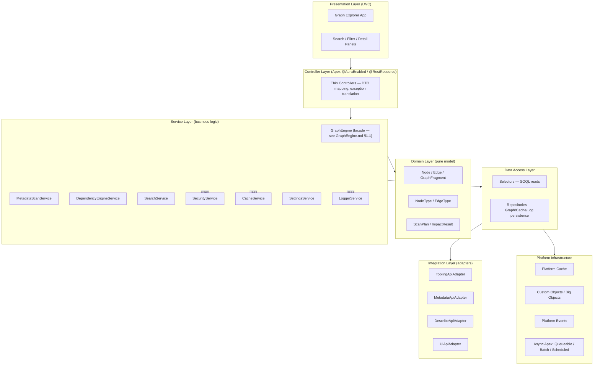
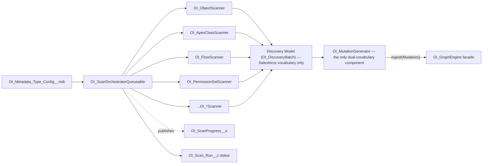
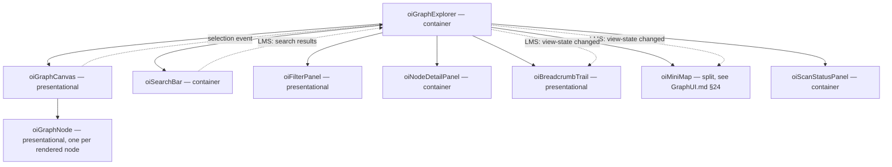

# Architecture — Salesforce Org Intelligence Platform

Status: Draft v1
Owner: Architecture
Applies to: API v67.0, Salesforce DX, AppExchange (2GP Managed Package target)

This document is the architectural source of truth for the platform, per `CLAUDE.md`. It defines the layered architecture, folder structure, service boundaries, the four core engines (Graph, Metadata Scanner, Dependency, Search), UI architecture, state management, caching, error handling, logging, security, package readiness, testing, and scalability. It contains no business logic and no code — only structure and rationale.

Key decisions are tracked as ADRs in [`ADR/`](ADR/). This document explains *what* the architecture is; the ADRs explain *why* each significant choice was made and what was rejected.

---

## 1. Product Framing

The platform scans a Salesforce org's own metadata (objects, fields, Apex, Flows, permissions, dashboards, etc.), models it as a **graph** of nodes and relationships, and lets administrators/architects explore that graph visually — "Google Maps for Salesforce metadata" rather than a report builder. See `CLAUDE.md` §Product Vision / Design Philosophy for the product framing; this document covers only how it is built.

Non-negotiable constraints inherited from `CLAUDE.md` that shape every decision below:

- **Package-ready from day one** — no Org/User/Profile/RecordType IDs, no assumptions about existing metadata, everything configurable.
- **Native Salesforce stack only** — Apex, LWC, Tooling/Metadata/Describe/UI APIs, Platform Events, async Apex, Platform Cache, Custom Metadata, Named Credentials. No middleware, no external services in v1.
- **Graph-first UX**, tables secondary.
- **Never load an entire org.** Lazy load, paginate, cache, batch.
- **Governor limits are a design input, not an afterthought** — the org being *scanned* is also the org the app *runs in*.

---

## 2. Layered Architecture

The platform follows Clean Architecture / layered separation of concerns. Dependencies point inward: outer layers know about inner layers, never the reverse.



| Layer | Responsibility | Must never |
|---|---|---|
| Presentation (LWC) | Render graph/tables, capture user intent, hold ephemeral UI state | Contain business logic, construct graph relationships, call Tooling/Metadata API directly |
| Controller (Apex) | Auth boundary, DTO mapping, exception translation | Contain business logic, branch on business rules |
| Service | Business rules, orchestration, engine logic | Perform raw SOQL, know about HTTP/callout shapes |
| Domain | Represent graph/scan/impact concepts as behavior-bearing value objects | Depend on any other layer (no SOQL, no callouts, no `@AuraEnabled`) |
| Data Access (Selector/Repository) | Query construction, persistence, enforce field-level access | Contain business rules |
| Integration (Adapter) | Isolate Tooling/Metadata/Describe/UI API shapes and versioning | Leak raw API response shapes past this layer |
| Platform Infrastructure | Cache, storage, eventing, async execution | — |

This mirrors `CLAUDE.md` §Service Layer Rules and §Architecture Principles (SOLID, low coupling, high cohesion, one responsibility per class).

`GraphEngine` in L3 is a **facade**, not a single class doing everything: internally it composes five named components — `OI_GraphBuilder`, `OI_GraphTraversal`, `OI_GraphRepository`, `OI_GraphSerializer`, `OI_GraphCache` — none of which are ever called from outside the facade, including by other services in this same layer (`OI_DependencyEngineService`, `OI_SearchService`). Full detail: [GraphEngine.md §1.1](GraphEngine.md#11-graphengine-facade--the-only-public-entry-point), [ADR-0013](ADR/0013-graphengine-facade.md).

---

## 3. Folder Structure

Apex has no physical namespacing (`CLAUDE.md` §Apex Organization — one flat `classes` folder, organized by the `OI_` prefix + suffix convention). LWC *does* support meaningful folder structure, one component per folder. The repository is organized as follows:

```
force-app/main/default/
├── classes/                          # flat, organized by naming convention (see below)
├── triggers/                         # thin, delegate-only
├── lwc/
│   ├── oiGraphExplorer/              # top-level container/app shell
│   ├── oiGraphCanvas/                # graph rendering surface
│   ├── oiMiniMap/
│   ├── oiSearchBar/
│   ├── oiFilterPanel/
│   ├── oiNodeDetailPanel/
│   ├── oiBreadcrumbTrail/
│   ├── oiScanStatusPanel/
│   ├── oiSettingsPanel/
│   ├── oiAdminConsole/
│   └── oiSharedUtils/                # non-visual JS utility module (LMS channel, formatters)
├── objects/                          # Custom Objects, Big Objects, and Custom Metadata
│   │                                  # Types all live here — SFDX source format has no
│   │                                  # distinct "bigObjects" directory; a Big Object is
│   │                                  # just a CustomObject metadata type with a __b
│   │                                  # suffix (confirmed during Sprint 7 implementation —
│   │                                  # an earlier draft of this diagram showed a separate
│   │                                  # top-level bigObjects/ folder, which the CLI's
│   │                                  # decomposed-metadata resolver cannot walk correctly)
│   ├── OI_Scan_Run__c/
│   ├── OI_Graph_Node__c/
│   ├── OI_Graph_Edge__c/
│   ├── OI_Log__c/
│   ├── OI_Graph_Node_Archive__b/
│   ├── OI_Graph_Edge_Archive__b/
│   ├── OI_Metadata_Type_Config__mdt/
│   └── ...                           # see DataModel.md
├── permissionsets/
│   ├── OI_Administrator.permissionset-meta.xml
│   ├── OI_Power_User.permissionset-meta.xml
│   └── OI_Viewer.permissionset-meta.xml
├── staticresources/                  # vetted client-side rendering assets only (see ADR-0007)
├── flexipages/ / applications/ / tabs/
└── ...
docs/
├── Architecture.md  Roadmap.md  DataModel.md  API.md  CodingStandards.md  Backlog.md
└── ADR/
```

### Apex naming convention (logical folders via prefix/suffix)

| Suffix | Layer | Example |
|---|---|---|
| `*Controller` | Controller | `OI_GraphController` |
| `*Engine` | Facade (Graph Engine only — the one component in this list callable from outside its own layer without also being one of the internal names below) | `OI_GraphEngine` |
| `*Service` | Service | `OI_MetadataScanService`, `OI_DependencyEngineService`, `OI_SearchService` |
| `*Builder` | Graph Engine internal — ingestion decision logic | `OI_GraphBuilder` |
| `*Traversal` | Graph Engine internal — BFS/DFS over Repository-supplied data | `OI_GraphTraversal` |
| `*Serializer` | Graph Engine internal — persisted/wire/cache representation shaping | `OI_GraphSerializer` |
| `*Cache` (Graph Engine internal use) | Graph Engine internal — fragment-result caching policy | `OI_GraphCache` |
| `*Selector` | Data Access (read) | `OI_NodeSelector`, `OI_EdgeSelector` |
| `*Repository` | Data Access (write/persist) — the *only* component touching storage for graph data | `OI_GraphRepository` |
| `*StorageProvider` | Data Access internal — one per storage backend, used only by `OI_GraphRepository` | `OI_CustomObjectStorageProvider`, `OI_BigObjectStorageProvider`, `OI_PlatformCacheStorageProvider` |
| `*SearchProvider` | Search internal — one per search domain, used only by `OI_SearchService` ([SearchEngine.md §5](SearchEngine.md#5-search-provider-abstraction)) | `OI_MetadataSearchProvider`, `OI_RecordSearchProvider` |
| `*Adapter` | Integration | `OI_ToolingApiAdapter` |
| `*Scanner` | Metadata Scanner strategy — graph-blind, produces Discovery Model only | `OI_ObjectScanner`, `OI_ApexClassScanner` |
| `*Generator` | The Mutation Generation boundary — the *only* class permitted to know both Salesforce metadata vocabulary and Graph Engine vocabulary ([MetadataScanner.md §15](MetadataScanner.md#15-mutation-generation-boundary)) | `OI_MutationGenerator` |
| `*Exception` | Domain error type | `OI_ServiceException` |
| `*Batch` / `*Queueable` / `*Schedulable` | Async orchestration | `OI_ScanOrchestratorQueueable` |
| (none — plain noun) | Domain value object | `OI_Node`, `OI_Edge`, `OI_ImpactResult` |
| `*Test` | Test class, mirrors class under test | `OI_GraphBuilderTest`, `OI_GraphRepositoryTest` |

The `*Builder`/`*Traversal`/`*Serializer`/`*Cache`/`*StorageProvider` suffixes are marked "internal" deliberately: naming alone doesn't enforce the facade rule (§4, [ADR-0013](ADR/0013-graphengine-facade.md)) — code review does — but a consistent, recognizable naming pattern makes "is this an internal Graph Engine class?" answerable at a glance, which is what makes the review rule enforceable in practice.

Modularity within a single package directory is achieved through this naming discipline plus strict layer dependency rules (§2), not through physical folders — see ADR-0003.

---

## 4. Service Boundaries

Each service owns one bounded responsibility and exposes a narrow interface; no service reaches into another's persistence directly — cross-service calls always go through the other service's public methods.

| Service | Owns | Does not own |
|---|---|---|
| **OI_MetadataScanService** (Metadata Scanner subsystem — full spec: [MetadataScanner.md](MetadataScanner.md)) | Discovering org metadata via Describe/Tooling/Metadata API, normalizing into the graph-blind **Discovery Model**, orchestrating scan runs | Graph structure, `typeKey`/`nodeKey`/`edgeKey`, Mutations, anything Graph-Engine-shaped — has zero Graph Engine dependency by design |
| **OI_MutationGenerator** | Translating Discovery Model → Graph Mutations (the *only* component that knows both the Salesforce metadata vocabulary and the Graph Engine's opaque vocabulary — [ADR-0015](ADR/0015-discovery-model-graph-blind-scanner.md)); calls `OI_GraphEngine` exclusively for ingest and for read-only retire-detection | Salesforce API call mechanics (never calls an Adapter); graph storage mechanics (never calls `OI_GraphRepository` directly) |
| **OI_GraphEngine** *(facade)* | The entire Graph Engine's public surface — ingestion, traversal, caching, serialization — composed internally from `OI_GraphBuilder`/`OI_GraphTraversal`/`OI_GraphRepository`/`OI_GraphSerializer`/`OI_GraphCache`, the *only* component allowed to construct nodes and edges (`CLAUDE.md` §Graph Engine). No business logic lives in the facade itself — it routes to exactly one internal component per call ([GraphEngine.md §1.1](GraphEngine.md#11-graphengine-facade--the-only-public-entry-point)) | Metadata discovery, impact-analysis *decision* semantics (traversal mechanics live inside it, but deciding what a result *means* is `OI_DependencyEngineService`'s job) |
| **OI_DependencyEngineService** | Forward/reverse dependency traversal *interpretation*, cycle detection — reads the graph exclusively through `OI_GraphEngine`, never writes it | Graph construction, node/edge persistence, direct access to `OI_GraphTraversal`/`OI_GraphRepository` |
| **OI_SearchService** | Query parsing, the Search Provider abstraction, centralized ranking, result assembly across both the Metadata and (opt-in) Record domains — full spec [SearchEngine.md](SearchEngine.md) | Graph traversal, metadata discovery, storage access of any kind — reads exclusively via `OI_NodeSelector`/`OI_EdgeSelector`/`OI_RecordSelector`, never via `OI_GraphRepository` or `OI_GraphEngine` ([SearchEngine.md §22, §23](SearchEngine.md#22-repository-integration)) |
| **OI_SecurityService** | Centralized CRUD/FLS/sharing checks, Custom Permission gating | Business rules of other services |
| **OI_CacheService** | Platform Cache read/write/invalidate, cache-key strategy — for *non-graph* caching needs (e.g., Settings lookups, Metadata-domain search results — [SearchEngine.md §20](SearchEngine.md#20-caching)); graph fragment caching specifically is `OI_GraphCache`, internal to the Graph Engine facade | Durable persistence (that's Repository's job); anything graph-shaped; Record-domain search results, which are never cached server-side ([SearchEngine.md §20](SearchEngine.md#20-caching)) |
| **OI_SettingsService** | Reading Custom Metadata/Custom Settings config | Any runtime business logic |
| **OI_LoggerService** | Structured log emission, correlation IDs | Log storage schema (delegates to `OI_LogRepository`) |

Boundary rule: a service may call another service's public API; it may **never** call another service's Selector/Repository/Adapter directly. This keeps each engine independently testable and independently replaceable (Open/Closed — e.g., swapping the Search engine's backing store later, per ADR-0007, touches nothing outside `OI_SearchService`). Inside the Graph Engine specifically, this rule is tightened one level further: `OI_GraphEngine` is the *only* callable surface, full stop — not even other Services reach `OI_GraphBuilder`/`OI_GraphTraversal`/`OI_GraphRepository`/`OI_GraphSerializer`/`OI_GraphCache` (ADR-0013).

---

## 5. Graph Engine Architecture

The Graph Engine is the single source of truth for the graph model (`CLAUDE.md` §Graph Engine: "UI components must never construct graph relationships directly"). Its full specification — including a deliberate correction to how node/edge typing was originally described here — lives in the dedicated [GraphEngine.md](GraphEngine.md); this section gives the summary a reader of this document needs.

**Domain model** (pure Apex value objects, no persistence knowledge):

- `OI_Node` — `nodeKey` (deterministic, domain-assigned), `typeKey`, `label`, `secondaryKey`, `attributes` (map).
- `OI_Edge` — `edgeKey`, `sourceNodeKey`, `targetNodeKey`, `typeKey`, `attributes`.
- `typeKey` (node and edge) — **an opaque, domain-assigned string, not a closed enum inside the engine.** `CLAUDE.md`'s example lists (Object, Field, ApexClass, ... / `HAS_FIELD`, `REFERENCES`, ...) are real types the platform ships with, but they are registered declaratively via a Domain Type Registry consumed by the Metadata Scanner and the Presentation layer — the Graph Engine itself never enumerates or validates against that list. This corrects the original phrasing here (which described a closed `NodeType`/`EdgeType` enumeration owned by the engine); see [GraphEngine.md §1–§3](GraphEngine.md#1-graph-philosophy) and [ADR-0011](ADR/0011-generic-node-edge-typing-via-domain-registry.md) for the full rationale — a closed enum inside the engine would mean every new metadata type requires a Graph Engine change, which contradicts Open/Closed and the engine's genericity requirement.
- `OI_GraphFragment` — a bounded, paginated slice of the graph (center node + N hops), the *only* shape ever returned to the Controller/UI layer. Includes a `frontier` set marking which returned nodes have unexplored neighbors (GraphEngine.md §4).

**Responsibilities**, exactly as scoped in `CLAUDE.md`, now split across the facade's internal components ([GraphEngine.md §1.1](GraphEngine.md#11-graphengine-facade--the-only-public-entry-point)):

1. **Build** (`OI_GraphBuilder` → `OI_GraphRepository`) — turn normalized scanner observations into version-aware writes: a new version, a liveness-only bookkeeping touch, or nothing, depending on whether content actually changed (GraphEngine.md §7). Never an unconditional upsert.
2. **Expand** (`OI_GraphTraversal`) — given a node key and hop count, return neighbors (bounded by hop depth *and* node count, paginated).
3. **Filter** (`OI_GraphTraversal`) — by node type, edge type, namespace, package.
4. **Impact analysis entry point** — delegates the actual traversal algorithm to `OI_DependencyEngineService`'s calls into `OI_GraphEngine`, but `OI_GraphRepository` remains the only writer of the underlying data that traversal reads.

Every one of the four responsibilities above is reached exclusively through `OI_GraphEngine`; nothing outside the facade calls `OI_GraphBuilder` or `OI_GraphTraversal` by name (§4, ADR-0013).

**Persistence** (detail in [DataModel.md](DataModel.md), rationale in ADR-0002, ADR-0012, ADR-0014):

- `OI_GraphRepository` is the *only* component that touches storage — the Graph Builder decides what should happen; the Repository decides how and where it's stored, dispatching to a Storage Provider per backend ([GraphEngine.md §7.1](GraphEngine.md#71-graph-repository-architecture), full specification in [GraphRepository.md](GraphRepository.md)). Version commits are atomic (insert-and-supersede in one transaction) and concurrent writes to the same key are resolved optimistically rather than via locking — [GraphRepository.md §6, §15](GraphRepository.md#6-version-persistence--the-commitversion-atomicity-fix), [ADR-0016](ADR/0016-repository-atomic-commit-and-optimistic-concurrency.md).
- **`GraphNode`/`GraphEdge` are immutable.** A content or lifecycle-state change is recorded as a **new version row**, never as an update of the existing one — the prior version's `Is_Current__c` flag is flipped to `false` and it is otherwise never touched again. The one exception is a liveness-only reaffirmation (checksum unchanged): that updates `Last_Seen_Run__c` in place on the current row, and only that. Full rationale: ADR-0014, [GraphEngine.md §2, §5, §7](GraphEngine.md#2-node-model).
- `Node_Key__c`/`Edge_Key__c` are now the *logical* identity, shared across every version of a node/edge — no longer unique on their own. `Node_Version_Key__c`/`Edge_Version_Key__c` (composite: key + version number) are the actual unique/External ID fields used for insert.
- Both `Source_Node_Key__c` and `Target_Node_Key__c` remain indexed text fields on the edge, giving indexed lookups in either traversal direction without doubling row count — unchanged from the original design, and unaffected by versioning since edges reference the *logical* node key, not a specific version.
- Superseded (non-current) version rows, and purged nodes/edges, roll off to `OI_Graph_Node_Archive__b` / `OI_Graph_Edge_Archive__b` (Big Objects) via a scheduled archival job — queryable asynchronously, no impact on transactional storage limits.

**Expansion algorithm placement**: BFS/DFS traversal logic lives in `OI_GraphTraversal` (expand/filter, reached only via `OI_GraphEngine`) and `OI_DependencyEngineService` (impact analysis, also reached only via `OI_GraphEngine`), operating over Repository-supplied edge sets — never in SOQL (SOQL cannot do recursive traversal) and never in the client. Traversal is bounded by hop depth *and* a total-node-count ceiling (GraphEngine.md §12) — fan-out at shallow depth can be as dangerous to governor limits as depth itself. Every read is implicitly scoped to `Is_Current__c = true` — traversal never surfaces a historical version.

**Who translates domain concepts into graph mutations**: `OI_MutationGenerator` — neither the Metadata Scanner nor the Graph Engine. A per-type Scanner (§6) knows what a Flow is but produces a graph-blind **Discovery Model**, not a mutation; `OI_MutationGenerator` is the one component that translates a discovered Salesforce component into a generic mutation (`typeKey: "SalesforceMetadata.Flow"`, label, attributes), which `OI_GraphBuilder`, reached through the `OI_GraphEngine` facade, then applies without any type-specific knowledge. Full rationale for this boundary — and why it's a distinct component from both the Scanner and the Builder — is in [MetadataScanner.md §15](MetadataScanner.md#15-mutation-generation-boundary) and [ADR-0015](ADR/0015-discovery-model-graph-blind-scanner.md). See [GraphEngine.md §7](GraphEngine.md#7-graph-builder-architecture) for the Mutation contract itself and its versioning decision logic.

---

## 6. Metadata Scanner Architecture

The Metadata Scanner discovers Salesforce metadata and nothing else — it has no knowledge of Graph Nodes, Edges, or Mutations, not even the Graph Engine's opaque `typeKey` vocabulary. Its complete specification — philosophy, pipeline, the Discovery Model, interfaces, registry, incremental/full/parallel scanning, retry, scheduling, orchestration, and the Mutation Generation boundary — lives in the dedicated [MetadataScanner.md](MetadataScanner.md); this section gives the summary a reader of this document needs.

**Pattern**: Strategy + Orchestrator, exactly as before, with one corrected detail: the Scanner's output is a graph-blind **Discovery Model** (`OI_DiscoveryBatch`), not a Mutation. One Scanner class per metadata type, all implementing `OI_IMetadataScanner` (`scan(context) -> OI_DiscoveryBatch`), registered and toggled declaratively via `OI_Metadata_Type_Config__mdt` (the *Scanner* Registry — a deliberately separate Custom Metadata Type from the Domain Type Registry the Graph Engine side uses, [MetadataScanner.md §7](MetadataScanner.md#7-scanner-registry)) so new metadata types can be added without touching the orchestrator.



**Execution model**: Queueable chaining, one hop per metadata type (or per batch within a type for large types), each hop:

1. Reads its config (batch size, enabled flag, API preference, per-type cadence) from the Scanner Registry.
2. Calls the relevant Adapter (Tooling/Metadata/Describe API) — never a raw HTTP callout or SOQL against Tooling objects from the scanner itself.
3. Normalizes results into a `OI_DiscoveryBatch`; where the source API supports it, requests only records changed since the last watermark to reduce callout volume (**API-level delta fetching** — this is as far as the Scanner's own "incremental" behavior goes; it never compares against graph state, since it doesn't know the graph exists — [MetadataScanner.md §8](MetadataScanner.md#8-incremental-scanning)).
4. Hands the batch to `OI_MutationGenerator`, which translates Salesforce vocabulary into Graph Mutations and calls `OI_GraphEngine` — never directly to `OI_GraphBuilder` or `OI_GraphRepository` (facade rule, ADR-0013). The actual content-diff decision (new version / liveness touch / no-op) happens inside `OI_GraphBuilder`, downstream of this call, exactly as [GraphEngine.md §7](GraphEngine.md#7-graph-builder-architecture) describes — the Scanner and Mutation Generator only ever *observe*; they never decide what an observation implies for graph state.
5. Publishes `OI_ScanProgress__e` for live UI progress and updates `OI_Scan_Run__c`.
6. Chains the next hop (`System.enqueueJob`) or, for very large metadata types, falls back to Batch Apex for that type's chunked processing.

**Why Queueable-chain over a single Batch job**: different metadata types need different APIs (Tooling vs Metadata vs Describe) with very different call shapes and per-type failure isolation; a chain lets one type's scanner fail without aborting the whole run, and lets scan cadence differ per type (e.g., rescanning Apex more often than Reports). See ADR-0004.

**Failure isolation**: a scanner failure is caught at the orchestrator boundary, logged with correlation to the `Scan_Run__c`, recorded as a partial failure on that run, and the chain continues to the next scanner — one bad metadata type never blocks the whole scan. A full scan's `isFullSnapshot` flag — which gates whether `OI_MutationGenerator` performs retire-detection — must only be set `true` if every chunk of that type's fetch succeeded; a partial failure suppresses retire-detection for that run rather than risking false retirements ([MetadataScanner.md §21](MetadataScanner.md#21-risks)).

---

## 7. Dependency Engine Architecture

Read-only consumer of the graph, reached exclusively through the `OI_GraphEngine` facade (never `OI_GraphTraversal`/`OI_GraphRepository` directly — §4, ADR-0013) and never writes nodes/edges (§4 boundary rule).

- **Forward impact** ("what does X depend on"): traverse outbound edges of dependency-flavored types (`DEPENDS_ON`, `CALLS`, `REFERENCES`, `INVOKES`, `USES_API`) from a starting node, depth-bounded (configurable default, e.g. 3 hops) to respect heap/CPU limits.
- **Reverse impact** ("what depends on X" — the change-impact question architects actually ask): same traversal against `Target_Node_Key__c`-indexed edges, always scoped to `Is_Current__c = true`.
- **Cycle detection**: DFS with a visited-set guard; required because Apex `DEPENDS_ON`/`CALLS` graphs can be cyclic (mutual class references), and unbounded recursion would exhaust CPU time.
- **Result shape**: `OI_ImpactResult` — a bounded subgraph plus a flat "affected components" list, suitable for both graph and table rendering (tables are a first-class secondary view per `CLAUDE.md` §UI Philosophy).
- **Caching**: impact results are expensive to compute and cheap to invalidate precisely — cached per `(nodeKey, direction, depth)` with invalidation scoped to nodes touched by the most recent scan delta (§10).

---

## 8. Search Architecture

`OI_SearchService` is the abstracted seam so the backing mechanism can change without touching callers (ADR-0007), backed in v1 by SOSL for ranked typeahead and SOQL for exact/structured lookup. Its complete specification — the Search Provider abstraction, the unified request/response model, ranking strategy, type/object filtering, the (opt-in) Record Search domain, and its deliberate separation from graph traversal — lives in the dedicated [SearchEngine.md](SearchEngine.md); this section gives the summary a reader of this document needs.

1. **Metadata domain (Tier 1 — typeahead)**: SOSL `FIND` across indexed, searchable fields on `OI_Graph_Node__c` (`Label__c`, `Secondary_Key__c`), scoped by `Node_Type__c`/`Parent_Key__c` filters and always scoped `WHERE Is_Current__c = true` in the `RETURNING` clause (GraphEngine.md §13) so historical versions never surface in results — issued through `OI_NodeSelector`, never inline inside `OI_SearchService` ([SearchEngine.md §0, §6](SearchEngine.md#0-relationship-to-prior-documents--what-this-corrects-adds-and-challenges)).
2. **Metadata domain (Tier 2 — exact/structured lookup)**: SOQL against `Secondary_Key__c` (optionally scoped by `Node_Type__c`/`Parent_Key__c`) for exact-match and "jump to node" navigation, where SOSL's relevance ranking isn't needed and precision matters more.
3. **Record domain (opt-in, off by default)**: a structurally separate search over customer business records — never persisted, never modeled as Graph Nodes, governed by full CRUD/FLS/sharing rather than the Apex-boundary model ADR-0006 defines for the platform's own objects. Full rationale: [SearchEngine.md §12, §18](SearchEngine.md#12-record-search), [ADR-0017](ADR/0017-search-provider-abstraction-record-search-outside-graph.md).

**Object-scoped filtering** (e.g., "only Fields on Account") is answered by a generic `Parent_Key__c` field on the node itself, never by a graph traversal — Search and graph traversal are separate concerns, enforced structurally: `OI_SearchService` never calls `OI_GraphTraversal` or `OI_GraphEngine` in either direction ([SearchEngine.md §11, §23](SearchEngine.md#11-object-filtering--via-parentkey-never-via-traversal), [ADR-0018](ADR/0018-denormalized-parent-key-for-search-scoping.md)). Selecting a search result is a separate, independent Controller call into `OI_GraphEngine` (API.md §2.1) triggered by the UI, never something `OI_SearchService` itself performs.

`OI_SearchService` composes a small Search Provider abstraction (`OI_ISearchProvider` — `OI_MetadataSearchProvider`, `OI_RecordSearchProvider`) mirroring `OI_GraphRepository`'s Storage Provider pattern ([GraphRepository.md §3](GraphRepository.md#3-storageprovider-interface)) — a future backend swap (e.g., an external search index, should very large orgs outgrow SOSL's practical result-set characteristics) is a new provider class, with zero changes to `OI_SearchController` or any LWC.

---

## 9. UI Architecture

**Shell**: a single Lightning App hosting `oiGraphExplorer` as the container/orchestrator. The graph is the primary surface; tables (e.g., a node-list view of search/filter results) are a secondary, always-available alternative rendering of the *same* selection — never a separate data path (`CLAUDE.md` §UI Philosophy). Its complete specification — the container/presentational component split, the Canvas/Node/Edge component architecture, the tree-vs-graph visualization analysis, layout strategy, and every navigation/exploration affordance — lives in the dedicated [GraphUI.md](GraphUI.md); this section gives the summary a reader of this document needs.

**Visual conformance boundary**: [VisualDesignSpecification.md](VisualDesignSpecification.md) is authoritative for Object Analyze mode's application-owned workspace. The package controls the explorer workspace but not Salesforce global chrome. Architecture conformance and visual conformance are separate gates: a correct container/presentational split does not establish that the rendered product matches the approved reference. See [ADR-0025](ADR/0025-reference-image-as-binding-visual-acceptance-contract.md).



- **Container vs. presentational split** (new, [GraphUI.md §3](GraphUI.md#3-component-architecture)): every component in this subsystem is either a container (may call Apex) or presentational (props in, events out, never calls Apex) — never both. `oiGraphCanvas` and everything it renders (`oiGraphNode`, and edges, which are Canvas-rendered SVG rather than components at all) are presentational; this is the concrete, structural form of "the Canvas must not directly fetch data."
- **Rendering surface** (`oiGraphCanvas`): SVG-based, virtualized/windowed rendering — only visible nodes/edges are drawn; expansion beyond the current viewport triggers progressive loading from `OI_GraphController`, never a full-graph fetch. Any third-party rendering library (scoped narrowly to layout math, [GraphUI.md §32](GraphUI.md#32-canvas-technologylibrary-decision), [ADR-0020](ADR/0020-svg-rendering-vendored-layout-library.md)) is vendored as a Static Resource and vetted against AppExchange Security Review constraints (CSP, no remote script loading) — see CodingStandards.md §Static Resources.
- **Cross-component communication**: Lightning Message Service (LMS) for decoupled pub/sub (selection changes, view-state changes, scan-progress push) between siblings that don't have a direct parent/child relationship; direct `@api` properties/events for strict parent↔child data flow (search bar → shell → canvas). No component reaches into another's DOM or internal state.
- **Progressive interaction contract**: expand/collapse/zoom/pan/mini-map/breadcrumbs/context-menu/keyboard-nav/dark mode are handled entirely client-side against already-fetched fragments where possible; only genuinely new data (unexplored neighborhood) triggers a server round-trip.
- **Visualization strategy**: a hybrid — true graph topology (cycles and shared nodes rendered honestly, never duplicated) with a radial, egocentric default layout (tree-like readability without a tree's data-structure limitations) — chosen over both a literal tree and an unconstrained force-directed graph. Full analysis: [GraphUI.md §18](GraphUI.md#18-tree-vs-graph-visualization-strategy), [ADR-0019](ADR/0019-hybrid-radial-graph-visualization.md).

---

## 10. State Management

Three explicitly separated state categories — deliberately *not* a heavyweight client state-management library, per `CLAUDE.md` §Core Principles ("prefer simple architecture that scales"). See ADR-0008.

| State category | Examples | Owned by | Lifetime |
|---|---|---|---|
| **Ephemeral UI state** | Expanded/collapsed nodes (reference-counted, [GraphUI.md §11–§13](GraphUI.md#11-view-state-model)), pan/zoom offset, current selection, open panels, per-node pagination cursors | A small module-scoped JS store (`oiSharedUtils/graphViewState.js`) — plain reactive module, LWC-safe, no framework | Tab session; lost on refresh |
| **Session state** | Recent searches, last-viewed graph, breadcrumb trail | `sessionStorage`, namespaced per user session (browser tab-scoped, never cross-user) | Browser tab session |
| **Server-authoritative state** | Graph fragments, scan status, node metadata | Apex via `@wire`/imperative Apex, refreshed on demand or pushed via Platform Event → `empApi` for live scan progress | Until explicitly refetched/invalidated |
| **Registry cache** (new, [GraphUI.md §10](GraphUI.md#10-state-management)) | The Presentation Type Registry (`getPresentationRegistry()`, §18 below) | Fetched once per session by the shell, held in `oiSharedUtils/presentationRegistry.js` | Tab session |

Data flows top-down from `oiGraphExplorer` (which owns the current "view" — center node, active filters, hop depth) to children via properties; children emit events upward for intent ("expand this node", "run this search"); the shell is the only place a fetch is triggered. This avoids prop-drilling *and* avoids introducing Redux-style global state machinery the product doesn't need at this scale.

---

## 11. Caching Strategy

Three layers, each with a distinct purpose and a distinct invalidation trigger (rationale in ADR-0010):

| Layer | Owner | Mechanism | Purpose | Invalidation |
|---|---|---|---|---|
| **L1 — Hot fragment cache** | `OI_GraphCache` (policy) via `OI_GraphRepository`'s Platform Cache provider (storage access) | Platform Cache (Org partition) keyed by `hash(nodeKey + hopDepth + filterSet + currentVersionChecksum)` | Serve repeat graph-fragment/search requests without SOQL | TTL (configurable via `OI_SettingsService`) **and** targeted eviction of keys touching a changed node after a scan delta; folding the current version's checksum into the key means a new version produces a natural miss even without an explicit eviction |
| **L2 — Durable current-version store** | `OI_GraphRepository` | `OI_Graph_Node__c` / `OI_Graph_Edge__c` (Custom Objects), `Is_Current__c = true` rows scoped by `Scan_Run__c` | Source of truth for "what's current"; survives cache eviction and org restarts; avoids re-hitting Tooling/Metadata API just to re-render | A content/state change inserts a new version and flips the prior row's `Is_Current__c` to `false` — never an in-place update (ADR-0014). Superseded rows are not deleted synchronously; they age out to the Big Object archive via a scheduled job (DataModel §7) |
| **L3 — Client session cache** | Client (outside the facade entirely) | In-memory JS map inside `oiGraphExplorer`, keyed the same as L1, LRU-bounded (GraphEngine.md §14/§16) | Avoid redundant Apex calls while the user pans/re-visits nodes within one session | Cleared on view-state reset, explicit "refresh," or LRU eviction once the size bound is exceeded |

**Invalidation is neighborhood-scoped, not global**: the Metadata Scanner knows exactly which node keys changed in a given run; it evicts only those keys (and their immediate cached neighbors) from L1 and lets L3 go stale naturally on next fetch. A full org rescan never implies a full cache flush — this is what makes incremental scanning (§6, ADR-0009) actually pay off. Full mechanics, including the Repository/Cache division of labor, are in [GraphEngine.md §7.1/§14](GraphEngine.md#71-graph-repository-architecture).

---

## 12. Error Handling

Custom exception hierarchy, rooted at `OI_ApplicationException` (per `CLAUDE.md` §Error Handling — "throw meaningful exceptions... never silently swallow"):

```
OI_ApplicationException (abstract)
├── OI_ServiceException        — business-rule violations inside a Service
│   └── OI_ConcurrencyException — detected write conflict in OI_GraphRepository, retryable
├── OI_IntegrationException    — Tooling/Metadata/Describe API failure, wraps original cause
├── OI_SecurityException       — CRUD/FLS/sharing/Custom Permission denial
└── OI_ValidationException     — bad input from Controller boundary
```

`OI_ConcurrencyException` is new (Sprint 4/[GraphRepository.md §15, §17](GraphRepository.md#15-concurrency-handling)) — the one exception type `OI_GraphBuilder` specifically catches and retries once (rather than treating as a terminal failure), signaling that two concurrent scan chains raced to version the same key. See [ADR-0016](ADR/0016-repository-atomic-commit-and-optimistic-concurrency.md).

- **Controllers** catch `OI_ApplicationException` subtypes at the boundary and translate to `AuraHandledException` with a sanitized, user-safe message (no stack traces, no internal object/field API names, no query text) — the raw exception and a correlation ID are logged via `OI_LoggerService` before translation, so support/debugging has the full detail server-side even though the client never sees it.
- **Async jobs** (Queueable/Batch) classify failures as retryable (callout timeout, `UNABLE_TO_LOCK_ROW`) vs terminal (malformed metadata, permission denial). Retryable failures re-enqueue with backoff up to a configured attempt cap; beyond the cap (or for terminal failures) the failure is recorded on `OI_Scan_Run__c` and surfaced in `oiScanStatusPanel` — never a silent job death.
- **No layer swallows exceptions silently.** A caught exception is always either re-thrown (possibly wrapped in a more specific type) or logged-and-recorded as a run/task failure; there is no `catch (Exception e) {}`.

---

## 13. Logging

- `OI_LoggerService` is the single entry point for structured logging across every layer; no class writes logs by any other means.
- **Structured fields**: timestamp, level (`DEBUG`/`INFO`/`WARN`/`ERROR`), correlation ID (per user action and per scan run), source class, message, and (for `ERROR`) stack trace.
- **Write path**: logging is decoupled from the caller's transaction via `OI_LogEvent__e` (Platform Event) → a subscriber trigger persists to `OI_Log__c` asynchronously, so logging never consumes the caller's DML/CPU budget or risks rolling back the caller's transaction on a logging failure.
- **Verbosity is configurable per environment without deployment** via `OI_Settings` Custom Metadata (log level threshold) — production defaults to `WARN`/`ERROR`, with `DEBUG` available for support-assisted troubleshooting.
- **Retention**: a scheduled batch job purges `OI_Log__c` rows past a configurable retention window (default in [DataModel.md](DataModel.md)) — an AppExchange app must not let its own diagnostic data silently consume the customer's storage limits indefinitely.

---

## 14. Security Model

Everything here follows `CLAUDE.md` §Security exactly: respect CRUD/FLS/sharing/User Mode, never expose unauthorized metadata, document any elevated access.

- **Data access enforcement**: all Selectors/Repositories execute `WITH USER_MODE` (or `Security.stripInaccessible` where inline user mode isn't applicable) for any query touching customer business data reachable through scanned metadata references. The app's *own* internal graph/log/config objects (`OI_*__c`) are Apex-boundary-controlled instead of relying on object-level CRUD/sharing for end users — see ADR-0006 for the full rationale (short version: these are application-internal cache tables, not business records; gating access at the Apex API surface via Custom Permission is simpler and more correct than building a record-sharing model for data no end user should ever query directly via list view/report).
- **Feature gating**: Custom Permissions (`OI_View_Graph`, `OI_Run_Scan`, `OI_Manage_Settings`, `OI_View_Logs`) assigned via package-shipped Permission Sets (`OI_Viewer`, `OI_Power_User`, `OI_Administrator`) — never Profile checks, since Profiles aren't packageable and CLAUDE.md explicitly disallows relying on Profile IDs. Customers are expected to compose these into their own Permission Set Groups.
- **Elevated access is documented, not silent**: triggering a scan requires the running user to hold whatever Tooling API / Metadata API permissions Salesforce itself requires (e.g., customizable-application-level access implied by those APIs); this constraint is documented in [API.md](API.md) and surfaced in `oiScanStatusPanel` if a scan can't start due to insufficient platform permission — the app never silently runs a scan with broader access than the invoking user actually has.
- **`without sharing` usage is scoped and justified**: `OI_GraphRepository`'s write paths against `OI_Graph_Node__c`/`OI_Graph_Edge__c` (the *only* component permitted to write them — ADR-0012) run `without sharing` (these are app-internal records with no meaningful owner-based sharing semantics), while every read path exposed to the UI runs `with sharing` and additionally checks the relevant Custom Permission before returning data.
- **Security Review readiness**: no hardcoded secrets, all external endpoints (if any, future) via Named Credential, LWC templates avoid unsafe DOM APIs, static resources are CSP-compliant (ADR-0007).

---

## 15. Package Readiness

Every point in `CLAUDE.md` §Package Compatibility and §Metadata Assumptions is treated as a hard constraint, enforced structurally:

- **No hardcoded IDs anywhere** — Org/User/Profile/PermissionSet/Record IDs are never compared or stored as literals; configuration lives in Custom Metadata (`OI_Metadata_Type_Config__mdt`, `OI_Settings__mdt`) which *is* packageable and environment-overridable per org.
- **Dynamic metadata detection** — the Metadata Scanner assumes nothing is present (no Flows, no custom objects, no namespaces) and degrades gracefully: a metadata type with zero instances in the target org simply produces zero nodes, never an error.
- **Distribution model**: Second-Generation Managed Package (2GP) targeted for AppExchange listing — namespace-protected IP, versioned upgrade path via package ancestry, matches ISV Security Review expectations for a commercial listing (vs. Unlocked Package, which doesn't protect Apex source and is a weaker fit for a paid AppExchange product). Full rationale in ADR-0005.
- **Install/uninstall lifecycle**: `OI_InstallHandler implements InstallHandler` seeds default Custom Metadata/Settings and schedules an initial (opt-in, not automatic) scan on install; uninstall behavior (data export reminder for `OI_Log__c`/`OI_Graph_*__c`) is documented, never silent data loss.
- **Namespace safety**: no cross-object hardcoded field-API-name string literals outside of `Schema`-safe describes where the field belongs to *scanned* (customer) metadata rather than the package's own objects; the package's own objects are referenced by strongly-typed Apex (safe under namespace injection at packaging time).
- **Versioning**: semantic package versioning (`major.minor.patch.build`), with package ancestry maintained for every push intended for promotion, so upgrades are non-destructive for existing subscribers.

---

## 16. Testing Strategy

Per `CLAUDE.md` §Testing Standards ("meaningful coverage rather than artificial coverage... verify behavior, not implementation"):

- **Unit tests (Apex)**: one test class per class under test (`OI_GraphBuilderTest`, `OI_GraphRepositoryTest`, `OI_GraphTraversalTest`, etc.), each Graph Engine internal component tested against a fake `OI_GraphRepository`/`OI_IGraphStorageProvider` (enabled by Dependency Inversion — see ADR-0003), plus a dedicated `OI_GraphEngineTest` verifying the facade only ever delegates and contains no logic of its own (ADR-0013). Integration-layer Adapters tested against `HttpCalloutMock`/`Test.setMock` fixtures so tests never depend on a real org's actual metadata (consistent with §Metadata Assumptions — tests must not assume any metadata exists).
- **Test data**: factory/builder pattern for constructing `OI_Node`/`OI_Edge`/DTO fixtures — no reliance on org-specific existing metadata, satisfying the "never assume an org contains X" rule even inside tests.
- **Coverage per test class**: positive, negative, bulk (200+ record patterns), permission-denied, and boundary-condition cases, as enumerated in `CLAUDE.md` §Testing Standards.
- **LWC unit tests**: Jest (`sfdx-lwc-jest`), mocking `@wire`/imperative Apex boundaries and LMS channels; assert on rendered state and emitted events, not internal implementation.
- **Contract tests**: a dedicated suite asserting the *shape* of Tooling/Metadata/Describe API responses the Adapters depend on, so a Salesforce platform/API-version change that silently alters a response shape is caught immediately rather than surfacing as a mysterious Graph Engine bug.
- **CI pipeline**: scratch-org create → deploy → run Apex + Jest tests → destroy, on every push; package version validation (`sf package version create --skip-validation=false`) before any promotion.
- **Target**: meaningful coverage well above the 75% governor minimum, tracked per-service, with an explicit review gate on any class below target before merge.

---

## 17. Scalability Considerations

Large subscriber orgs may have tens of thousands of metadata components. Every engine is designed against that ceiling, not against a demo org:

- **Never a synchronous full-org scan** — scanning is always async (Queueable chain / Batch Apex), chunked per metadata type with configurable batch size (§6).
- **Graph reads are always bounded** — the Graph Engine never returns an unpaginated fragment; hop depth and result-set size are always capped and configurable (§5, §9).
- **Storage scales via Big Objects at the edges** — transactional custom-object storage holds only *current-version* rows (`Is_Current__c = true`); superseded versions and purged nodes/edges move to `OI_Graph_Node_Archive__b` / `OI_Graph_Edge_Archive__b` so subscriber storage limits aren't consumed by version history (§5, ADR-0014). This is the specific mechanism that keeps immutable versioning from becoming an unbounded storage liability — see GraphEngine.md §21 for the honest risk accounting.
- **Incremental scanning is the default mode** — full rescans are opt-in and explicitly costed to the admin in the UI, since they are the expensive path (§6, ADR-0009).
- **Self-imposed API budget**: the Scanner tracks its own Tooling/Metadata API call consumption per run against a configurable ceiling (customers have limited daily API call allocations shared with *other* integrations) and can pause/resume rather than exhausting the org's daily limit.
- **Governor-limit-aware chunking**: every batched operation respects SOQL row limits (50k), callout limits (100/transaction), and heap limits (6MB sync / 12MB async) as hard chunk-size inputs, not assumptions to be discovered in production.
- **Horizontal scan parallelization**: independent metadata types can scan concurrently via separate Queueable chains where governor limits allow, rather than one strictly serial chain, to keep large-org scan wall-clock time reasonable.

---

## 18. Related Documents

- [GraphEngine.md](GraphEngine.md) — complete Graph Engine specification (node/edge/graph model, lifecycle, builder, traversal, caching, rendering contract, extension points)
- [GraphRepository.md](GraphRepository.md) — complete Graph Repository & Storage layer specification (Storage Provider abstraction, atomic version commit, concurrency/idempotency, retention/archival, storage migration strategy)
- [SearchEngine.md](SearchEngine.md) — complete Search Engine specification (Search Provider abstraction, request/response model, ranking, type/object filtering, Record Search, separation from graph traversal)
- [GraphUI.md](GraphUI.md) — complete Visual Graph UI specification (component architecture, Canvas/Node/Edge rendering, tree-vs-graph visualization strategy, reference-counted view-state, layout, navigation, accessibility, large-graph handling)
- [MetadataScanner.md](MetadataScanner.md) — complete Metadata Scanner specification (discovery pipeline, Discovery Model, Mutation Generation boundary, incremental/full/parallel scanning, orchestration)
- [DataModel.md](DataModel.md) — full object/field/Big Object/Platform Event schema
- [API.md](API.md) — Apex controller contracts, REST integration surface, event contracts
- [CodingStandards.md](CodingStandards.md) — naming, structure, and quality rules
- [Roadmap.md](Roadmap.md) — phased delivery plan, including Phase 7's Hierarchy Accelerator
- [Backlog.md](Backlog.md) — epics and prioritized backlog, including the Hierarchy Accelerator epic
- [ADR/](ADR/) — Architecture Decision Records for every choice marked "ADR-xxxx" above, including [ADR-0022](ADR/0022-hierarchy-accelerator-separate-persistence-lane.md) — the Hierarchy Accelerator's structurally separate persistence lane, a new subsystem alongside the Graph Engine/Metadata Scanner/Dependency Engine/Search covered by §5–§8 above, deliberately not sharing their versioning or security model (see the ADR for why)
