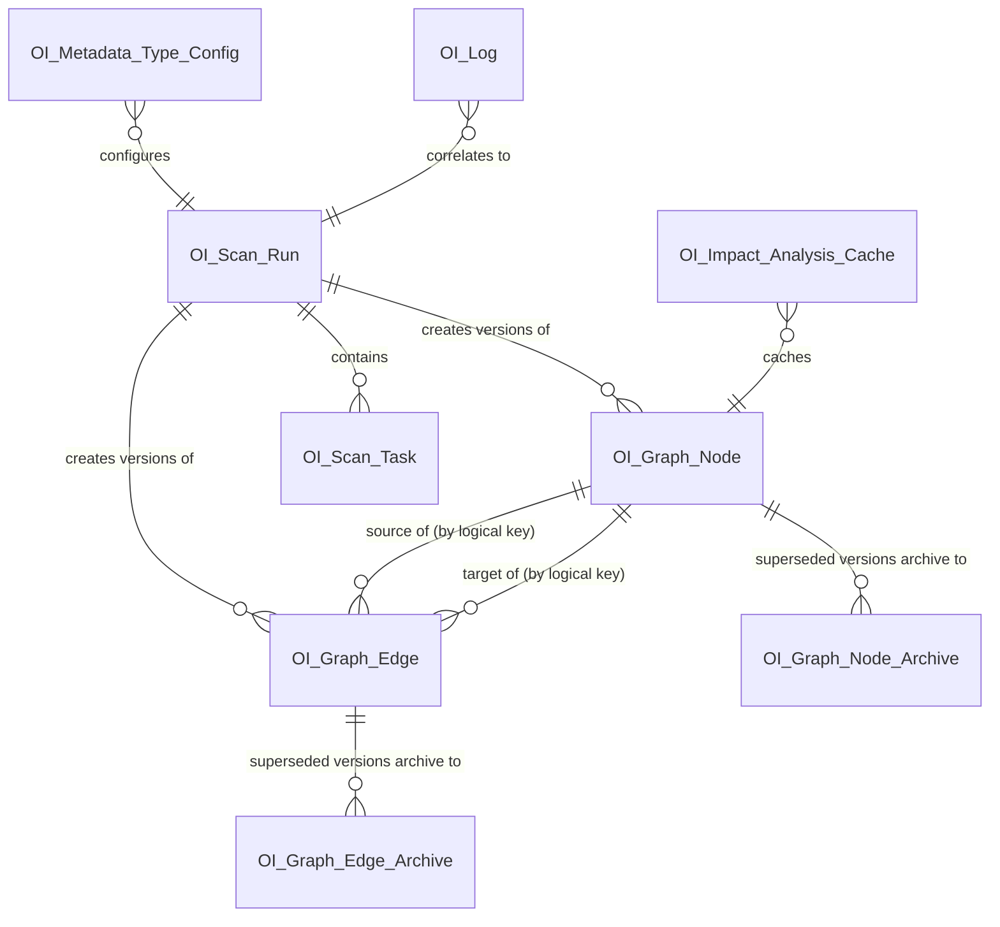

# Data Model — Salesforce Org Intelligence Platform

Status: Draft v1
Applies to: API v67.0

This document defines the platform's own persistence schema — the objects, fields, Big Objects, Platform Events, and Custom Metadata/Settings that back the engines described in [Architecture.md](Architecture.md). It does **not** define any customer business data; every object here is application-internal (see ADR-0006 for why these are Apex-boundary-secured rather than end-user-shared).

Naming: every package object/field carries the `OI_` prefix pre-namespace, becoming `<namespace>__OI_Xyz__c` once packaged. All custom fields use the `__c` suffix as usual; this doc omits it in prose for readability but includes it in field tables.

---

## 1. Entity Overview

`OI_Graph_Node`/`OI_Graph_Edge` are drawn as one-to-many from `OI_Scan_Run` deliberately — each carries potentially many version rows across many scan runs, not one row updated in place; the many-per-node relationship shown here *is* the versioning model (§2.3, §2.4, [ADR-0014](ADR/0014-immutable-node-edge-versioning.md)).

---

## 2. Standard Objects (Custom Objects, `__c`)

### 2.1 `OI_Scan_Run__c`
One row per scan execution (full or incremental). The unit of correlation for progress tracking, logging, and cache invalidation scoping.

| Field | Type | Notes |
|---|---|---|
| `Name` | Auto Number | `SCAN-{0000}` |
| `Status__c` | Picklist | `Queued`, `Running`, `Completed`, `CompletedWithErrors`, `Failed`, `Cancelled` |
| `Scan_Type__c` | Picklist | `Full`, `Incremental` |
| `Started_At__c` | DateTime | |
| `Completed_At__c` | DateTime | |
| `Triggered_By__c` | Lookup(User) | Who/what initiated the run (scheduled jobs still attribute to the scheduling user) |
| `Metadata_Types_Included__c` | Long Text Area | Snapshot of which `OI_Metadata_Type_Config__mdt` entries were active for this run |
| `Node_Count__c` | Number | Nodes touched (created/updated) this run |
| `Edge_Count__c` | Number | Edges touched this run |
| `Error_Count__c` | Number | Count of task-level failures |
| `Api_Call_Budget_Used__c` | Number | Self-tracked Tooling/Metadata API call consumption for this run (see Architecture §17) |

### 2.2 `OI_Scan_Task__c`
One row per metadata-type scanner invocation within a run — the per-scanner unit referenced in Architecture §6's failure-isolation model. This object tracks orchestration outcome only; the actual discovered data (the Discovery Model, [MetadataScanner.md](MetadataScanner.md) §5) is never persisted here or anywhere else — it exists only in-memory within the Queueable hop that produced it, handed directly to `OI_MutationGenerator` (§24 Open Question in MetadataScanner.md revisits whether this should ever change).

| Field | Type | Notes |
|---|---|---|
| `Scan_Run__c` | Master-Detail(`OI_Scan_Run__c`) | |
| `Metadata_Type__c` | Text(80) | e.g. `CustomObject`, `ApexClass`, `Flow` — this is the Scanner's own `componentKind` vocabulary, not a Graph `typeKey` ([MetadataScanner.md](MetadataScanner.md) §5) |
| `Status__c` | Picklist | `Pending`, `Running`, `Succeeded`, `Failed`, `Skipped` |
| `Records_Scanned__c` | Number | |
| `Records_Changed__c` | Number | Delta-detected changes (incremental scans) — detected via API-level watermark filtering (below), not via any comparison against graph state ([MetadataScanner.md §8](MetadataScanner.md#8-incremental-scanning)) |
| `Is_Full_Snapshot__c` | Checkbox | Mirrors `OI_DiscoveryBatch.isFullSnapshot` — must only be set `true` if every chunk of this type's fetch succeeded; gates whether `OI_MutationGenerator` performs retire-detection for this task ([MetadataScanner.md §9, §21](MetadataScanner.md#9-full-scanning)) |
| `Last_Successful_Watermark__c` | DateTime | The `sourceModstamp` cursor from the most recent successful run of this type — read by the Scanner to request only records changed since this point where the source API supports it ([MetadataScanner.md §8](MetadataScanner.md#8-incremental-scanning)) |
| `Retry_Attempt_Count__c` | Number | Tracks retries against the configured attempt cap ([MetadataScanner.md §11](MetadataScanner.md#11-retry-strategy)) |
| `Error_Message__c` | Long Text Area | Sanitized failure summary; full detail lives in `OI_Log__c` via `Correlation_Id__c` |

### 2.3 `OI_Graph_Node__c`
The canonical node **version** table backing the Graph Engine (Architecture §5, full spec in [GraphEngine.md](GraphEngine.md)). **One row per version, not one row per node** — this is the schema-level consequence of immutable versioning ([ADR-0014](ADR/0014-immutable-node-edge-versioning.md)): a node with three content changes over its lifetime has three rows here, all sharing the same `Node_Key__c`, exactly one of them with `Is_Current__c = true`.

| Field | Type | Mutable after insert? | Notes |
|---|---|---|---|
| `Node_Version_Key__c` | Text(255), **External ID, Unique, Indexed** | No | `{Node_Key__c}::v{Version_Number__c}` — the actual unique identity of this row. Takes over the External ID role `Node_Key__c` held before versioning. **Corrected from Text(300) during Sprint 7 implementation**: 255 characters is the platform's hard ceiling for a Text field — 300 was never deployable. `Node_Key__c` values approaching 255 characters combined with a version suffix can theoretically exceed this; in practice domain-assigned keys are far shorter, and this is accepted as a documented limitation rather than solved with a schema redesign (CLAUDE.md's "closest package-safe design" guidance). |
| `Node_Key__c` | Text(255), Indexed (**no longer unique**) | No | The *logical* node identity, shared across every version of this node. Domain-assigned. |
| `Version_Number__c` | Number | No | Monotonically increasing per `Node_Key__c`, starting at 1. |
| `Is_Current__c` | Checkbox, Indexed | **Yes — the one narrow exception, alongside `Last_Seen_Run__c` below** | True on exactly one row per `Node_Key__c` at any time. Flipped to `false` on the prior current row the instant a new version is inserted — this is the only value-change ever made to a row after it's first written, besides `Last_Seen_Run__c`. |
| `Node_Type__c` | Text(80), Indexed | No | Opaque type key (e.g. `SalesforceMetadata.Flow`), validated against `OI_Node_Type_Descriptor__mdt` at the Scanner boundary — **not** a Picklist. A Picklist is a closed set requiring a package deploy to extend a value; Text keeps new types addable via Custom Metadata alone. See [ADR-0011](ADR/0011-generic-node-edge-typing-via-domain-registry.md) and [GraphEngine.md §1–§3](GraphEngine.md#1-graph-philosophy). Trade-off accepted: loses automatic Picklist indexing — see GraphEngine.md §15 for why this is low-risk in practice. |
| `Label__c` | Text(255) | No | Display label |
| `Secondary_Key__c` | Text(255), Indexed | No | Generic alternate identifier, opaque to the engine — the domain layer populates it with whatever it considers a canonical handle (for Salesforce metadata, an API name; the engine has no concept of "API name"). Renamed from `Api_Name__c` — that name leaked a Salesforce-specific concept onto a table required to be domain-agnostic (GraphEngine.md §2). |
| `Parent_Key__c` | Text(255), Indexed, optional | No | **New, Sprint 5.** Opaque reference to another row's `Node_Key__c` — populated for component kinds with exactly one natural structural parent ([MetadataScanner.md §5](MetadataScanner.md#5-discovery-model)). Filter-only (an equality predicate, never a `FIND`-clause target) — exists to support [SearchEngine.md §11](SearchEngine.md#11-object-filtering--via-parentkey-never-via-traversal)'s object-scoped filtering without a graph traversal. See [ADR-0018](ADR/0018-denormalized-parent-key-for-search-scoping.md). |
| `Attributes_Json__c` | Long Text Area (131,072) | No | Type-specific attributes (e.g. field type, object sharing model) — schemaless by design since node shape varies per type |
| `State__c` | Picklist: `Discovered`, `Active`, `Stale`, `SoftDeleted` | No (a state change is a new version) | Lifecycle state ([GraphEngine.md §5](GraphEngine.md#5-node-lifecycle)) — a Picklist is fine here, unlike `Node_Type__c`, because this vocabulary is engine-owned infrastructure, not extensible domain vocabulary (GraphEngine.md §1's distinction). `Purged` rows don't appear here — they've been moved to the Big Object archive and removed. |
| `Graph_Scope__c` | Text(80), Indexed | No | Logical graph partition key; defaults to a single implicit value today (GraphEngine.md §4 extension point) |
| `First_Seen_Run__c` | Lookup(`OI_Scan_Run__c`) | No | The run that created *this version*. Set once. |
| `Last_Seen_Run__c` | Lookup(`OI_Scan_Run__c`) | **Yes — the other narrow exception** | Updated in place, only on the current row, when a later scan reaffirms this version's content unchanged (a liveness touch, not a new version — GraphEngine.md §7). |
| `Checksum__c` | Text(64) | No | Hash of scanner-normalized content for *this version*. Comparing an incoming observation's checksum against the current row's is exactly how the Builder decides new-version vs. liveness-touch vs. no-op (Architecture §6/ADR-0009, GraphEngine.md §7, §9). |

Indexing note: `Node_Version_Key__c` (External ID) is the row-level unique key; `Node_Key__c` and `Secondary_Key__c` remain indexed for logical-identity and search/exact-lookup purposes respectively, though `Node_Key__c` is no longer unique on its own. `Is_Current__c` is indexed and is required in the `WHERE` clause of essentially every query against this object outside an explicit history feature (GraphEngine.md §13, §15, §21) — this predicate is centralized in the Selector layer so it can never be omitted by accident. `Node_Type__c` no longer carries automatic Picklist indexing; it is always queried alongside an already-selective predicate in practice, so this is an accepted trade-off, not an oversight.

### 2.4 `OI_Graph_Edge__c`
The canonical edge **version** table (Architecture §5) — same one-row-per-version structure as `OI_Graph_Node__c` above, for the identical reason ([ADR-0014](ADR/0014-immutable-node-edge-versioning.md)).

| Field | Type | Mutable after insert? | Notes |
|---|---|---|---|
| `Edge_Version_Key__c` | Text(255), External ID, Unique, Indexed | No | `{Edge_Key__c}::v{Version_Number__c}` — takes over the External ID role `Edge_Key__c` held before versioning. Corrected from Text(300) — see the identical note on `OI_Graph_Node__c.Node_Version_Key__c` above. |
| `Edge_Key__c` | Text(255), Indexed (no longer unique) | No | The *logical* edge identity: `hash(SourceNodeKey + EdgeTypeKey + TargetNodeKey)`. |
| `Version_Number__c` | Number | No | Same rationale as the node table. |
| `Is_Current__c` | Checkbox, Indexed | Yes — narrow exception | Same rationale as the node table. |
| `Source_Node_Key__c` | Text(255), Indexed | No | Points to `OI_Graph_Node__c.Node_Key__c` — the *logical* key, not a specific node version (text reference, not a standard lookup — see rationale below). |
| `Target_Node_Key__c` | Text(255), Indexed | No | Same. |
| `Edge_Type__c` | Text(80), Indexed | No | Opaque type key (e.g. `SalesforceMetadata.References`), validated against `OI_Edge_Type_Descriptor__mdt` at the Scanner boundary — not a Picklist, same rationale as `OI_Graph_Node__c.Node_Type__c` ([ADR-0011](ADR/0011-generic-node-edge-typing-via-domain-registry.md)) |
| `Weight__c` | Number | No | Reserved for future ranking/impact-scoring use |
| `Attributes_Json__c` | Long Text Area (32,768) | No | Edge-specific metadata (e.g. which field on a lookup edge) |
| `State__c` | Picklist: `Discovered`, `Active`, `Stale`, `SoftDeleted` | No (a state change is a new version) | Same rationale as the node table (GraphEngine.md §6) |
| `Graph_Scope__c` | Text(80), Indexed | No | Same partition key as the node it belongs to |
| `First_Seen_Run__c` | Lookup(`OI_Scan_Run__c`) | No | Same rationale as the node table |
| `Last_Seen_Run__c` | Lookup(`OI_Scan_Run__c`) | Yes — narrow exception | Same rationale as the node table |

**Why text-reference keys instead of standard Lookup relationships**: nodes and edges are written independently and out of order during a scan (an edge may reference a node not yet scanned this run); a hard Lookup would force strict insert ordering and would break on cross-type references Salesforce relationship fields can't model generically (a `Lookup` field targets one specific object, but an edge's source/target can be *any* node type). External-ID-style text keys with app-level referential integrity (enforced in `OI_GraphRepository`, the only writer — [ADR-0012](ADR/0012-graph-repository-storage-gateway.md)) avoid this constraint — this is a deliberate trade of a small amount of DB-level integrity guarantee for the flexibility the graph model requires. Note also that `Source_Node_Key__c`/`Target_Node_Key__c` reference the *logical* node key, never a `Node_Version_Key__c` — an edge relates to "the node," not to one historical snapshot of it (GraphEngine.md §3), so a node gaining a new version never forces its edges to re-version.

### 2.5 `OI_Impact_Analysis_Cache__c`
Durable cache of Dependency Engine results (Architecture §7/§11), sitting alongside — not replacing — Platform Cache L1.

| Field | Type | Notes |
|---|---|---|
| `Node_Key__c` | Text(255), Indexed | |
| `Direction__c` | Picklist | `Forward`, `Reverse` |
| `Depth__c` | Number | Hop depth the result was computed for |
| `Result_Json__c` | Long Text Area (131,072) | Serialized `OI_ImpactResult` |
| `Computed_At__c` | DateTime | |
| `Expires_At__c` | DateTime | TTL enforced by `OI_CacheService`; also cleaned by the retention batch job |

### 2.6 `OI_Log__c`
Structured log sink, written asynchronously via `OI_LogEvent__e` subscriber (Architecture §13).

| Field | Type | Notes |
|---|---|---|
| `Timestamp__c` | DateTime | |
| `Level__c` | Picklist | `DEBUG`, `INFO`, `WARN`, `ERROR` |
| `Correlation_Id__c` | Text(36), Indexed | UUID per user action or scan run |
| `Source__c` | Text(255) | Originating class/method |
| `Message__c` | Long Text Area (4,096) | |
| `Stack_Trace__c` | Long Text Area (32,768) | `ERROR` only |
| `Running_User__c` | Lookup(User) | |

Retention: default 30 days (configurable via `OI_Settings__mdt`), enforced by `OI_LogRetentionBatch` (scheduled).

---

## 3. Big Objects

Under immutable versioning ([ADR-0014](ADR/0014-immutable-node-edge-versioning.md)), both nodes and edges now accumulate historical version rows, not just edges — so both get a Big Object archive, mirroring each other exactly.

**Platform limitation discovered during Sprint 7 implementation**: a Big Object index caps the combined length of every Text field it includes at 100 characters total. The five-field index this section originally specified (`Node_Version_Key__c` + `Node_Key__c` + `Version_Number__c` + `Scan_Run_Id__c` + `Archived_At__c`) could not fit — `Node_Version_Key__c`/`Node_Key__c` alone at their live-table length (255) exceed the ceiling many times over. The index is corrected below to `Node_Key__c` (60 chars) + `Version_Number__c` (10 digits) + `Archived_At__c` (DateTime, doesn't count toward the text ceiling) — the actual "look up history for this node, in order" access pattern the archive exists to serve. `Node_Version_Key__c` and `Scan_Run_Id__c` remain ordinary (non-indexed) fields on the object; they are not part of this index. `Node_Key__c`/`Edge_Key__c` are correspondingly capped at 60 characters on the archive objects only (still 255 on the live `OI_Graph_Node__c`/`OI_Graph_Edge__c` tables) — an accepted, documented limitation for very long domain-assigned keys, not solved with a redesign (CLAUDE.md's "closest package-safe design" guidance).

### 3.1 `OI_Graph_Node_Archive__b`
Append-only archive for node versions superseded by later scans or purged after soft-deletion (Architecture §5/§17, GraphEngine.md §5/§7.1) — keeps transactional storage bounded to the *current* version per node while preserving full history for trend/audit views on the roadmap.

| Field | Type | Notes |
|---|---|---|
| `Node_Version_Key__c` | Text(255) | Not part of the Big Object index — see the platform-limitation note above. |
| `Node_Key__c` | Text(60), Index field (part of Big Object index) | Logical node identity — the field a future history feature queries by. Capped at 60 chars on this archive object (255 on the live table) due to the Big Object 100-character index-length ceiling. |
| `Version_Number__c` | Text(10), Index field | Big Objects store numbers as text-comparable index fields; zero-padded for correct ordering. |
| `Scan_Run_Id__c` | Text(18) | Not part of the index (see note above); optional. |
| `Node_Type__c`, `Label__c`, `Secondary_Key__c`, `Parent_Key__c`, `State__c`, `Checksum__c` | Text / Long Text Area as appropriate | Full content snapshot of the superseded version — everything needed to reconstruct "what this node looked like at version N" without touching the live table |
| `Attributes_Json__c` | Long Text Area | |
| `Archived_At__c` | DateTime, Index field | |

### 3.2 `OI_Graph_Edge_Archive__b`
Append-only archive for edge versions, identical structure and rationale to §3.1.

| Field | Type | Notes |
|---|---|---|
| `Edge_Version_Key__c` | Text(255) | Not part of the Big Object index — see §3.1's platform-limitation note. |
| `Edge_Key__c` | Text(60), Index field | Same 60-character cap as `OI_Graph_Node_Archive__b.Node_Key__c`, same reason. |
| `Version_Number__c` | Text(10), Index field (zero-padded) | |
| `Scan_Run_Id__c` | Text(18) | Not part of the index; optional. |
| `Source_Node_Key__c` | Text | |
| `Target_Node_Key__c` | Text | |
| `Edge_Type__c`, `State__c` | Text | |
| `Archived_At__c` | DateTime, Index field | |
| `Attributes_Json__c` | Long Text Area | |

Big Objects trade synchronous query/DML for effectively unlimited async-queryable storage — appropriate here because archived versions are read only by an occasional "show history" feature (or, per GraphEngine.md §19, a future AI-generated change narrative), never on the interactive graph-browsing hot path. Both archives are written exclusively by `OI_GraphRepository`'s `OI_BigObjectStorageProvider` (GraphEngine.md §7.1) — nothing else touches them.

---

## 4. Custom Metadata Types (packageable configuration)

### 4.1 `OI_Node_Type_Descriptor__mdt` / `OI_Edge_Type_Descriptor__mdt`
The **Domain Type Registry** — added alongside [ADR-0011](ADR/0011-generic-node-edge-typing-via-domain-registry.md) as the home for the type vocabulary the Graph Engine itself deliberately doesn't own (full rationale in [GraphEngine.md](GraphEngine.md) §1, §7, §17). Two parallel metadata types: one consumed by the Metadata Scanner (what `typeKey`s exist, what they mean), one consumed by the Presentation layer (how to render them). Kept as two types rather than one because they change for different reasons and are read by different layers — the Scanner never needs icon/color data, and the UI never needs to know which Scanner class produces a type.

`OI_Node_Type_Descriptor__mdt`:

| Field | Type | Notes |
|---|---|---|
| `Type_Key__c` | Text(80) | e.g. `SalesforceMetadata.Flow` — the value that ends up in `OI_Graph_Node__c.Node_Type__c` |
| `Display_Label__c` | Text(255) | Human-readable name shown in filter panels |
| `Icon_Name__c` | Text(255) | SLDS icon token, resolved generically by the Canvas/Detail Panel — no LWC-side hardcoding per type ([GraphEngine.md §17](GraphEngine.md#17-rendering-contract-for-lwc)) |
| `Color_Token__c` | Text(40) | Design-token reference for node styling |
| `Search_Boost_Weight__c` | Number | **New, Sprint 5.** Admin-tunable ranking multiplier applied uniformly by `OI_SearchService` ([SearchEngine.md §14](SearchEngine.md#14-ranking-strategy)) — the identical mechanism, and the identical field name, `OI_Record_Search_Scope__mdt` (§4.4) uses for the Record domain, so one ranking concept spans both domains rather than two |

`OI_Edge_Type_Descriptor__mdt` mirrors this shape (`Type_Key__c`, `Display_Label__c`, plus a `Line_Style__c` token for edge rendering) for edge types.

### 4.2 `OI_Metadata_Type_Config__mdt`
Drives the Metadata Scanner's Strategy registry (Architecture §6, full spec [MetadataScanner.md §7](MetadataScanner.md#7-scanner-registry)) — adding support for a new metadata type is a metadata deploy, not an Apex code change to the orchestrator. This is the **Scanner Registry** — deliberately distinct from the Domain Type Registry (`OI_Node_Type_Descriptor__mdt`/`OI_Edge_Type_Descriptor__mdt`, §4.1); the two answer different questions for different, non-overlapping readers (Scanner vs. Mutation Generator/Presentation).

| Field | Type | Notes |
|---|---|---|
| `Metadata_Type_Api_Name__c` | Text(80) | e.g. `Flow` — this is a `componentKind` value in [MetadataScanner.md](MetadataScanner.md) §5 terms |
| `Enabled__c` | Checkbox | |
| `Scanner_Class__c` | Text(255) | Fully-qualified `OI_IMetadataScanner` implementation, resolved via `Type.forName` |
| `Batch_Size__c` | Number | Chunk size for this type's scan |
| `Priority__c` | Number | Scan-order hint within the orchestrator chain |
| `Preferred_Api__c` | Picklist | `Describe`, `UI`, `Tooling`, `Metadata`, `REST`, `SOQL` — mirrors the API Selection Priority in `CLAUDE.md`; `SOQL` added in Sprint 8 for `OI_ApexClassScanner` (plain SOQL against the standard `ApexClass` object — the original 5 values had no way to name this, the lightest tier the priority list itself defines) |
| `Min_Rescan_Interval_Minutes__c` | Number | A scheduled full-org run skips this type if its last successful scan is younger than this interval — avoids burning API budget rescanning a low-churn type on the same cadence as a high-churn one ([MetadataScanner.md §13](MetadataScanner.md#13-scan-scheduling)) |
| `Retry_Attempt_Cap__c` | Number | Overrides the org-wide default in `OI_Settings__mdt`, if a specific type's API tends to need more/fewer retries |

### 4.3 `OI_Settings__mdt`
Org-wide/hierarchical configuration (org default + optional per-profile or per-permission-set-group override pattern via Custom Metadata relationship, not Custom Settings, to remain packageable and versionable).

| Field | Type | Notes |
|---|---|---|
| `Cache_TTL_Minutes__c` | Number | L1 Platform Cache default TTL |
| `Max_Hop_Depth__c` | Number | Default/ceiling for graph expansion and dependency traversal |
| `Max_Traversal_Node_Count__c` | Number | Second, independent ceiling on total nodes visited per traversal call, regardless of hop depth — protects against high-fan-out nodes at shallow depth ([GraphEngine.md §12](GraphEngine.md#12-graph-traversal-algorithms)) |
| `Client_Cache_LRU_Size__c` | Number | L3 client-session cache eviction bound ([GraphEngine.md §14](GraphEngine.md#14-graph-caching-strategy)) |
| `Repository_Page_Size__c` | Number | Page size for `OI_GraphRepository.getCurrentKeysByType`'s keyset pagination, used by `OI_MutationGenerator`'s retire-detection ([GraphRepository.md §13](GraphRepository.md#13-pagination)) |
| `Storage_Migration_Mode__c` | Picklist: `Off`, `DualWrite`, `ReadNew`, `NewOnly` | Engine-owned infrastructure vocabulary (a Picklist is appropriate here, unlike `Node_Type__c` — [ADR-0011](ADR/0011-generic-node-edge-typing-via-domain-registry.md)'s distinction) gating the dual-write/verify/cutover/decommission storage migration pattern; defaults to `Off` and is not exercised until a real backend migration is undertaken ([GraphRepository.md §22](GraphRepository.md#22-storage-migration-strategy)) |
| `Min_Search_Query_Length__c` | Number | **New, Sprint 5.** Default 2 — below this, SOSL is skipped in favor of a SOQL prefix-match fallback ([SearchEngine.md §7, §17](SearchEngine.md#7-soql-strategy)) |
| `Default_Search_Page_Size__c` | Number | **New, Sprint 5.** Server-side clamp on caller-requested search `pageSize` ([SearchEngine.md §17](SearchEngine.md#17-search-limits)) |
| `Max_Search_Results__c` | Number | **New, Sprint 5.** Total results returned across pagination for one logical search session before `truncated = true` replaces further paging ([SearchEngine.md §16, §17](SearchEngine.md#16-pagination)) |
| `Enable_Record_Search__c` | Checkbox, default `false` | **New, Sprint 5.** Master switch for the Record Search domain — off by default; even with individual sObjects configured via `OI_Record_Search_Scope__mdt` (§4.4), Record Search stays disabled until this is explicitly turned on ([SearchEngine.md §12](SearchEngine.md#12-record-search), [ADR-0017](ADR/0017-search-provider-abstraction-record-search-outside-graph.md)) |
| `Max_Canvas_Working_Set__c` | Number | **New, Sprint 6.** Ceiling on the *cumulative* number of nodes held in the client's `GraphViewState` across all expand actions in one view — distinct from `Max_Traversal_Node_Count__c` (§4.3 above), which bounds a single traversal call, not the running total a long browsing session can accumulate. Hitting it surfaces an explicit "collapse something to continue" state, never a silent refusal or a silent eviction of currently-visible nodes ([GraphUI.md §26, §27](GraphUI.md#26-large-graph-handling)) |
| `Log_Level__c` | Picklist | `DEBUG`,`INFO`,`WARN`,`ERROR` |
| `Log_Retention_Days__c` | Number | |
| `Daily_Api_Call_Budget__c` | Number | Self-imposed Tooling/Metadata API ceiling per scan day (Architecture §17) |
| `Default_Scan_Schedule_Cron__c` | Text(64) | Optional; scans are opt-in, never auto-enabled on install |
| `Hierarchy_History_Retention_Days__c` | Number | **New, HA-13.** Default 365. Retention window for `OI_Hierarchy_Relationship_History__c` (ADR-0022's "no Big Object archival path yet" risk) — mirrors `Log_Retention_Days__c`'s pattern of shipping the config field ahead of its consuming batch job; no `OI_HierarchyHistoryRetentionBatch` exists yet, same as `OI_LogRetentionBatch`/F-7 |

### 4.4 `OI_Record_Search_Scope__mdt`
**New, Sprint 5.** The admin-controlled, opt-in allow-list of customer business sObjects eligible for Record Search ([SearchEngine.md §12](SearchEngine.md#12-record-search), [ADR-0017](ADR/0017-search-provider-abstraction-record-search-outside-graph.md)). Records themselves are never persisted or indexed by this platform — this Custom Metadata Type configures *which objects* `OI_RecordSelector` is permitted to query live, nothing more. Deliberately a separate type from every other registry in this platform (the Scanner Registry, the Domain Type Registry) — it answers a third, distinct question ("what business data may Search touch") that neither existing registry was built to answer.

| Field | Type | Notes |
|---|---|---|
| `SObject_Api_Name__c` | Text(80) | Target business object. |
| `Enabled__c` | Checkbox, default `false` | Off by default per row — nothing is searchable until explicitly opted in, mirroring `Enable_Record_Search__c`'s master-switch posture at the individual-object level. |
| `Display_Field_Api_Name__c` | Text(80), default `"Name"` | Which field supplies a result's `displayName` — not every object has a `Name` field, so this is configurable rather than assumed. |
| `Search_Boost_Weight__c` | Number | Identical ranking mechanism and field name as `OI_Node_Type_Descriptor__mdt.Search_Boost_Weight__c` (§4.1) — one ranking concept spans both search domains. |

---

## 5. Platform Events

### 5.1 `OI_Scan_Progress__e`
Publish-only progress channel for live UI updates (Architecture §6, §9).

| Field | Type |
|---|---|
| `Scan_Run_Id__c` | Text |
| `Metadata_Type__c` | Text |
| `Percent_Complete__c` | Number |
| `Status__c` | Text |

### 5.2 `OI_Cache_Invalidation__e`
Fired by the Metadata Scanner when a node/edge gains a new version (never on a liveness-only touch, since content hasn't changed — GraphEngine.md §7); consumed by `OI_GraphCache`'s subscriber, internal to the `OI_GraphEngine` facade, to evict exactly the affected L1 keys (Architecture §11, GraphEngine.md §14).

| Field | Type |
|---|---|
| `Node_Key__c` | Text |
| `Reason__c` | Text (`ScanUpdate`, `ScanDelete`, `ManualInvalidate`) |

### 5.3 `OI_Log_Event__e`
Decouples log writes from the caller's transaction (Architecture §13).

| Field | Type |
|---|---|
| `Level__c` | Text |
| `Correlation_Id__c` | Text |
| `Source__c` | Text |
| `Message__c` | Text (long) |
| `Stack_Trace__c` | Text (long) |

---

## 6. Permission Model Objects

Custom Permissions (assigned via package-shipped Permission Sets, never Profiles — Architecture §14):

| Custom Permission | Grants |
|---|---|
| `OI_View_Graph` | Read graph fragments, search, view impact analysis |
| `OI_Run_Scan` | Trigger scans, view scan run history |
| `OI_Manage_Settings` | Edit `OI_Settings__mdt`/`OI_Metadata_Type_Config__mdt` |
| `OI_View_Logs` | Read `OI_Log__c` via the admin console |
| `OI_Search_Records` | **New, Sprint 5.** Exposes the Record Search *capability* — visibility into individual records is still governed entirely by the org's own sharing/FLS/CRUD model, never by this permission alone ([SearchEngine.md §18](SearchEngine.md#18-security-and-sharing), [ADR-0006](ADR/0006-apex-boundary-security-model-for-app-internal-data.md)) |

Shipped Permission Sets: `OI_Viewer` (View_Graph only), `OI_Power_User` (+ Run_Scan), `OI_Administrator` (all five). `OI_Search_Records` is deliberately not bundled into `OI_Administrator` by default in this document's recommendation — Record Search's opt-in-by-design posture (§4.3, §4.4) extends to permission assignment too; customers compose it into their own Permission Set Groups only once they've explicitly enabled the feature.

---

## 7. Node/Edge Lifecycle Notes

Rewritten under immutable versioning ([ADR-0014](ADR/0014-immutable-node-edge-versioning.md)) — **there is no "update" in the old sense of a DML `UPDATE` against an existing row's content.** Every row, once inserted, keeps its content forever; what changes is which row is current.

- **Creation**: `OI_GraphRepository` inserts version 1 (`Version_Number__c = 1`, `State__c = Active`, `Is_Current__c = true`) the first time a `Node_Key__c`/`Edge_Key__c` is observed. Never a blind upsert.
- **Liveness touch (no new version)**: a later scan observes the same content (checksum matches the current row's `Checksum__c`). `OI_GraphRepository` updates `Last_Seen_Run__c` **in place** on the current row — the one narrow exception to immutability, alongside `Is_Current__c` itself (GraphEngine.md §2, §7).
- **New version (real change)**: a later scan observes different content, or a lifecycle transition occurs (Active→Stale, Stale→SoftDeleted, etc. — GraphEngine.md §5/§6). `OI_GraphRepository` inserts a new row (`Version_Number__c` incremented, new content and/or `State__c`), flips the prior current row's `Is_Current__c` to `false`, and never touches that prior row again. Cache invalidation (L1) is triggered for the affected node's neighborhood on this path, keyed off the checksum change (GraphEngine.md §14).
- **Deletion (of underlying org metadata)**: represented as a `State__c = SoftDeleted` new version, not a flag flip on an existing row — this lets the UI show "recently removed" state and lets Impact Analysis warn about dangling references before the node disappears entirely. After a full retention window with no reappearance, a scheduled job moves **every version row** for that `Node_Key__c`/`Edge_Key__c` (the complete history, not just the current one) to the Big Object archive (§3) and removes the live rows — this is what "Purged" means (GraphEngine.md §5).
- **Archival of non-current versions independent of deletion**: separately from the soft-delete/purge path above, non-current version rows for entities that are still `Active` (i.e., the node still exists, it just has an old superseded version sitting in the live table) also age out to the Big Object archive on a schedule, so a frequently-changing node's history doesn't accumulate indefinitely in the transactional table even while the node itself remains alive (GraphEngine.md §7.1, §21).
- **Storage growth control**: this lifecycle, combined with Big Object archival (§3) and log retention (§2.6), is what keeps the package's own storage footprint bounded in the subscriber's org — an explicit AppExchange Security Review and general good-citizenship concern (Architecture §17). This is also the primary mitigation for the version-row growth risk versioning introduces — see [GraphEngine.md §21](GraphEngine.md#21-risks) for the honest accounting, and [GraphEngine.md §24](GraphEngine.md#24-open-questions) for the still-open question of exactly what threshold triggers this archival pass.
