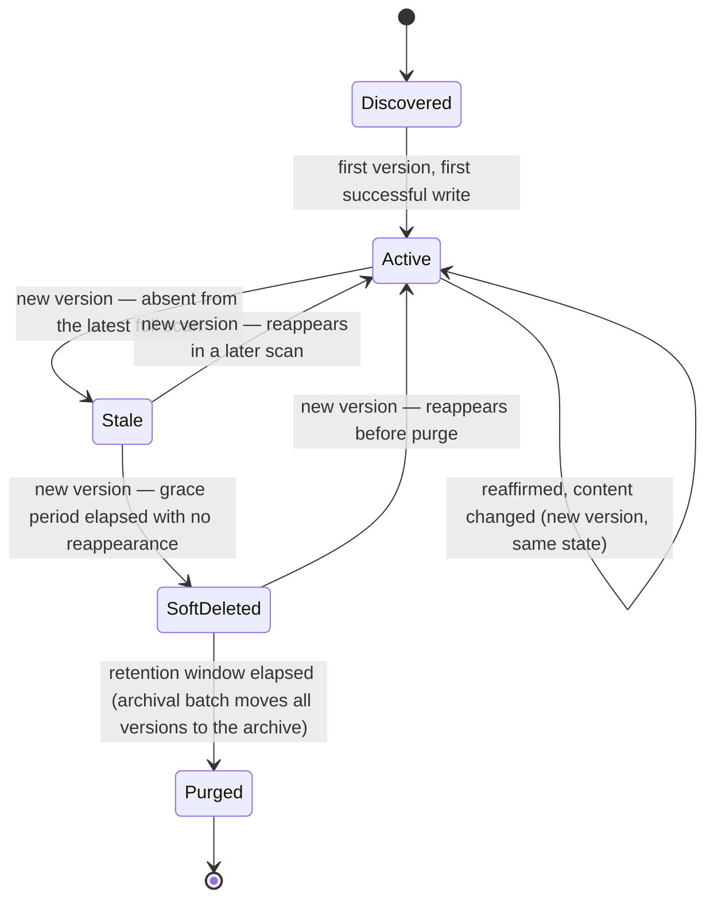

# Graph Engine — Salesforce Org Intelligence Platform

Status: Draft v1
Owner: Architecture
Applies to: API v67.0

The Graph Engine is the core of the platform. This document is its complete architectural specification: philosophy, data model, lifecycle, builder, serialization, loading strategy, traversal, search support, caching, performance, memory, the LWC rendering contract, the Apex↔LWC API contract, and forward-looking extension points (including AI). It contains no implementation code — only structure, contracts, and rationale.

**Governing constraint, stated once and enforced throughout this document: the Graph Engine must be completely generic. It has no knowledge of Objects, Fields, Flows, Apex, or any other Salesforce metadata concept. Everything it stores and traverses is a generic Node with an opaque type key, or a generic Edge with an opaque type key.** Salesforce-specific meaning is applied entirely by layers *above* the engine (the Metadata Scanner and a Domain Type Registry) and *outside* the engine (the Presentation layer's rendering registry). The engine's job is to be an excellent generic graph store and traversal service — nothing more.

---

## 0. Relationship to Prior Documents — What This Amends and Why

This document has been amended twice since first written. Both rounds are recorded here in full, because the second round changes *how nodes and edges persist*, which is exactly the kind of thing worth being able to trace later.

### Round 1 — Generic typing (`typeKey` instead of a closed enum)

[Architecture.md](Architecture.md) §5 and [ADR-0001](ADR/0001-graph-data-model-as-core-abstraction.md) established the graph-as-core-abstraction decision correctly, but described `NodeType`/`EdgeType` as **closed enumerations** ("Object, Field, ApexClass, Trigger, Flow..."). That was a mistake worth correcting before any schema was deployed: a closed enum baked into the engine means every new metadata type the Scanner learns to handle requires a Graph Engine change — which directly contradicts the engine being "generic" and contradicts `CLAUDE.md`'s extensibility and Open/Closed principles.

| Document | Section | Change | Reason |
|---|---|---|---|
| [ADR-0001](ADR/0001-graph-data-model-as-core-abstraction.md) | Decision | Amended — "graph over relational" stands; the closed-enum aspect is superseded | See [ADR-0011](ADR/0011-generic-node-edge-typing-via-domain-registry.md) |
| ADR/ | — | **ADR-0011** added | Formalizes generic typing via an externalized Domain Type Registry |
| [Architecture.md](Architecture.md) | §5 | Node/edge type description generalized, points here | Keep the flagship doc consistent with this correction |
| [DataModel.md](DataModel.md) | §2.3/§2.4 | `Node_Type__c`/`Edge_Type__c` changed from Picklist → Text(80), indexed; `Api_Name__c` renamed to `Secondary_Key__c` | A Picklist is a closed set requiring a package deploy to extend. `Api_Name__c` named a Salesforce-specific concept on a table that must not know what an API name is. |
| [DataModel.md](DataModel.md) | §4 | `OI_Node_Type_Descriptor__mdt` / `OI_Edge_Type_Descriptor__mdt` added | The Domain Type Registry needs a home |
| [API.md](API.md) | §2.1 | `getGraphFragment` gains `knownChecksums`; response gains `frontier[]` | Closes two gaps the original contract left implicit |
| [Backlog.md](Backlog.md) | Epic: Graph Engine | `GE-0` added ahead of `GE-1` | The Domain Type Registry is now a prerequisite |

### Round 2 — GraphRepository, the GraphEngine facade, and immutable versioning

Three further architectural decisions, made directly (not derived by this document — recorded here, elaborated below, and formalized as ADRs): (1) a **GraphRepository** layer is introduced so the Graph Builder never touches storage directly — `Scanner → Graph Builder → Graph Repository → Storage`, with Storage as a pluggable set of providers (Custom Objects, Big Objects, Platform Cache, future providers); (2) a **GraphEngine facade** becomes the *only* public entry point — external modules never call `GraphBuilder`, `GraphTraversal`, `GraphRepository`, `GraphSerializer`, or `GraphCache` directly; (3) **`GraphNode`/`GraphEdge` become immutable** — no in-place mutation after creation; a content or lifecycle-state change creates a new version rather than rewriting the existing one.

| Document | Section | Change | Reason |
|---|---|---|---|
| ADR/ | — | **ADR-0012, ADR-0013, ADR-0014** added | Formalize the Repository, Facade, and Immutable-Versioning decisions respectively |
| [ADR-0002](ADR/0002-hybrid-custom-object-big-object-graph-persistence.md) | Related | Pointer added to ADR-0012/0014 | The hybrid-storage decision stands; how it's accessed and how rows persist are now elaborated separately |
| [ADR-0003](ADR/0003-layered-architecture-with-dependency-inversion.md) | Related | Pointer added to ADR-0013 | The layered architecture stands; the Facade is a stricter, Graph-Engine-specific application of it |
| [Architecture.md](Architecture.md) | §2–§6, §11 | `OI_GraphService` renamed/reframed as the `OI_GraphEngine` facade composing five named sub-components; persistence language changed from "upsert" to "insert new version" | Keep the flagship doc's vocabulary aligned with this document |
| [DataModel.md](DataModel.md) | §2.3/§2.4 | `Node_Key__c`/`Edge_Key__c` demoted from unique External ID to plain indexed Text; new `Node_Version_Key__c`/`Edge_Version_Key__c` (unique External ID), `Version_Number__c`, `Is_Current__c`, `State__c` fields added | A logical node/edge now has many version rows, not one row updated in place |
| [DataModel.md](DataModel.md) | §3 | `OI_Graph_Node_Archive__b` added (parallel to the existing edge archive) | Nodes now accumulate historical versions too, not just retired edges |
| [API.md](API.md) | §1, §2.1, §2.3 | Explicit statement that Controllers call `OI_GraphEngine` only | Reinforces the facade rule at the contract-documentation boundary |
| [Backlog.md](Backlog.md) | Epic: Graph Engine | Items reworded around the facade/repository/versioning shape | Keep backlog items buildable in the right order |

Everything else in the prior documents — the layered architecture, service boundaries, hybrid Custom-Object/Big-Object persistence, incremental scanning, three-layer caching — holds and is *elaborated*, not contradicted, below. New top-level sections §21–§24 (Risks, Trade-offs, Alternatives Considered, Open Questions) consolidate reasoning that was previously scattered as inline callouts and add what Round 2 introduced.

### Round 3 — the Scanner does not produce Mutations

§7 below previously said each per-type Scanner (`OI_FlowScanner`, etc.) emits an "already-generic" `UpsertNode` Mutation directly. That was corrected once [MetadataScanner.md](MetadataScanner.md) made the Metadata Scanner's own blindness requirement explicit: a Scanner that constructs a `typeKey` has to know the Graph Engine's vocabulary, which is exactly the coupling this document's own genericity principle (§1) argues against, mirrored onto the other side of the seam. The Scanner now produces a **Discovery Model** ([MetadataScanner.md](MetadataScanner.md) §5), and a new, single component — the **Mutation Generator** (`OI_MutationGenerator`, [MetadataScanner.md](MetadataScanner.md) §15) — is the only thing that translates it into the Mutations `OI_GraphBuilder` consumes. Nothing about `OI_GraphBuilder`'s own contract (§7 below) changes — its input was always "a Mutation list from somewhere upstream"; what changes is only the identity and shape of that upstream caller. Full rationale: [ADR-0015](ADR/0015-discovery-model-graph-blind-scanner.md).

### Round 4 — GraphRepository gets its own document, and two real gaps in §7.1 are corrected

§7.1 below sketched the Graph Repository at summary depth — enough to establish the Storage Provider abstraction and the division of labor with `OI_GraphCache`, but not enough to catch two defects that only surfaced once this layer was designed at full depth in the new, dedicated [GraphRepository.md](GraphRepository.md): (1) the original five-operation contract described `insertVersion` and `flipCurrent` as two independently callable steps, which leaves a real partial-write corruption window (zero or two `Is_Current__c = true` rows for the same key) if a failure lands between them — corrected by merging them into one atomic `commitVersion` operation ([GraphRepository.md §6](GraphRepository.md#6-version-persistence--the-commitversion-atomicity-fix), [ADR-0016](ADR/0016-repository-atomic-commit-and-optimistic-concurrency.md)); (2) nothing in the original contract answered how `OI_MutationGenerator`'s retire-detection ([MetadataScanner.md §15](MetadataScanner.md#15-mutation-generation-boundary)) actually enumerates "everything the graph currently thinks exists of a given type" — added as a new, paginated `getCurrentKeysByType` operation ([GraphRepository.md §2](GraphRepository.md#2-graphrepository-interface), §13). A third correction, not a defect so much as an inconsistency with `CLAUDE.md`'s own stated rules: the Repository does not construct SOQL itself — every Custom Object read is delegated to `OI_NodeSelector`/`OI_EdgeSelector`, consistent with `CLAUDE.md`'s Selector/Repository split, which §7.1 had left unapplied to the Graph Engine's own Repository ([GraphRepository.md §12](GraphRepository.md#12-query-strategy--selector-delegation)). Concurrency handling for concurrent scan chains — a scenario Architecture §17's horizontal-scan-parallelization commitment makes real, and which no prior document addressed at all — is new content, not a correction, and is fully specified in [GraphRepository.md §15](GraphRepository.md#15-concurrency-handling).

| Document | Section | Change | Reason |
|---|---|---|---|
| ADR/ | — | **ADR-0016** added | Formalizes the atomic-commit and optimistic-concurrency decisions |
| [ADR-0012](ADR/0012-graph-repository-storage-gateway.md) | Status, Consequences, Related | Amended to point to ADR-0016/GraphRepository.md and reflect the corrected (still five-operation, different shape) contract | Keep the ADR consistent with the corrected design rather than the originally-sketched one |
| [ADR-0014](ADR/0014-immutable-node-edge-versioning.md) | Related | Pointer added to GraphRepository.md/ADR-0016 | The atomicity mechanics behind "flipped to `isCurrent = false`" now have a full specification |
| docs/GraphRepository.md | — | **New document** | The Repository's full 25-section specification — this document's §7.1 below is now a summary pointing to it, the same pattern §5/§6 of Architecture.md already use for pointing here |
| [Backlog.md](Backlog.md) | Epic: Graph Engine | GE-2a/GE-3 reworded; GE-3 (`OI_NodeSelector`/`OI_EdgeSelector`) becomes a dependency of GE-2a, not a peer | The Selector-delegation correction means the Repository cannot be built before its Selectors exist |

### Round 5 — a second generic field, `parentKey`, for Search's object-scoped filtering

Designing the Search Engine ([SearchEngine.md](SearchEngine.md)) surfaced a real gap: "scope this Field search to just the Fields on Account" has no answer in the Node model as it stood without a graph traversal — and Search is explicitly required to never perform one ([SearchEngine.md §11](SearchEngine.md#11-object-filtering--via-parentkey-never-via-traversal)). §2 below is amended to add **`parentKey`** — a second field, alongside `secondaryKey`, that is opaque to the engine and meaningful only to the domain layer: an optional reference to another node's logical `nodeKey`, populated once at ingestion by `OI_MutationGenerator` from a `parentComponentKey` the Scanner already faithfully knows for component kinds with exactly one natural structural parent ([MetadataScanner.md §5, §15](MetadataScanner.md#5-discovery-model)). This is the first concrete use of the "promoted attribute slot" extension point §2 already flagged as future work — narrower than the general mechanism (one field, not a configurable slot system), because one field is all the concrete need (§11) actually requires. Full rationale: [ADR-0018](ADR/0018-denormalized-parent-key-for-search-scoping.md).

| Document | Section | Change | Reason |
|---|---|---|---|
| ADR/ | — | **ADR-0017, ADR-0018** added | Formalize the Search Provider abstraction/Record Search boundary and the `parentKey` denormalization decision, respectively |
| docs/SearchEngine.md | — | **New document** | The Search subsystem's full 28-section specification — §13 below is now a summary pointing to it, the same pattern §7.1 uses for pointing to GraphRepository.md |
| [MetadataScanner.md](MetadataScanner.md) | §5, §15 | `OI_DiscoveredComponent.parentComponentKey` added; a `parentKey` pass-through step added to the Mutation Generator's translation mechanics | The Scanner already faithfully knows a component's natural parent (if it has one) — no new discovery work, just one more field carried through |
| [DataModel.md](DataModel.md) | §2.3, §3.1 | `Parent_Key__c` added to `OI_Graph_Node__c` and its archive mirror | Schema-level home for the new field |

### Round 6 — the Presentation Type Registry's delivery mechanism is decided

§17 below originally left an open "or" — "Custom Metadata **or** a versioned static resource, resolved at build time" — for how the registry actually reaches a running LWC session. Designing the Visual Graph UI ([GraphUI.md](GraphUI.md)) at full depth is what actually needed this resolved: a build-time-baked static resource would mean a new metadata type's styling requires a package push, directly contradicting the "new type = Custom Metadata record + Scanner class, zero deploy" promise every other document in this set makes for every other part of the platform. §17 is amended below: the registry is read at runtime, via a new `OI_SettingsController.getPresentationRegistry()` call, and cached client-side for the session — never baked into a static resource.

| Document | Section | Change | Reason |
|---|---|---|---|
| ADR/ | — | **ADR-0019, ADR-0020** added | Formalize the hybrid radial-graph visualization decision and the SVG rendering/vendored-layout-library decision, respectively |
| docs/GraphUI.md | — | **New document** | The Visual Graph UI's full 37-section specification |
| [API.md](API.md) | §2.5 | `OI_SettingsController.getPresentationRegistry()` added | New, minimal API surface needed to resolve §17's registry-delivery ambiguity |
| [DataModel.md](DataModel.md) | §4.3 | `Max_Canvas_Working_Set__c` added to `OI_Settings__mdt` | The client-side working-set ceiling [GraphUI.md §26](GraphUI.md#26-large-graph-handling) needs, distinct from the existing per-request traversal ceilings |

### Round 7 — Sprint 8 closes two real gaps found implementing the Metadata Scanner MVP

Building the first real Scanner → Discovery Model → Mutation Generator → Graph Builder → Repository pipeline (Sprint 8, [MetadataScanner.md](MetadataScanner.md)) surfaced two implementation-level gaps in this document's own contracts that had no answer until a real caller existed: (1) §2's Node Model requires the Graph Builder to stamp `firstSeenRunId`/`lastSeenRunId` on every version, but neither the `UpsertNode`/`RetireNode`/`UpsertEdge`/`RetireEdge` Mutation shape (§7) nor `OI_GraphEngine.ingest` carried a run identifier for it to use; (2) §15's retire-detection requires "a read-only, paginated call to `OI_GraphEngine`," but the Sprint 7 facade (§1.1) never actually exposed one. Both are additive, non-breaking closures of gaps this document already implied but never fully specified — not new design.

| Document | Section | Change | Reason |
|---|---|---|---|
| `OI_GraphMutation` | — | `scanRunId` added to the class and all 4 static factories | Closes gap (1) — `OI_MutationGenerator` resolves it from the `OI_Scan_Task__c` the batch belongs to and threads it through |
| `OI_GraphEngine` | §1.1 | `getCurrentActiveKeysByType(typeKey, cursor, pageSize, isEdgeFlavor)` added — a thin pass-through to `OI_GraphRepository.getCurrentKeysByType`, no business logic | Closes gap (2), fulfilling §15's own requirement rather than deviating from it |
| `OI_IGraphStorageProvider` / `OI_GraphRepository` | §7.1 | `touchLiveness` corrected from a single-key signature to `touchLiveness(Set<String> keys, Id runId, Boolean isEdgeFlavor)` | The Sprint 7 shape was itself the (unintentional) deviation from this document's own "every method is bulk-shaped by contract" claim (§7.1) — never exercised at bulk volume until Sprint 8's Graph Builder implementation made the gap concrete (a liveness-touch-heavy scan calling it once per key would query/DML-in-a-loop) |

Full rationale, plus the Discovery-Model-internal `componentKey` deviation (a deterministic string rather than a hash, needed for cross-batch `parentKey`/relationship-endpoint resolution — scoped to [MetadataScanner.md](MetadataScanner.md) §5 only, never touching `nodeKey`/`edgeKey`/`versionKey`, which remain real SHA-256 digests exactly as §2/§3 specify): [MetadataScanner.md](MetadataScanner.md)'s Sprint 8 amendment section and the Sprint 8 deliverables report.

---

## 1. Graph Philosophy

Two words matter more than any other design choice here: **generic** and **bounded**.

**Generic** means the engine's vocabulary is exactly three concepts — Node, Edge, and Graph Fragment — and nothing else. It does not have a `NodeType` enum with Salesforce values. It does not have a field called "API Name." It does not know that a Flow can call an Apex class, or that a field belongs to an object. All of that meaning is assigned by a **Domain Type Registry** (owned by the Metadata Scanner domain, §7) and consumed by the Presentation layer's rendering registry (§17) — never baked into the engine itself.

This is not genericity for its own sake. It buys three concrete things:

1. **Open/Closed compliance for real** — adding a new metadata type (say, a future Salesforce feature the Scanner learns to read) is a Custom Metadata record plus a new Scanner class. Zero Graph Engine code changes, zero new package version required for the engine itself.
2. **Reusability beyond metadata** — because the engine has no Salesforce-metadata assumptions, it can, without modification, model *any* typed graph a future feature wants to feed it (org-vs-org drift diffs, a future DevOps/CI graph, anything — see §20). This wasn't a stated requirement, but it falls out for free from doing genericity properly, and costs nothing extra to obtain.
3. **A genuinely thin, stable core** — the highest-risk, most load-bearing component in the platform is also the smallest and least likely to need to change once built. Everything volatile (which metadata types exist, how they're scanned, how they're styled) lives in layers that change constantly around a stable core.

**Bounded** means the engine never materializes, returns, or traverses "the whole graph." Every read has a hop limit *and* a node-count ceiling (§12); every write is chunked; every cache entry has a size and a TTL. This is a restatement of Architecture.md §1's "never load an entire org," made specific to every operation this engine exposes.

> **What "generic" does *not* mean**: the engine is not agnostic about graph-infrastructure concepts like versioning, scan-run scoping, lifecycle state, or checksums — those are properties of *any* graph, regardless of domain, and the engine owns them. Genericity is about domain *vocabulary* (Object/Field/Flow/Apex), not about graph *mechanics*.

---

## 1.1 GraphEngine Facade — The Only Public Entry Point

Everything described in this document is real internal structure, not real *public* structure. `GraphEngine` (`OI_GraphEngine`) is the single class every external module is allowed to call for anything graph-related. Internally it composes five named, single-responsibility sub-components, none of which are ever called directly from outside the facade:

```
OI_GraphEngine  (facade — the only public surface)
├── OI_GraphBuilder      — §7,  ingestion: turns Mutations into version-aware writes
├── OI_GraphRepository   — §7.1, the only component that touches Storage
├── OI_GraphTraversal    — §12, BFS/DFS over Repository-supplied data
├── OI_GraphSerializer   — §8,  persisted / wire / cache representation shaping
└── OI_GraphCache        — §14, fragment-result caching policy
```

**Who "external" means, concretely**: `OI_GraphController`, `OI_DependencyController` (Architecture §4/API.md), `OI_DependencyEngineService` (which reads the graph but must do so through the facade, not by reaching into `OI_GraphTraversal`/`OI_GraphRepository`/Selectors itself), `OI_SearchService` (if it ever needs graph reads beyond its own indexed fields), and `OI_MetadataScanService` (which ingests through the facade's Builder-facing method, not by holding a reference to `OI_GraphBuilder`). This is a direct tightening of Architecture §4's service-boundary rule ("a service may call another service's public API; it may never call another service's Selector/Repository/Adapter directly") — applied one level deeper, *inside* what was previously described as a single `OI_GraphService`.

**Facade method shape**: every `OI_GraphEngine` method is a thin pass-through — it validates nothing itself beyond routing, delegates to exactly one sub-component (occasionally two, e.g. a fragment read asks `OI_GraphCache` first and falls through to `OI_GraphTraversal` + `OI_GraphRepository` on a miss), and returns that sub-component's result. **No business logic lives in the facade itself.** This constraint is deliberate and is revisited in §21 (Risks) — a facade that accumulates logic of its own stops being a facade and becomes a second god-object sitting in front of the first one.

**What this replaces**: earlier drafts of this document and of Architecture.md referred to a single `OI_GraphService` responsible for "build, expand, filter." That name and shape are superseded — `OI_GraphEngine` is the facade; "build" is `OI_GraphBuilder`'s job (via `OI_GraphRepository`); "expand/filter" is `OI_GraphTraversal`'s job. This is not a renaming for its own sake — splitting one class's stated responsibilities across four named, independently testable components is a direct application of Single Responsibility, made necessary by the fact that "build" and "expand" now have materially different rules to follow (Builder must never touch storage directly; Traversal must never write).

---

## 2. Node Model

**`GraphNode` is immutable.** Once constructed — in memory as an Apex value object, and once persisted as a version row — a node's content is never rewritten. There are two distinct places this principle applies, and they are easy to conflate, so they're stated separately:

1. **In-memory immutability** (the Apex value object): `OI_Node` has no setters and no fields that change after construction. "Updating" a node in code always means producing a *new* `OI_Node` instance, never mutating an existing reference. This is uncontroversial, costs nothing, and is a plain application of good value-object design — every method that would conceptually "change" a node (e.g., applying a new attribute) returns a new instance.
2. **Persisted immutability** (the version row): this is the substantial decision. A node's *content* fields, once written to a version row, are never updated by a subsequent DML statement against that row. A content or lifecycle-state change is recorded as a **new row** — a new version — never as an `UPDATE`/`upsert` of the existing one. The full mechanics, including one narrow, explicitly-justified exception, are in §7 (Graph Builder) and §7.1 (Graph Repository); this section defines the fields the model carries.

| Field | Type | Mutable after creation? | Who assigns it | Notes |
|---|---|---|---|---|
| `nodeKey` | opaque string | No | Domain layer (Scanner) | The *logical* node identity, stable across every version of this node. Not, by itself, unique in storage once versioning is introduced — see §7.1. |
| `versionNumber` | integer | No | Engine (Graph Builder) | Monotonically increasing per `nodeKey`, starting at 1. Assigned once, at version creation. |
| `versionKey` | opaque string | No | Engine (Graph Builder) | `hash(nodeKey + versionNumber)` — the actual unique identity of *this row*, used for upsert-free inserts (§7.1). |
| `typeKey` | opaque string | No | Domain layer, via the Type Registry | Convention: `<domain>.<type>`, e.g. `SalesforceMetadata.Flow`. The engine treats this as an uninterpreted string; it does not validate it against the registry (that happens at the Scanner/Builder boundary — see §7). A `typeKey` change is content, so it produces a new version like any other content field. |
| `label` | string | No | Domain layer | Display text. |
| `secondaryKey` | opaque string, optional | No | Domain layer | Generic alternate identifier (replaces `Api_Name__c`, see §0 Round 1). |
| `parentKey` | opaque string, optional | No | Domain layer | **New, §0 Round 5.** An optional reference to another node's logical `nodeKey`, for component kinds with exactly one natural structural parent (a Field's parent is its Object). Opaque to the engine — a graph-mechanics fact (an optional reference), never a domain-vocabulary one — exactly the same genericity treatment as `secondaryKey`. Used by Search for object-scoped filtering ([SearchEngine.md §11](SearchEngine.md#11-object-filtering--via-parentkey-never-via-traversal)) without a traversal; never resolved or dereferenced by the engine itself. |
| `attributes` | opaque key-value bag (JSON) | No | Domain layer | Type-specific detail. Schemaless by design — see the trade-off discussion below. |
| `checksum` | opaque string, optional | No | Domain layer | Content hash. Comparing an incoming checksum against the *current version's* checksum is exactly how the Builder decides whether a new version is needed at all (§7). |
| `graphScope` | opaque string, optional, defaults to a single implicit value | No | Domain layer | Logical graph partition key (§4). |
| `state` | enum (engine-owned) | **Indirectly, via a new version** | Engine (Graph Builder) | Lifecycle state — §5. A state transition (e.g. Active→Stale) always produces a new version, even with unchanged content — the transition itself is meaningful history worth preserving immutably. |
| `firstSeenRunId` | opaque string | No | Engine (Graph Builder) | Set once, at this version's creation. Never updated. |
| `lastSeenRunId` | opaque string | **Yes — the one narrow exception** | Engine (Graph Builder) | See callout below. |
| `isCurrent` | boolean | **Yes — the other narrow exception** | Engine (Graph Builder) | True on exactly one version row per `nodeKey` at any time — the one currently authoritative for reads. Flipped to `false` on the prior current row the instant a new version is created. |

**Deliberately absent**: no `NodeType` picklist, no per-type typed columns, no relationship fields. Anything type-specific lives in `attributes`.

> **The two narrow exceptions to immutability, stated precisely, because glossing over them would be dishonest**: `lastSeenRunId` and `isCurrent` are the only fields ever updated in place on an existing row, and only on the row currently marked `isCurrent = true`. Neither is *content* — they are bookkeeping *about* a version (when was it last reconfirmed live, is it still the current one), exactly analogous to how §1 already draws a line between domain vocabulary (which the engine must be generic about) and graph mechanics (which the engine owns and manages directly). Here the same kind of line is drawn between a version's *content* (immutable, forever) and *bookkeeping about the version* (the two fields above, mutable, engine-owned). Why this exception exists at all, and what it costs to close it, is discussed honestly in §21–§24 rather than hidden.

### Design trade-off: JSON attribute bag vs. a generic key-value child object

Considered and rejected: a child object (`OI_Node_Attribute__c` with `Node__c`/`Key__c`/`Value__c`) would make individual attributes SOQL-filterable and reportable (e.g., "all fields of type Currency" as a real filter, not just full-text search). Rejected for v1 because it multiplies row count by the average attribute count per node (5–20×) — a real storage and bulk-DML cost at the scale this product targets (Architecture §17), now compounded further by versioning (every new version would multiply the child rows again) — and turns every bulk fragment fetch into either an N+1 query pattern or a large `IN`-clause join. The JSON bag keeps writes single-row and bulk-cheap.

This is flagged as an **extension point (§20)**, not closed off: if a proven customer need emerges for structured attribute filtering beyond full-text search, the middle ground is a small number of *promoted* attribute slots (e.g., three generic `PromotedAttr1_Key__c`/`PromotedAttr1_Value__c` pairs per node) that the Domain Type Registry opts specific attributes into per type — bounded row growth, targeted filterability, no full key-value explosion.

---

## 3. Edge Model

**`GraphEdge` is immutable**, under the identical two-level principle as §2: the in-memory `OI_Edge` value object has no setters, and a persisted edge's content is never rewritten — a content or lifecycle-state change produces a new version row, with the same two narrow bookkeeping exceptions (`lastSeenRunId`, `isCurrent`).

| Field | Type | Mutable after creation? | Who assigns it | Notes |
|---|---|---|---|---|
| `edgeKey` | opaque string | No | Domain layer | The *logical* edge identity: `hash(sourceNodeKey + typeKey + targetNodeKey)`. Stable across every version of this edge. |
| `versionNumber` / `versionKey` | as Node | No | Engine (Graph Builder) | Same rationale as §2. |
| `typeKey` | opaque string | No | Domain layer, via the Type Registry | Same convention/rules as node `typeKey`. |
| `sourceNodeKey` / `targetNodeKey` | opaque string | No | Domain layer | References the *logical* `nodeKey` (§2), not a specific node version — an edge relates to "the node," not to one historical snapshot of it, so an edge is never re-versioned solely because the node it points to gained a new version. Text references, not standard Lookups — nodes and edges are written independently and out of order within a scan (§7.1); a hard relationship field would force insert ordering the Builder does not guarantee. |
| `attributes` | opaque key-value bag | No | Domain layer | Edge-specific detail (e.g., which field on a lookup-type edge). |
| `weight` | number, optional | No | Domain layer | Generic numeric hook; reserved for future ranking use (§20). |
| `state` | enum (engine-owned) | Indirectly, via a new version | Engine | Lifecycle state — §6. |
| `graphScope`, `firstSeenRunId` | as Node | No | Engine/Domain | Same rationale as Node. |
| `lastSeenRunId`, `isCurrent` | as Node | Yes — the two narrow exceptions | Engine | Same rationale as Node (§2). |

### Design decision: all edges are directed, always

Some real-world relationships are naturally symmetric (a generic "related to" association). Rather than teach the engine to special-case a `symmetric` flag and branch traversal logic on it, the rule is: **every edge is directed, full stop.** A symmetric relationship is represented by the domain layer emitting *two* directed edges (A→B and B→A). This keeps every traversal algorithm in the engine (§12) uniform — one code path, no directionality branching — which is a direct application of `CLAUDE.md`'s "prefer simple architecture that scales over complicated architecture that appears enterprise." The cost (twice the edge rows for symmetric relationships) is small and worth paying for the simplification.

---

## 4. Graph Model

A "Graph" is not a stored entity — there is no single row representing "the graph." A Graph is the logical set of all Nodes and Edges sharing a `graphScope`. By default there is exactly one implicit scope (the org being scanned), so this costs nothing today, but it is what enables, without any schema change later:

- Multiple logical graphs in one physical store (e.g., a future "sandbox vs. production drift" comparison, Backlog PG-5).
- A "diff graph" between two scan runs, computed and stored as its own scoped node/edge set rather than requiring a bespoke comparison feature bolted onto the main graph.

### Graph Fragment

The engine never returns "the graph" — only a **Graph Fragment**, the sole shape ever crossing the engine's public boundary:

```
GraphFragment {
  centerNodeKey?: string
  nodes: NodeSummary[]        // key, typeKey, label, secondaryKey, state — NOT full attributes (see §10)
  edges: EdgeSummary[]        // key, typeKey, sourceNodeKey, targetNodeKey
  frontier: string[]          // node keys included above whose neighbors were NOT fetched —
                               // i.e., "these are expandable; ask again to go further"
  hasMore: boolean
  nextCursor?: string
}
```

The `frontier` field is a concrete addition over the original `OI_GraphFragmentDTO` sketch in Architecture.md/API.md: without it, the client has no way to know which visible nodes have unexplored neighbors short of re-querying. With it, the Canvas can render an "expandable" affordance (e.g., a `+` badge) directly from the fragment response, with no extra round-trip (§11, §18).

---

## 5. Node Lifecycle

Lifecycle state is engine-owned infrastructure (§1's distinction), driven entirely by the Graph Builder reacting to scan outcomes — never set directly by the domain layer or the UI. Under immutable versioning (§2), **every state transition below is recorded as a new version row** — the previous version's content (including its `state` value) is never rewritten; a transition inserts a new row carrying the new `state`, and flips `isCurrent` on the old row to `false`. The one transition that does *not* create a new version is the self-loop "Active, reaffirmed, nothing changed" case — that's a liveness touch, not a transition, and is called out explicitly below.



- **Discovered → Active**: the Graph Builder inserts version 1 from the first mutation observed for this `nodeKey`. `isCurrent = true`.
- **Active → Active, liveness touch (no new version)**: a subsequent scan's checksum matches the current version's checksum exactly — nothing about the node changed, it was simply seen again. The Builder updates `lastSeenRunId` **in place** on the current row (the one narrow exception from §2) and stops there. This is the case that keeps incremental scanning (ADR-0009) from being defeated by versioning: most nodes, most scans, take this path, and it costs one small field update, not a new row.
- **Active → Active, new version (content changed)**: the incoming checksum differs from the current version's. The Builder inserts a new version with the new content, flips the prior current row's `isCurrent` to `false`, and does not otherwise touch that prior row again — it is now permanent history.
- **Active → Stale**: the node's underlying entity was not observed in the most recent *full* scan of its type. A new version is inserted (`state = Stale`, content otherwise carried forward unchanged) — the transition itself is worth an immutable record, even though nothing about the node's *content* changed. Incremental scans don't drive this transition (they don't look everywhere), which is exactly why full rescans, though more expensive, remain necessary periodically (Roadmap Phase 3).
- **Stale → SoftDeleted**: after a configurable grace period (`OI_Settings__mdt`) with no reappearance — a new version records the transition.
- **SoftDeleted → Purged**: retention window elapses; a scheduled batch job moves **every version row** for this `nodeKey` (not just the current one — the whole history) to `OI_Graph_Node_Archive__b` (DataModel §3) and removes the live rows.

Edges follow the identical state machine, with one addition: an edge referencing a node that has reached `SoftDeleted` or `Purged` is itself force-transitioned to `Stale` (a new edge version) regardless of its own scan status — a relationship can't be more "active" than the thing it points at.

> **Build status (Sprint 11 amendment):** this write-time cascade is not built — `OI_MutationGenerator` only retires nodes/edges directly observed missing from a full snapshot of their own `componentKind`; it does not walk edges off a node it just retired (disclosed independently in MetadataScanner.md §0.1). As a read-time safety net (not a substitute for the cascade), `OI_GraphTraversal.expand` filters any edge whose source or target key has no current version row out of the returned fragment, so a stale edge can never reach the UI referencing a node the client wasn't also given. Building the actual write-time cascade remains open Roadmap work.

---

## 6. Edge Lifecycle

Same state machine and same liveness-touch-vs-new-version distinction as §5, applied per-edge. One additional nuance specific to edges: because edges may legitimately arrive referencing a node not yet persisted this run (out-of-order scan writes, §3/§7.1), a newly-arrived edge whose endpoint doesn't yet exist is persisted directly as version 1, `state = Active` (not blocked), on the expectation the endpoint will be resolved before the run completes. A lightweight, non-blocking **dangling-edge sweep** runs at the end of each scan run — not as a hard constraint during ingestion, but as an observability check — and any edge still dangling after the run completes is logged (not rejected) for investigation; this is deliberately eventual-consistency-over-strict-referential-integrity, a trade-off necessitated by bulk Apex DML ordering, not an oversight.

---

## 7. Graph Builder Architecture

The Graph Builder is the *only* component permitted to decide that a node or edge should change. Its public contract, reachable only through the `OI_GraphEngine` facade (§1.1), is a single generic ingestion operation over a **Mutation** list — this is the seam that keeps the engine's promise of knowing nothing about Salesforce metadata:

| Mutation | Fields | Semantics |
|---|---|---|
| `UpsertNode` | nodeKey, typeKey, label, secondaryKey, attributes, checksum, graphScope | An **observation**, not a storage instruction — see the decision logic below. `OI_MutationGenerator` is saying "this was observed with this content," nothing more; the Builder decides what, if anything, that implies for storage. |
| `RetireNode` | nodeKey | An observation that this node was not seen — drives Active/Stale → SoftDeleted transition candidacy (subject to grace period, §5), always as a new version. |
| `UpsertEdge` | edgeKey, typeKey, sourceNodeKey, targetNodeKey, attributes, weight?, graphScope | Same "observation" semantics as `UpsertNode`, edge-scoped. |
| `RetireEdge` | edgeKey | Same as `RetireNode`, edge-scoped. |

**Who produces mutations**: `OI_MutationGenerator` — *not* the Graph Builder, and, as of [MetadataScanner.md](MetadataScanner.md) (§0 Round 3), *not* the Scanner either. The Metadata Scanner produces a Discovery Model expressed in Salesforce's own vocabulary (`componentKind`, e.g. `Flow`), knowing nothing about `typeKey`s or Mutations at all ([MetadataScanner.md](MetadataScanner.md) §1, §5). `OI_MutationGenerator` is the one component that translates "this is a Salesforce Flow with these properties" into a generic `UpsertNode{typeKey: "SalesforceMetadata.Flow", ...}` mutation ([MetadataScanner.md](MetadataScanner.md) §15). The translation happens entirely in that one component, at the boundary, before the Builder ever sees the data — the Builder's input is always already-generic, and the Builder never knows *why* an observation looks the way it does, only what to do with it.

### The Builder's decision logic — this is the heart of immutable versioning

Because storage is now version-aware (§2, §7.1) and the Builder itself never touches storage (**the Graph Builder must never directly access storage — every read and write goes through `OI_GraphRepository`**), processing a batch of `UpsertNode`/`UpsertEdge` observations is a three-way decision per key, made by comparing each observation against the *current* version the Repository reports back:

1. **No current version exists** → this is a genuinely new node/edge. The Builder asks the Repository to insert version 1, `state = Discovered` immediately followed by `Active`, `isCurrent = true`.
2. **A current version exists and its checksum matches the observation's checksum** → nothing changed; this is a liveness touch. The Builder asks the Repository to update `lastSeenRunId` **in place** on that current row — no new version, per §2's narrow exception.
3. **A current version exists and its checksum differs** → real content change. The Builder asks the Repository to insert a new version (incrementing `versionNumber`) carrying the new content, and to flip the prior current row's `isCurrent` to `false`.

`RetireNode`/`RetireEdge` follow a parallel two-way decision: if the current version's `state` is already the target lifecycle state, no action (idempotent); otherwise, insert a new version carrying the new `state` (§5/§6), flipping the prior row's `isCurrent`.

**Why this has to be bulk-shaped, not per-observation**: step 1 requires knowing, for an entire incoming batch of observations, which keys already have a current version and what its checksum is — a single round-trip to the Repository asking "give me the current version for this whole set of keys" (never one lookup per observation, which would be exactly the kind of query-in-a-loop CodingStandards §4 forbids). The Builder assembles its full decision set (which observations are new / liveness-only / content-changed / state-changed) *before* issuing any write, then issues one bulk write call to the Repository per decision category.

**What the Builder validates** (and only this — generic invariants, never domain rules):
- Keys are non-null and non-empty.
- No edge references itself as both source and target unless an explicit `attributes.allowSelfLoop` flag is present (a generic escape hatch, not a domain rule — the Builder doesn't know *why* a self-loop might be legitimate, only that one was explicitly declared intentional).
- Mutation batches are bulk-shaped (a list, never a single-mutation call in a loop) — enforced as a hard API shape, not just a convention, per CodingStandards §4's bulkification rules.

**Ordering and idempotency**: within one scan run, mutations across scanner types can arrive in any order without corrupting state (§3's rationale) — an edge observation whose endpoint node hasn't been observed yet in this run is still accepted (§6). Replaying the identical observation twice in the same run (same key, same checksum) is a no-op past the first liveness touch — subsequent identical touches simply re-confirm `lastSeenRunId` redundantly, which is harmless. The Builder processes mutation batches transactionally at `OI_Scan_Task__c` granularity (matching Architecture §6's per-scanner failure isolation) — a batch failure fails that task, not the whole run.

---

## 7.1 Graph Repository Architecture

`OI_GraphRepository` is the **only** component, anywhere in the platform, that issues a storage operation against node/edge data — no exceptions. The Graph Builder decides *what* should happen (§7); the Repository is the only thing that knows *how*, and *where*, it's actually stored. This is the concrete form of the required flow: `Scanner → Graph Builder → Graph Repository → Storage`. Its full architectural specification — the Storage Provider abstraction, the corrected write-atomicity design, concurrency handling for parallel scan chains, pagination, migration strategy, and more — is in the dedicated **[GraphRepository.md](GraphRepository.md)** (§0 Round 4, above); this section gives the summary a reader of this document needs.

### Storage Provider abstraction

The Repository does not talk to Custom Object DML, Big Object DML, or Platform Cache APIs inline in its own method bodies — it delegates to a small `OI_IGraphStorageProvider`-shaped interface, with one implementation per backend:

| Storage Provider | Backend | Used for |
|---|---|---|
| `OI_CustomObjectStorageProvider` | `OI_Graph_Node__c` / `OI_Graph_Edge__c` | Current-version and recent-history rows — the interactive read/write path (ADR-0002, ADR-0012) |
| `OI_BigObjectStorageProvider` | `OI_Graph_Node_Archive__b` / `OI_Graph_Edge_Archive__b` | Purged nodes/edges and aged-out non-current versions — async-query-only, effectively unlimited history (ADR-0002) |
| `OI_PlatformCacheStorageProvider` | Platform Cache (Org partition) | Backing store for `OI_GraphCache`'s fragment-result caching (§14) — the Repository executes the actual cache reads/writes; `OI_GraphCache` decides *when* and *with what key/TTL* (see the division of labor below) |
| *(future)* | anything | New backends (e.g., a hypothetical future native Salesforce graph primitive) plug in as a new provider implementing the same interface — zero change to the Builder, zero change to callers above the Repository |

**Why a provider abstraction rather than the Repository branching internally per backend**: a single class with `if (needsArchive) {...} else if (needsCache) {...}` branching per storage decision is exactly the kind of thing that becomes unmaintainable as backends are added, and it's a direct Open/Closed violation — adding a new backend would mean editing the Repository's own conditional logic rather than adding a new, isolated implementation. The provider interface keeps each backend's DML/query specifics contained to one class. Full interface detail: [GraphRepository.md §3](GraphRepository.md#3-storageprovider-interface).

### Division of labor between `OI_GraphRepository` and `OI_GraphCache`

Both touch Platform Cache, which could read as a contradiction if left unstated, so it's stated explicitly: **`OI_GraphRepository` is the only component with direct Platform Cache API access** (`Cache.Org.get`/`put`, wrapped inside `OI_PlatformCacheStorageProvider`). `OI_GraphCache` (§14) never calls the Platform Cache API itself — it is a *policy* component that decides cache keys, TTLs, and invalidation-event handling, and issues its reads/writes *through* the Repository's Platform Cache provider, exactly the same way `OI_GraphTraversal` issues its durable-storage reads through the Repository's Custom Object provider. This keeps "who is allowed to touch storage" a single, unambiguous answer (the Repository) even though two different facade-internal components (Repository directly, Cache by delegation) have reasons to read/write the cache backend. Full detail, including why the Platform Cache provider implements a smaller, separate interface than the two durable providers: [GraphRepository.md §10](GraphRepository.md#10-platform-cache-interaction).

### Repository contract (generic, key-shaped, bulk-only) — corrected, Round 4

The Repository's public contract is **five operations**, corrected from an earlier sketch of this section that described two of them (`insertVersion`/`flipCurrent`) as independently callable — full rationale for both corrections below is in [GraphRepository.md §0](GraphRepository.md#0-relationship-to-prior-documents--what-this-corrects-and-adds) and §6:

- `getCurrentVersions(Set<key>) → Map<key, VersionRecord>` — the bulk lookup the Builder's decision logic (§7) depends on. Delegates its actual SOQL to `OI_NodeSelector`/`OI_EdgeSelector`, never constructed inline by the Repository itself ([GraphRepository.md §12](GraphRepository.md#12-query-strategy--selector-delegation)).
- `getCurrentKeysByType(typeKey, cursor, pageSize) → Page<key>` — **new**. Paginated enumeration of every currently-Active key for a given type, the operation `OI_MutationGenerator`'s retire-detection ([MetadataScanner.md §15](MetadataScanner.md#15-mutation-generation-boundary)) actually needs and which the original sketch of this section never provided a way to do ([GraphRepository.md §2](GraphRepository.md#2-graphrepository-interface), §9, §13).
- `commitVersion(newVersionRecord, supersededVersionKey?)` — **corrected: this single, atomic operation replaces the separate `insertVersion`/`flipCurrent` calls previously described here.** It inserts the new version and, if a `supersededVersionKey` is given, flips that row's `isCurrent` to `false`, both within one `Savepoint`-guarded transaction — closing a real partial-write corruption window (zero or two current rows for the same key) that the two-call design left open ([GraphRepository.md §6](GraphRepository.md#6-version-persistence--the-commitversion-atomicity-fix), [ADR-0016](ADR/0016-repository-atomic-commit-and-optimistic-concurrency.md)). Concurrent commits to the same key are resolved optimistically via the deterministic version-key's own uniqueness constraint, not via pessimistic locking (which does not provide cross-transaction protection here) — [GraphRepository.md §15](GraphRepository.md#15-concurrency-handling).
- `touchLiveness(key, runId)` — updates `lastSeenRunId` in place on the current row (§7's decision path 2) — the one operation, alongside the supersede-flip inside `commitVersion`, that changes a value on an existing row.
- `archiveSupersededVersions(cutoff)` — moves non-current rows past the retention window to the Big Object provider and removes them from the Custom Object provider; reused by the same scheduled job that already existed for soft-deleted/purged nodes (DataModel §7), now with a wider scope (superseded content/state versions too, not only purged nodes).

Every method above is bulk-shaped by contract — there is no single-key overload that issues its own DML; a single-key call is a one-element bulk call. `commitVersion` is the one exception worth naming explicitly: it cannot be bulked *across different keys* without giving up the atomicity guarantee it exists to provide — each key's insert-then-flip pair is its own transactional unit ([GraphRepository.md §11](GraphRepository.md#11-bulk-operations), §14).

---

## 8. Graph Serialization Format

`OI_GraphSerializer` is the facade-internal component (§1.1) responsible for all three concerns below — nothing outside `OI_GraphEngine` constructs any of these representations directly. Three distinct serialization concerns, easy to conflate — kept explicitly separate:

1. **Persisted attribute serialization** (`Attributes_Json__c` on the sObject): a flat or shallow-nested JSON object, domain-defined, opaque to the engine. Convention (enforced by the Domain Type Registry, not the engine): keys are stable strings, values are primitives or primitive arrays — no deeply nested structures, keeping the blob cheap to store and to eventually surface in the Detail Panel without a schema.

2. **Wire serialization (Apex → LWC)**: standard `@AuraEnabled` DTO serialization — this is mechanical (the platform does it), not something the engine hand-builds. What *is* an engine design decision is the DTO shape itself (§4's `GraphFragment`, §18's full contract) — keeping it intentionally light (no full attributes in bulk fragment responses, §10).

3. **Cache serialization** (Platform Cache, L1 — Architecture §11): **recommendation** — store a compact JSON *string* representation of a fragment in the cache partition, not a live Apex object graph. Platform Cache partition capacity is a purchased, finite resource; a compact JSON string has a smaller, more predictable memory footprint than a fully deserialized Apex object graph with its associated overhead, and Salesforce cache reads/writes accept serializable primitives (including strings) directly. This is a concrete refinement of Architecture §11's caching strategy, worth calling out explicitly rather than leaving "how L1 stores a fragment" unspecified.

---

## 9. Incremental Graph Loading

Distinct from **incremental scanning** (ADR-0009, which is about the Scanner deciding what to re-fetch from Salesforce APIs). Incremental *graph loading* is about the client and the Graph Engine avoiding re-sending data the client already has.

**Mechanism**: the client tracks, per node/edge it currently holds, the `checksum` of the *current version* it last received (or, for edges, a simple presence marker — edges don't carry a domain checksum in the same sense). On a re-fetch of an already-partially-loaded area (e.g., the user returns to a previously explored region after a scan completed), the client sends a `knownChecksums: Map<nodeKey, checksum>` alongside its request (§0's API.md amendment). `OI_GraphTraversal` compares this against the `isCurrent` row's checksum via the Repository (§7.1) — historical/superseded versions are never part of this comparison; the client only ever knows about "current." The server:

- Skips re-serializing any node whose current checksum matches what the client already has.
- Returns only new nodes, changed nodes (checksum mismatch), and a `retiredKeys[]` list for anything the client holds that has since transitioned to `Stale`/`SoftDeleted`.

This reuses a mechanism the platform already has for an unrelated purpose (ADR-0009's checksums) to solve a second problem (client payload minimization) for free — a deliberate design synergy, not a coincidence. It directly serves "minimize server round-trips" (Architecture §1/§17) by shrinking round-trip *payload size* even when round-trip *count* is unavoidable.

Scope note: live push of changes to an already-open session (via `OI_Cache_Invalidation__e` → `empApi`/LMS, notifying a user mid-browse that a node they're looking at just changed) is a real possibility this design doesn't preclude, but it is **explicitly deferred** — flagged as an extension point (§20) rather than built now, since the complexity (matching invalidation events to currently-rendered node sets across open sessions) isn't justified without observed user demand (`CLAUDE.md`: "never invent missing business requirements").

---

## 10. Lazy Loading Strategy

Three independent lazy-loading dimensions:

1. **Initial load**: nothing loads until the user searches or opens a specific node. No "org overview" seed graph is computed or cached by default — an appealing-sounding feature ("show me the 20 most-connected nodes on open") would require an expensive graph-wide fan-out computation that conflicts directly with "never load an entire org." **Recommendation**: if a starting-point feature is wanted, it should be a small, *admin-curated* set of pinned nodes (configuration, cheap, bounded) rather than a computed "most connected" ranking — flagged as an extension point (§20), not built in v1.
2. **Expand-triggered load**: fetching a node's neighbors happens only on explicit user expand action (§11) — this is the primary lazy-loading mechanism and is already implied by Architecture §5/§9; this document makes the trigger explicit and singular (expand is the *only* thing that causes a neighbor fetch — panning/zooming never do).
3. **Attribute lazy load**: bulk `GraphFragment` responses carry only `NodeSummary` (key/typeKey/label/secondaryKey/state, §4) — never the full `attributes` blob. Full attributes are fetched exactly once, on demand, via `getNodeDetail` (already a separate API.md method) when the user opens the Detail Panel for one specific node.

Point 3 is stated explicitly here as a **rule**, not left as an implementation detail: most nodes a user pans across during a browsing session are never individually inspected, so paying for one extra round-trip per *inspected* node is a better trade than inflating every bulk fragment response with attribute payloads most of those nodes will never need. This is a direct, quantifiable application of "minimize server round-trips" balanced against "never load more than needed" — the two Architecture §1 principles are in tension here, and this rule resolves the tension explicitly rather than leaving it to whoever implements the DTO first.

---

## 11. Expand/Collapse Algorithm

**Expand(nodeKey)**: fetch the 1-hop neighborhood of `nodeKey` (respecting the node-count ceiling, §12), excluding anything already present in the client's loaded set (using `knownChecksums`, §9, to avoid re-sending unchanged data even for nodes newly entering view). Add the results to the canvas; mark `nodeKey` as expanded in client view-state.

**Collapse(nodeKey)** — this is where a naive implementation breaks, and it's worth spelling out precisely why: a node can be reachable through more than one expanded ancestor (two different expanded nodes both point to the same shared node — common in metadata graphs, e.g. a field referenced by two different Flows). Collapsing one ancestor must **not** hide a node still visible through another expanded path.

**Algorithm**: the client view-state (§10 of Architecture.md, refined here) maintains, per currently-visible node, a count of *distinct expanded ancestors currently supporting its visibility* (not a boolean "is visible"). Expand increments the supporting-count of each newly-revealed neighbor by one (or adds it fresh at count 1); collapse decrements the supporting-count of each of the collapsed node's direct neighbors by one, and a node is only actually removed from the canvas when its supporting-count reaches zero. This is a reference-counting scheme, not a subtree-deletion scheme — it is the one piece of client view-state logic in this entire document worth flagging as "would be a subtle, hard-to-notice bug if implemented naively," which is exactly the kind of non-obvious constraint worth documenting explicitly rather than discovering in a bug report. **[GraphUI.md §13](GraphUI.md#13-reference-counting-visibility-model)** makes this precise at the concrete client-data-structure level — specifically, "the collapsed node's direct neighbors" means exactly the per-node *revealed-set* that node's own expand introduced, tracked separately from the running supporting-count, which is the detail a correct implementation actually needs and this section alone doesn't fully pin down.

---

## 12. Graph Traversal Algorithms

`OI_GraphTraversal` is the facade-internal component (§1.1) implementing both primitives below. It reads exclusively through `OI_GraphRepository` (§7.1), and every read it issues is implicitly scoped to `isCurrent = true` — traversal never sees a historical/superseded version; there is, in v1, no "traverse the graph as of an earlier scan run" capability (flagged as an Open Question, §24). Two primitives, both implemented server-side (never in SOQL, which cannot express variable-depth traversal — Architecture §5):

- **BFS** — used for Expand (§11, 1-hop) and forward/reverse Impact Analysis (Architecture §7, N-hop).
- **DFS with white/gray/black coloring** — used for cycle detection ahead of any traversal that could otherwise recurse indefinitely on a cyclic metadata graph (mutual Apex class references are a real, common case). Standard directed-graph cycle detection — explicitly named as directed-graph DFS here because the algorithm differs from undirected-graph cycle detection, and §3 already established edges are always directed, so there is no ambiguity about which variant applies.

**Refinement over Architecture.md §7/§17**: the original traversal bounding was described only in terms of **hop depth**. This document adds a second, independently-enforced ceiling: **total node-count visited per traversal call**, regardless of hop depth. Rationale: a highly-connected node (a core object referenced by hundreds of Flows, for instance) can blow heap/CPU budgets at a *shallow* hop depth purely through fan-out — hop-depth bounding alone doesn't protect against that. Both ceilings are configurable (`OI_Settings__mdt`); a traversal call stops and returns a partial (paginated) result the instant *either* ceiling is hit, whichever comes first — this is a genuine strengthening of the original design, not a stylistic addition.

**Extension point, not built now**: a bidirectional-BFS "path finder" between two arbitrary nodes ("how does Node A relate to Node B") is algorithmically straightforward to add on top of the same BFS primitive and would make a compelling feature, but is not part of v1 — flagged in §20 rather than built speculatively, since no roadmap phase currently calls for it.

---

## 13. Search Indexing Strategy

The engine's contribution to search is exactly two indexed, generic, searchable fields: `label` and `secondaryKey` (§2), plus one filter-only field, `parentKey` (§0 Round 5, §2), added to support object-scoped filtering without a traversal. `typeKey` remains filter-only (exact-match SOQL predicate, not full-text) — used to scope a search to particular categories, never itself the subject of a text search. `attributes` remains **not searchable** — SOSL does not meaningfully index into an opaque JSON blob, an accepted limitation, not an oversight. The Search *engine* itself — its architecture, ranking/relevance strategy, request/response model, provider abstraction, record search, and its abstraction seam — has its own complete specification in the dedicated **[SearchEngine.md](SearchEngine.md)**; this section states only what the Graph Engine's own data model contributes to that specification.

**Versioning consequence**: because `OI_Graph_Node__c` holds one row per *version*, not one row per node (§2, §7.1), an un-scoped SOSL search would surface historical/superseded rows alongside the current one for any node with change history. SOSL supports a `WHERE` clause inside its `RETURNING` clause, so every search query issued against these objects is required to include `WHERE Is_Current__c = true` — enforced inside the Selector the Search Engine uses ([SearchEngine.md §6, §21](SearchEngine.md#6-sosl-strategy)), never left to be remembered by each caller.

---

## 14. Graph Caching Strategy

`OI_GraphCache` is the facade-internal component (§1.1) owning cache *policy* — keys, TTLs, invalidation handling — for L1. It never calls the Platform Cache API itself; it issues reads/writes through `OI_GraphRepository`'s `OI_PlatformCacheStorageProvider` (§7.1), which is the only thing with direct Platform Cache access. Restates and sharpens Architecture §11/ADR-0010 specifically for the Graph Engine's own reads:

- **L1 (Platform Cache, policy owned by `OI_GraphCache`, storage access via `OI_GraphRepository`)**: keyed `hash(nodeKey + hopDepth + nodeTypeFilter + edgeTypeFilter + currentVersionChecksum)` — the current version's checksum is folded into the key so a content-change (a new version, §7) naturally produces a cache miss without requiring an explicit eviction call for that specific key; targeted eviction via `OI_Cache_Invalidation__e` remains the mechanism for neighborhood-scoped invalidation beyond the changed key itself (unchanged from Architecture §11). Value is the compact JSON serialization from §8, not a live object graph.
- **L2 (Custom Object current-version rows, owned by `OI_GraphRepository`)**: the durable source of truth for "what's current." Nothing new here beyond DataModel.md §2.3/§2.4 (as amended, §0), except that L2 now also implicitly holds recent non-current version rows pending archival — reads against L2 for anything but explicit history features always filter `Is_Current__c = true`.
- **L3 (client session cache)**: this document adds an explicit **bound** Architecture §11 left unspecified — an LRU cap (configurable, sane default on the order of a few thousand nodes) with eviction of the least-recently-touched entries once exceeded. Without an explicit cap, a long browsing session accumulates unbounded client-side memory (this is really a memory-management concern, revisited in §16, but the cache-layer fix belongs here). L3 is outside the facade entirely — it is a browser-side concern the Apex `OI_GraphEngine` has no visibility into.

---

## 15. Performance Considerations

Consolidated list — each item traces to a specific section above:

- Every traversal is bounded by **both** hop depth and node-count (§12) — the single most important performance guarantee in this document.
- Bulk-fragment responses exclude full attributes (§10) — smaller payloads for the common (browse-heavy, inspect-light) usage pattern.
- Incremental client sync via `knownChecksums` (§9) avoids re-transmitting unchanged data on repeat visits.
- All Builder/Repository operations are bulk-shaped by contract (§7, §7.1), never single-record-in-a-loop — including the Builder's new "read current versions for this whole batch" step, which is one Repository call per batch, never per observation.
- **New cost introduced by versioning, stated honestly**: every write now costs one extra bulk read (current-version lookup, §7) before any write is issued — versioning trades a small, bulk-safe read cost for the immutability/auditability guarantee (§2). This is a real, non-zero cost, not a rounding error to wave away — see §22 (Trade-offs).
- Cache values are compact JSON, not live object graphs (§8), reducing L1 partition footprint and L3 client memory footprint alike; folding the current version's checksum into the L1 cache key (§14) means a content-change produces a natural miss without a separate eviction round-trip for that key.
- Every read against `OI_Graph_Node__c`/`OI_Graph_Edge__c` outside an explicit history feature filters `Is_Current__c = true` (§7.1, §13) — this predicate is centralized in the Selector layer so it can never be forgotten by a caller, and it is what keeps versioning from silently degrading every other read path's row count over time.
- `secondaryKey`, `nodeKey`/`edgeKey`, and the new `versionKey`/`Is_Current__c` are the fields expected to carry query-plan-relevant indexing; `Node_Type__c`/`Edge_Type__c` moving from Picklist to Text (§0) trades away automatic platform indexing — mitigated because these fields are virtually never queried alone; they're always combined with an already-selective predicate (a specific `nodeKey` set, an `Is_Current__c = true` scope, or a small candidate set from a prior search step). If profiling ever shows this insufficient, requesting a custom index via Salesforce Support is a low-risk, no-schema-change follow-up — flagged honestly as a trade-off, not hidden.

---

## 16. Memory Management

- **Server-side (Apex heap: 6 MB synchronous / 12 MB asynchronous)**: the Graph Builder processes mutation batches in bounded chunks (sized to the same `Batch_Size__c` configuration the Scanner already uses, Architecture §6) — it never accumulates "the whole scan's mutations" in memory before applying any of them. Traversal results are streamed into the paginated `GraphFragment` shape (§4) rather than assembled as one unbounded in-memory structure before serialization.
- **Storage growth from versioning (new in this round)**: unlike heap, this isn't a per-transaction limit — it's a standing row-count concern. A node/edge that changes on every scan accumulates one version row per scan indefinitely unless archived. The archival job (§7.1) is what bounds this, not the Builder or Repository at write time; see §21 (Risks) for the honest accounting of how bad this can get for a pathological case (a node that changes every single scan, forever) and why the liveness-touch exception (§7) is what keeps the *common* case cheap.
- **Client-side (browser memory)**: the L3 cache LRU bound (§14) addresses one half of this; the other half is the Canvas's own rendered node/edge set, which must be actively pruned — not merely visually hidden — once it grows past a configurable working-set size, evicting the least-recently-interacted-with far-off-screen nodes first. This is distinct from Collapse (§11, a deliberate user action) — this is passive housekeeping during long, wandering browsing sessions, and is called out explicitly because Architecture.md's original UI section didn't specify a client memory ceiling at all.

---

## 17. Rendering Contract for LWC

The genericity principle (§1) extends into the Presentation layer, and this is worth stating as its own explicit rule, because it's easy to satisfy §1–§16 perfectly in Apex and then quietly violate it in LWC by writing `if (typeKey === 'SalesforceMetadata.Flow') { icon = 'flow-icon' }` in component JS. **That is exactly as much a genericity violation as putting a `NodeType` enum in Apex would be**, and this document treats it as such.

**Rule**: the LWC layer holds **zero** hardcoded type-name branches. Instead, a **Presentation Type Registry** — a small, declarative, packageable config (`OI_Node_Type_Descriptor__mdt`/`OI_Edge_Type_Descriptor__mdt`, DataModel §4.1) — maps each `typeKey` to: an icon name, a color token, and a label-display template. **Delivery mechanism, resolved §0 Round 6**: Custom Metadata is the source of truth, read at runtime via `OI_SettingsController.getPresentationRegistry()` (API.md §2.5, new) and cached client-side for the session — never baked into a static resource at build time, which would require a package push for every new type's styling and contradict the Custom-Metadata-only extensibility promise every other document in this platform makes. The Canvas and Detail Panel components resolve styling by looking up `typeKey` against this cached registry at render time, generically, the same way regardless of whether the type is `SalesforceMetadata.Flow` or something a domain nobody has designed yet introduces later. An unregistered `typeKey` resolves to a fixed generic default, never an error ([GraphUI.md §20](GraphUI.md#20-node-type-rendering-registry)).

**Generic Canvas component contract**:
- **Inputs**: `nodes: NodeSummary[]`, `edges: EdgeSummary[]`, `frontier: string[]`, `selectedNodeKey?`, `viewport` (pan/zoom state).
- **Outputs (events)**: `expand(nodeKey)`, `collapse(nodeKey)`, `select(nodeKey)`, `viewportChange(viewport)`.
- The Canvas never fetches data itself (Architecture §9's existing rule — the shell owns fetching) and never contains a type-specific conditional of any kind.

This elaborates, rather than contradicts, Architecture.md §9 — that section didn't specify *how* type-aware styling would be implemented, and this document closes that gap explicitly. Full component-level detail — the container/presentational split, the Node/Edge component architecture, the reference-counting view-state model made concrete, layout strategy, and the tree-vs-graph analysis — is the complete subject of the dedicated **[GraphUI.md](GraphUI.md)**.

---

## 18. API Contracts Between Apex and LWC

This section is the authoritative, precise version of API.md §2.1's Graph Controller contracts, incorporating this document's two amendments (§0):

| Method | Input (additions in **bold**) | Output (additions in **bold**) |
|---|---|---|
| `getGraphFragment` | `nodeKey`, `hopDepth`, `nodeTypeFilter[]`, `edgeTypeFilter[]`, `pageCursor`, **`knownChecksums: Map<String,String>` (optional)** | `nodes[]` (NodeSummary — key/typeKey/label/secondaryKey/state, no attributes), `edges[]`, **`frontier[]`**, **`retiredKeys[]`**, `hasMore`, `nextCursor` |
| `getNodeDetail` | `nodeKey` | full `attributes`, lifecycle `state`, `lastSeenRunId` — unchanged from API.md |
| `getMiniMapSummary` | `nodeKey`, `radius` | unchanged — coarse counts only, already consistent with genericity (counts by `typeKey`, not by a hardcoded type list) |

No other API.md contracts require amendment — the Search, Dependency, Scan, and Settings controllers were already expressed generically (they pass/return `nodeKey`/`typeKey`-shaped data, not Salesforce-specific fields).

---

## 19. Future AI Integration

The Graph Engine's role with respect to any future AI feature is deliberately narrow and one-directional: **AI is a consumer of the existing generic contracts (§18), never a modification to the Node/Edge model or the engine's internals.** This is what makes the following genuinely additive rather than speculative scope creep baked in now:

- **Natural-language query translation**: an "AI Query Translator" component sits *above* the engine, translating a question like "what depends on this field" into a call to the existing `getImpact`/`search` API — the engine needs zero changes to support this, which is itself validation that the generic API surface (§18) is well-designed. This should be the template for every future AI feature: if it requires changing the Graph Engine's contract, that's a signal the feature is being designed wrong, not that the engine needs an AI-specific escape hatch.
- **Impact-narrative generation**: given an already-computed `OI_ImpactResult` (Architecture §7), a Salesforce-native LLM surface (Prompt Builder / Agentforce, keeping with `CLAUDE.md`'s native-platform-first preference) can generate a plain-English "why this matters" summary — strictly read-only over data the engine already produced, no write-back path, no risk to graph integrity.
- **Semantic/similarity search**: if Salesforce's native vector/embedding capabilities (e.g., Data Cloud vector search) become a fit, they would sit behind the existing `OI_SearchService` abstraction seam (ADR-0007) as an additional tier — not a Graph Engine change, since search backend choice was already designed to be swappable.
- **Anomaly/drift detection**: consuming the Big Object edge archive (Architecture §5/§17) to flag unusual growth in a node's fan-in/fan-out over time as a possible technical-debt signal — reads historical data the engine already persists; adds no new write path.
- **Change-narrative generation (new, enabled directly by immutable versioning)**: because every content/state change is now a discrete, immutable version row (§2, §5), a future feature could ask an LLM to summarize a node's version history in plain English ("this Flow changed 4 times in the last 30 days; here's what changed each time") — this is a strictly read-only consumption of the version log via `OI_GraphEngine`'s existing (or a small additive) history-read method, requiring no new write path and no change to the immutability model. This is the clearest example yet of the "AI is a consumer, never a model change" rule earning its keep — versioning was decided for auditability/consistency reasons (§21–§24), and a compelling AI feature fell out of it for free.

Nothing in this section is committed to a roadmap phase — all of it is explicitly speculative and deferred, listed here only to demonstrate that the generic design (§1) doesn't need to be reopened to support it later.

---

## 20. Extension Points

A consolidated list of every place this document deliberately left a seam rather than closing a design off, each traceable to the section that introduced it:

| Extension point | Where introduced | What it enables without a Graph Engine change |
|---|---|---|
| Domain Type Registry (`typeKey` is just a string) | §1, §7 | New metadata types, or entirely new non-Salesforce domains, feeding the same graph |
| `graphScope` partition key | §4 | Multiple logical graphs (drift comparisons, historical diffs) in one physical store |
| Promoted attribute slots | §2, §13 | Structured filtering/search on specific attributes, without full key-value explosion — `parentKey` (§0 Round 5) is the first concrete, narrow instance of this seam |
| Presentation Type Registry | §17, [GraphUI.md §20–§21](GraphUI.md#20-node-type-rendering-registry) | New node/edge type styling without touching LWC code |
| Pluggable search backend | §13 (ADR-0007) | Swapping SOSL for an external index if scale ever demands it |
| Admin-curated pinned starting nodes | §10 | A "starting point" UX without a computed graph-wide ranking |
| Bidirectional path-finder traversal | §12 | "How is A related to B" as a future feature on the existing BFS primitive |
| Live invalidation push to open sessions | §9 | Real-time staleness notification, deferred pending demonstrated need |
| AI Query Translator sitting on the existing API | §19 | Natural-language graph queries with zero engine changes |
| Pluggable Storage Providers | §7.1 | New durable/cache backends without touching the Builder, Traversal, or callers |
| Version history as a first-class read (time travel) | §2, §5, §19, §24 | "Show me this node as of scan run N" or AI-generated change narratives, on data the model already retains |
| `Superseded_By_Version_Key__c` as an alternative to `Is_Current__c` | §24 | Fully eliminates even the one narrow mutable-flag exception, at the cost of a different "find current" query shape — a live open question, not a committed direction |

Every extension point above is a *seam*, not a partially-built feature — none of them require speculative code today; they require only that the boundaries described in this document (generic typing, the Mutation contract, the Presentation Type Registry, the stable `getGraphFragment`/`getImpact` API shape, the Repository-only storage-access rule) be honored as new work is added, so that the day one of these is actually needed, it's additive rather than a rearchitecture.

---

## 21. Risks

Things that could genuinely go wrong if the design above isn't respected in practice, each with its mitigation:

| Risk | Why it could happen | Mitigation |
|---|---|---|
| **Version-row storage bloat** | A node/edge that changes on every scan (a frequently-edited Apex class, for instance) accumulates one version row per scan indefinitely if nothing archives them. This is the single biggest risk this round of decisions introduces. | The liveness-touch exception (§7) means *unchanged* reaffirmation never creates a row — only real content/state changes do, which bounds growth to actual change frequency, not scan frequency. The archival job (§7.1) moves aged-out non-current versions to the Big Object archive on a schedule. Both are necessary; neither alone is sufficient — see §22 for the trade-off being accepted here. |
| **`Is_Current__c` query omission** | A future Selector or report query against `OI_Graph_Node__c`/`OI_Graph_Edge__c` that forgets `WHERE Is_Current__c = true` will silently include historical rows — wrong counts, wrong search results, wrong traversal neighbors. | The predicate is centralized inside the Selector layer's query-building methods (§13, §15), not left to be remembered ad hoc by each caller. Any new query path against these objects is a code-review item, not a runtime safeguard — flagged honestly as a process control, not a technical one. |
| **Repository becoming a god-object** | Every storage need across the whole platform funnels through one class; without discipline it could accumulate ad hoc methods for every caller's convenience. | The Storage Provider interface (§7.1) keeps backend-specific logic out of the Repository itself; the Repository's own surface stays limited to the five generic operations listed in §7.1 — any new need should map to a new or extended provider, not a new Repository method with backend-specific behavior baked in. |
| **Facade becoming a god-object** | Same failure mode, one layer up: `OI_GraphEngine` is the only public entry point, so there's constant pressure to add "just one more" convenience method to it. | §1.1's rule that the facade contains zero business logic is the guardrail — a method that would need logic beyond "route to one sub-component" belongs in that sub-component, with the facade adding only a new thin pass-through, not new behavior. |
| **Builder's extra read-before-write round-trip becomes a real cost at high scan volume** | The three-way decision (§7) requires a bulk current-version lookup before every write batch — this is new cost that didn't exist under simple upsert. | Bulk-shaped by contract (one lookup per batch, not per key) keeps this proportional to batch count, not observation count; still worth watching under real load, which is why it's listed as a risk and not dismissed. |
| **Dangling edges accumulate silently if the sweep (§6) is ignored** | The eventual-consistency trade-off for out-of-order edge arrival means a genuinely broken reference (not just a same-run ordering artifact) could persist undetected. | The dangling-edge sweep's findings must be surfaced somewhere a human looks — this document assumes the sweep logs via `OI_LoggerService` (Architecture §13); if that logging isn't monitored, this risk isn't actually mitigated in practice, only in theory. |
| **Concurrent scan chains racing to version the same key** (new, Round 4) | Architecture §17 commits the platform to horizontal scan parallelization — independent metadata types scanning concurrently via separate Queueable chains — which makes two transactions legitimately touching the same node/edge key at close to the same instant a real, if rare, scenario, not a hypothetical one. | Resolved optimistically via the deterministic version-key's own External ID uniqueness constraint, with a capped one-retry reconciliation on conflict — not via pessimistic locking, which does not provide cross-transaction protection between separate Queueable executions. Full design: [GraphRepository.md §15](GraphRepository.md#15-concurrency-handling), [ADR-0016](ADR/0016-repository-atomic-commit-and-optimistic-concurrency.md). |

---

## 22. Trade-offs

Deliberate costs accepted for a benefit gained — consolidating trade-offs introduced inline throughout this document plus this round's new ones, so a reader can see the whole ledger in one place:

| Trade-off | Cost accepted | Benefit gained |
|---|---|---|
| Immutable versioning (§2, §5–§7) | Extra storage (version rows accumulate for changing entities); extra read-before-write round-trip (§15, §21) | No lost-update races, a genuine audit trail, and a foundation for time-travel/change-narrative features (§19, §20) that a mutate-in-place model couldn't offer without a bolt-on afterward |
| Liveness-touch exception to immutability (§2, §7) | The model is not 100% zero-mutation — two fields (`lastSeenRunId`, `isCurrent`) are updated in place | Keeps the *common* case (unchanged reaffirmation) as cheap as the pre-versioning design, preserving ADR-0009's incremental-scanning storage economics rather than defeating them |
| GraphRepository + Storage Provider abstraction (§7.1) | More classes/interfaces than a Builder that just calls DML directly | Genuine pluggability of storage backends (ADR-0002, ADR-0012) without touching the Builder or any caller above it |
| GraphEngine facade (§1.1) | An extra indirection layer for every call | A hard architectural guarantee that internals (Builder, Traversal, Repository, Serializer, Cache) can be changed or replaced without touching any external caller |
| JSON attribute bag vs. structured columns (§2) | No SOQL-level filtering on individual attributes | Single-row, bulk-cheap writes; avoids an N+1/child-object explosion, now more consequential under versioning than it was before |
| `typeKey`/`Node_Type__c` as Text vs. Picklist (§0 Round 1, §15) | Loses automatic platform indexing | Extensibility without a package deploy per new type — the entire point of the genericity decision |
| SOSL vs. an external/custom search index (§13, ADR-0007) | No relevance-ranking customization, no search inside `attributes` | Zero additional infrastructure, fully native, adequate at anticipated scale |

---

## 23. Alternatives Considered

At the engine-design level, summarized here with pointers to the ADRs that carry the full analysis — this section is a map, not a duplicate of each ADR's reasoning:

- **Versioning model** — (a) status quo, upsert-in-place (rejected: this document's whole point was to stop doing this); (b) fully-versioned with zero exceptions, every touch including unchanged reaffirmation creates a row (rejected: would defeat incremental scanning's storage economics, §21); (c) **chosen** — content/state changes version, liveness reaffirmation is in-place bookkeeping. Full analysis: [ADR-0014](ADR/0014-immutable-node-edge-versioning.md).
- **Storage access** — (a) status quo, Builder talks to each backend directly (rejected — this document's other main point); (b) one monolithic Repository class branching per backend internally (rejected: Open/Closed violation, unmaintainable as backends grow); (c) **chosen** — Repository + pluggable Storage Provider interface. Full analysis: [ADR-0012](ADR/0012-graph-repository-storage-gateway.md).
- **Public surface shape** — (a) status quo, callers informally use whichever internal component seems closest to what they need; (b) convention-only discipline ("just don't call the internals," unenforced); (c) **chosen** — a single facade class, internals never referenced outside it. Full analysis: [ADR-0013](ADR/0013-graphengine-facade.md).
- **"Current" pointer mechanism** (§2, §7.1) — (a) a mutable `Is_Current__c` boolean flag (**chosen**, simpler query shape); (b) a `Superseded_By_Version_Key__c` self-reference with no mutable flag at all (rejected for now, not permanently — see §24); (c) a separate dedicated "head pointer" object distinct from the version rows entirely (rejected: an extra object and an extra join for a problem (a) already solves adequately).
- **Concurrency strategy for the Repository's write path** (§7.1, new Round 4) — (a) pessimistic `SELECT ... FOR UPDATE` locking (rejected: provides no protection across separate Queueable transactions); (b) a dedicated lock-row custom object (rejected: reinvents what the version-key's own uniqueness constraint already provides, and adds a stale-lock cleanup problem); (c) **chosen** — optimistic concurrency via deterministic version-key collision detection. Full analysis: [GraphRepository.md §15, §23](GraphRepository.md#15-concurrency-handling), [ADR-0016](ADR/0016-repository-atomic-commit-and-optimistic-concurrency.md).
- **Object-scoped search filtering mechanism** (§2, new Round 5) — (a) a live traversal over structural edges at search time (rejected: Search is required to never load the dependency graph); (b) a materialized, multi-level ancestor path (rejected: more machinery than any concrete need requires); (c) **chosen** — a single generic `parentKey` field, populated once at ingestion. Full analysis: [SearchEngine.md §11, §31](SearchEngine.md#11-object-filtering--via-parentkey-never-via-traversal), [ADR-0018](ADR/0018-denormalized-parent-key-for-search-scoping.md).

---

## 24. Open Questions

Genuinely undecided things — flagged honestly rather than papered over with a confident-sounding default:

1. **Should liveness-only reaffirmation remain exempt from versioning, or should the platform eventually version every touch for complete auditability?** Current default: exempt (§7, §22). Revisit if a compliance/audit requirement surfaces that specifically needs "prove this node was checked on date X" beyond what `lastSeenRunId` on the current row already provides.
2. **Should a version-history read API/UI ("time travel") be built now that the schema supports it for free, or does it stay Backlog-only until a customer need is demonstrated?** Leaning toward the latter (`CLAUDE.md`: "never invent missing business requirements"), but flagged because the AI change-narrative idea (§19) would depend on it existing in some form.
3. **Is the mutable `Is_Current__c` flag the right mechanism, or should "current" instead be modeled as "no successor exists" via a `Superseded_By_Version_Key__c` self-reference, eliminating even that one exception?** The flag is simpler to query (`WHERE Is_Current__c = true` vs. `WHERE Superseded_By_Version_Key__c = null`) but is a real, if narrow, mutation. Not urgent to resolve, but worth revisiting if "the model has zero mutation, full stop" ever becomes a stated requirement (e.g., for a specific compliance certification) rather than a design preference.
4. **Should `OI_GraphRepository`'s Platform Cache provider ever be used for anything other than backing `OI_GraphCache`'s fragment-result caching?** Currently scoped narrowly (§7.1, §14); no other use case has been identified. Revisit only if one concretely emerges — don't build generality for its own sake in the meantime.
5. **What triggers the archival job for superseded versions — age, a keep-last-N-versions count, or both?** Not decided here; flagged for Roadmap Phase 5 (archival hardening) rather than decided prematurely in this document.
6. **Does an edge ever need to pin to a specific node *version* rather than the logical node (§3)?** Current answer is no — edges reference logical `nodeKey`. If a future feature needed "this edge was valid specifically against version 4 of the target," that would be a real model change, not just a new read path — worth flagging now so it isn't discovered as a surprise later.
