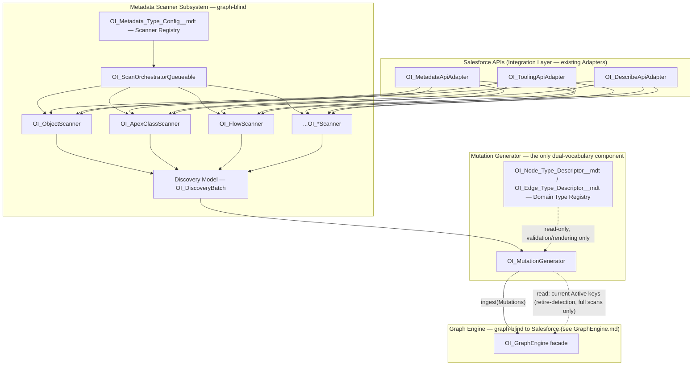
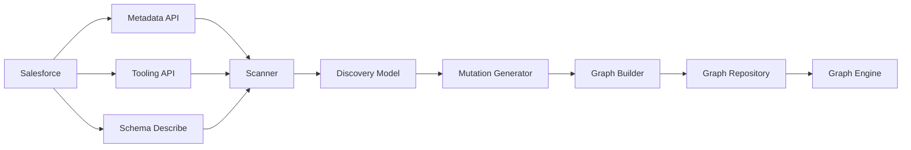

# Metadata Scanner — Salesforce Org Intelligence Platform

Status: Draft v1
Owner: Architecture
Applies to: API v67.0

This document is the complete architectural specification of the Metadata Scanner subsystem: philosophy, architecture, lifecycle, pipeline, the Discovery Model, interfaces, registry, incremental/full/parallel scanning, retry/error recovery, scheduling, orchestration, the Mutation Generation boundary, performance, package readiness, extension points, security, and forward integrations. It contains no implementation code — only structure, contracts, and rationale.

**Governing constraint, stated once and enforced throughout: the Metadata Scanner discovers metadata and nothing else. It has no knowledge of Graph Nodes, Graph Edges, or Graph Mutations — not even the opaque `typeKey` vocabulary the Graph Engine uses.** Its output is a generic **Discovery Model**, expressed entirely in Salesforce's own metadata vocabulary. A separate, single component — the **Mutation Generator** — is the only thing in the platform permitted to know about *both* vocabularies (Salesforce metadata and the Graph Engine's opaque graph model), and its sole job is translating one into the other.

---

## 0. Relationship to Prior Documents — What This Amends and Why

[Architecture.md](Architecture.md) §6 and [GraphEngine.md](GraphEngine.md) §7 previously described each per-type Scanner (`OI_FlowScanner`, etc.) as directly emitting an "already-generic" `UpsertNode{typeKey: "SalesforceMetadata.Flow", ...}` Mutation. On closer review, driven by this document's explicit requirement, that was too permissive: it meant the Scanner had to know the Graph Engine's `typeKey` convention, which is graph vocabulary, not metadata vocabulary — a real, if narrow, boundary violation of exactly the kind [GraphEngine.md](GraphEngine.md) §1 warns against for the *other* side of this same seam. This document corrects it by inserting two new pipeline stages that didn't exist as named components before: the **Discovery Model** (the Scanner's actual, graph-blind output) and the **Mutation Generator** (the new, sole translator).

| Document | Section | Change | Reason |
|---|---|---|---|
| ADR/ | — | **ADR-0015** added | Formalizes the Discovery Model / Mutation Generator boundary |
| [GraphEngine.md](GraphEngine.md) | §0, §7 | Corrected: Scanners no longer described as emitting Mutations; `OI_GraphBuilder`'s input is now explicitly attributed to the Mutation Generator, not the Scanner | Keep the flagship Graph Engine doc from contradicting this one |
| [Architecture.md](Architecture.md) | §6 | Rewritten as a summary pointing here, matching how §5 points to GraphEngine.md | Avoid two documents each claiming to be authoritative about the same subsystem |
| [ADR-0009](ADR/0009-incremental-scanning-via-checksum-diffing.md) | Decision | Clarified: the Scanner computes a raw checksum; the *comparison* against previously stored state happens in `OI_GraphBuilder`, downstream of the Mutation Generator, not in the Scanner | The original phrasing said "the scanner compares... against the stored value," which requires knowing graph state — precisely what the Scanner must not know |
| [DataModel.md](DataModel.md) | §2.2, §4.2 | `Last_Successful_Watermark__c` added to `OI_Scan_Task__c`; `Min_Rescan_Interval_Minutes__c` added to `OI_Metadata_Type_Config__mdt` | Needed for API-level delta fetching (§8) and per-type cadence (§13), neither of which existed as concrete fields before |
| [Backlog.md](Backlog.md) | Epic: Metadata Scanner, Epic: Graph Engine | Items split to reflect Discovery Model production vs. Mutation Generation as distinct, separately buildable units | Keeps the backlog buildable in dependency order |

Everything else in the prior documents — Queueable-chain orchestration (ADR-0004), the Scanner Registry (`OI_Metadata_Type_Config__mdt`), failure isolation, the self-imposed API budget — holds and is elaborated, not contradicted, below.

**Addendum, Sprint 5**: designing the Search Engine ([SearchEngine.md](SearchEngine.md)) surfaced a need for object-scoped search filtering (e.g., "only Fields on Account") without a graph traversal — resolved by a new generic `parentKey` field on the Node model ([ADR-0018](ADR/0018-denormalized-parent-key-for-search-scoping.md)), sourced from a new, optional `parentComponentKey` on `OI_DiscoveredComponent` (§5) for component kinds that have exactly one natural structural parent, carried through by the Mutation Generator via one more pass-through step (§15). No boundary changes — the Scanner already faithfully knows this fact for the kinds that have it; this is one more field on an existing shape, not a new capability.

---

## 0.1 Sprint 8 Amendment — Metadata Scanner MVP (Objects, Fields, Apex Classes)

Sprint 8 built the first real implementations against this document's contracts:
`OI_ObjectScanner`, `OI_FieldScanner`, `OI_ApexClassScanner`, a real `OI_MutationGenerator`,
a real `OI_GraphBuilder`, and `OI_ScanOrchestratorQueueable`. Building against the
contracts for real — rather than the Sprint 7 seam-only stubs — surfaced a few gaps this
document left implicit. Recorded here rather than silently resolved, per this project's
own "document the limitation and choose the closest package-safe design" standard.

**1. `componentKey`/`relationshipKey` are deterministic strings, not one-way hashes.**
§5 says `componentKey = hash(componentKind + namespace + fullyQualifiedName)`. In
practice, `OI_MutationGenerator` only ever sees one `OI_DiscoveryBatch` at a time (its
documented contract), yet a component's `parentComponentKey` — or a relationship's
endpoint `componentKey` — routinely refers to a component discovered by a **different**
Scanner/task (a Field's parent Object, scanned separately from the Field). A one-way
SHA-256 digest cannot be inverted to recover the `(componentKind, namespace,
fullyQualifiedName)` needed to derive that other component's `nodeKey` without the
original component in memory. `OI_ComponentKeyUtil` therefore builds `componentKey` as
the deterministic, parseable string `"<componentKind>::<namespace>::<fullyQualifiedName>"`
instead of a hash. This costs nothing architecturally: `componentKey` remains
internal-only (§19 — never exposed to any external caller), so the deviation from the
literal word "hash" is invisible outside the Scanner/Mutation-Generator seam. `nodeKey`/
`edgeKey`/`versionKey` — the values actually persisted — remain real SHA-256 digests,
exactly as [GraphEngine.md](GraphEngine.md) §2/§3 specify.

**2. Object-scope boundary for `OI_ObjectScanner`/`OI_FieldScanner` (componentKind
"CustomObject").** Both Scanners use Schema Describe (the lightest native mechanism
capable of enumerating every SObject and field without Tooling/Metadata API or a
callout) and share `OI_ObjectScopeFilter`, which excludes: Custom Metadata Types
(`__mdt`), Platform Events (`__e`), Big Objects (`__b`), External Objects (`__x`), and
the automatically-generated companion objects every object gets (`History`/`Share`/
`Feed`/`ChangeEvent`). Each of these is a structurally distinct Salesforce metadata
concept warranting its own future Scanner/componentKind rather than being folded into
"CustomObject" — an MVP scope boundary, not an oversight.

**3. Apex Class dependency extraction is fully deferred, not partially built.**
`OI_ApexClassScanner` queries the standard `ApexClass` object via plain SOQL (lighter
than Tooling API, and sufficient for identity/attributes — Sprint 8 objective §7
explicitly scopes "Basic Apex Class node creation = required, Comprehensive Apex
dependency extraction = deferred"). It emits zero relationships: the standard `ApexClass`
object exposes no call-graph information; that requires Tooling API's
`MetadataComponentDependency`, an intentionally deferred dependency this document's API
Selection Priority (Describe > UI > Tooling > Metadata > REST > **SOQL**) already ranks
below what Sprint 8 needed. `Preferred_Api__c` (`OI_Metadata_Type_Config__mdt`) gained a
`SOQL` picklist value to name this precisely — the original 5-value set (Describe/UI/
Tooling/Metadata/REST) had no way to say "plain SOQL against a standard object," the
lightest tier this priority list itself names.

**4. Governor-limit-safe chunking lives in the Orchestrator, not the Scanner or Mutation
Generator contracts.** `OI_GraphRepository.commitVersion` cannot be bulked across
different keys without losing its atomicity guarantee ([GraphRepository.md](GraphRepository.md)
§11) — a real, accepted cost that becomes the dominant constraint the moment a Scanner's
output is large (a first-ever full-org Field scan can be thousands of components).
Rather than change the Scanner (`scan()` still returns one complete `OI_DiscoveryBatch`
per call, exactly as documented) or `OI_MutationGenerator` (`translateAndIngest` still
takes one `OI_DiscoveryBatch`), the Orchestrator layer chunks a large batch's
components/relationships into transaction-safe pieces, each processed via its own
`translateAndIngest` call (`isFullSnapshot = false` to suppress retire-detection on every
sub-chunk), accumulating the observed-key set across chunks and calling
`OI_MutationGenerator.retireMissingKeys`/`findMissingKeys`+`retireKeys` (Sprint 9.1 — public
entry points factored out of `translateAndIngest`'s internal retire-detection call) once
ingestion completes for a full-snapshot type. `translateAndIngest` also returns the `Set<String>` of
nodeKeys observed in that call — opaque bookkeeping the Orchestrator threads through
without interpreting, never a Graph Engine vocabulary leak. This is exactly the "very
large individual metadata types may additionally use Batch Apex... within their own
scanner" allowance [ADR-0004](ADR/0004-queueable-chain-scan-orchestration.md) already made — realized
as Orchestrator-level chunking rather than a Scanner-internal Batch job, since the
Scanner's own `scan()` call for Sprint 8's 3 types is not itself the governor-limit
bottleneck; the downstream per-key commit cost is. **Sprint 9.1 correction**: Sprint 8/9
realized this chunking via further Queueable hops nested within
`OI_ScanOrchestratorQueueable`'s own chain — which, as Sprint 9's real-scale validation
proved, shares the Developer Edition chain-depth ceiling with inter-type advancement,
defeating the point of chunking at all. §0.3 below corrects this: chunking is now
Batch-Apex-driven (`OI_ScanComponentIngestBatchable`/`OI_ScanRelationshipIngestBatchable`),
which is what this ADR-0004 allowance meant in the first place.

**5. Known limitations carried into Sprint 9:** per-type cadence
(`Min_Rescan_Interval_Minutes__c`) and incremental watermarking are not applied yet —
every scan is a full scan for every enabled type. Retire-detection's own retire-mutation
pass is not itself chunked across hops (safe for an initial scan and the common case of
few retirements; a full rescan retiring a very large number of components in one pass
could still approach the per-transaction DML ceiling). Cascading edge retirement when an
endpoint node is retired ([GraphEngine.md](GraphEngine.md) §5) is not built. `Records_Changed__c`
on `OI_Scan_Task__c` is not populated (`translateAndIngest` reports observed-key counts,
not a new/changed/unchanged breakdown). Genuine multi-hop Queueable chaining is verified
by code inspection and an algorithmic unit test of the chunk-extraction logic, not by a
full synchronous replay of a real multi-hop chain in an Apex test — Apex enforces a
ceiling on chained/cumulative async job execution within `Test.startTest()/stopTest()`
that does not exist in production, confirmed empirically during Sprint 8 validation.

---

## 0.2 Sprint 9 Amendment — Single-Flight Guard, MS-4b Completion, GE-2c

Sprint 9 closed three gaps Sprint 8's amendment above left open, and discovered/fixed a
fourth, more serious one while validating them at real scale:

**0. Chain-depth ceiling is a real org-edition constraint, and a broken chain must never
leave a run stuck.** Sprint 8 attributed every "Maximum stack depth has been reached"
failure to Apex test-execution limits specifically. Running a real scan against a
Developer Edition org during Sprint 9 validation reproduced the identical error in a
genuine, non-test execution, after 4 real chained hops — Developer Edition and trial orgs
enforce a real, low ceiling on total chained Queueable depth; production/sandbox orgs
(Enterprise/Unlimited/Performance/Professional — what this package ships to) do not. Worse,
the failure path itself could throw the same exception a second time while trying to
recover, leaving the Scan Run permanently `Running` — which would permanently block the
single-flight guard (item 2 below) from ever allowing another scan. `OI_ScanOrchestratorQueueable`
now wraps every `System.enqueueJob` call defensively: if it throws for any reason (chain-
depth ceiling, a transient platform error), the run is force-completed as
`CompletedWithErrors` instead of being left stuck. Confirmed by re-running the same real
scan after the fix: the run correctly reached `CompletedWithErrors` (rather than hanging)
after persisting 240 real `OI_Graph_Node__c` rows — but the scan still never reached
`CustomField`, because the 4-hop ceiling was consumed entirely by `CustomObject`'s own
ingestion chunking. **Sprint 9.1 closes this properly — see §0.3.**

**1. MS-4b completed — retire-detection is now chunked, not just retire-*generation*.**
Sprint 8 chunked the primary component/relationship ingestion path across Queueable hops
but still ran retire-detection as one unchunked pass at the end (`retireMissingKeys`,
looping internally across every page of Active keys in one call). A retirement wave large
enough to need many `commitVersion` calls in that single pass could approach the
per-transaction DML-statement ceiling the same way unchunked ingestion could. Sprint 9
originally added `OI_MutationGenerator.retireMissingKeysPage` — a single-page retire
operation paged one Queueable hop at a time. **Sprint 9.1 superseded this** (see §0.3) once
real-scale validation showed the Queueable-paged design shared, and re-triggered, the same
chain-depth ceiling the ingestion fix removed; `retireMissingKeysPage` is deleted, replaced
by `findMissingKeys` (read-only, pages internally, issues no DML) + `retireKeys` (write-only,
takes an already-identified list) driving `OI_ScanRetireDetectionBatchable`. `retireMissingKeys`
(the original, unchunked, loop-inside-one-call method) is unchanged and still available for
callers with a small, known-bounded Active-key population.

**2. Single-flight guard implemented** (§13, above) — was previously documented, not built.

**3. GE-2c (optimistic-concurrency retry) implemented in `OI_GraphBuilder`** — see
[GraphRepository.md](GraphRepository.md) §15's amendment for the full detail; summarized
here because it changes this subsystem's failure behavior: a scan task that races another
write to the same key now self-heals via one retry (re-read, recompute, retry once) rather
than failing outright on the first conflict it encounters.

**Known limitation carried forward**: retire-detection's write side is chunked (Sprint
9.1, §0.3); the *read* side (`getCurrentActiveKeysByType`, via `findMissingKeys`) still
pages at `RETIRE_DETECTION_PAGE_SIZE` per call, matching the ingestion path's own
governor-safety margin — no further increase in scope beyond what Sprint 9 approved
(Flow/Trigger/ValidationRule scanners, incremental watermarking, and per-type cadence
enforcement remain Phase 3, not built here).

---

## 0.3 Sprint 9.1 Amendment — All Chunking Moved to Batch Apex

Sprint 9's real-scale validation (§0.2 item 0) exposed that force-completing a broken
chain was not enough: the chain broke *while still scanning `CustomObject`*, because
`OI_ScanOrchestratorQueueable` chunked a large type's component/relationship ingestion
via *further Queueable hops nested within the same chain* used for inter-type
advancement. 240 `CustomObject` components at a chunk size of 60 needed 4+ ingestion
hops alone — consuming the Developer Edition ceiling before `CustomField` was ever
reached. `CustomField` nodes and `HAS_FIELD` edges were never produced by that run.

**Root cause, precisely**: two independent concerns — "advance to the next metadata
type" and "process the next chunk of an oversized type's batch" — were both paid for out
of the same scarce resource (Queueable chain depth), and [ADR-0004](ADR/0004-queueable-chain-scan-orchestration.md)'s
own stated mitigation ("not chaining more hops than metadata types configured") silently
stopped being true the moment MS-4b's chunking (§0.2 item 1) landed on top of Sprint 8's
ingestion chunking, without anyone revisiting that invariant.

**Fix, first pass**: `beginScanTask` dispatches a batch exceeding `CHUNK_SIZE` to
`OI_ScanComponentIngestBatchable` (`Database.executeBatch`, scope size = `CHUNK_SIZE`)
instead of a further Queueable hop. Its `finish()` chains to
`OI_ScanRelationshipIngestBatchable` if relationships also need chunking. Batch Apex
`execute()`/`finish()` invocations are not tracked by the Queueable chain-depth counter,
so a type of any real-world size no longer touches the inter-type chain's depth budget.

**Fix, second pass — retire-detection needed the identical treatment.** The first pass
still routed retire-detection through a Queueable-paged resume (MS-4b's original design,
§0.2 item 1), reasoning that a first-ever scan retires nothing so this path would cost
zero extra hops. Re-running the real validation immediately falsified that: the read side
of retire-detection pages proportionally to how many keys are *already Active*, entirely
independent of whether anything ends up missing — so a rescan of an org that already has
data (exactly the second Sprint 9.1 validation run, against `CustomObject` rows the first
run had already persisted) re-triggered the identical chain-depth ceiling, this time inside
retire-detection instead of ingestion. `OI_MutationGenerator.retireMissingKeysPage` is
deleted; retire-detection is now split into `findMissingKeys` (read-only, pages internally
via the existing selector, issues no DML, safe to run in one transaction regardless of
Active-key population size) and `retireKeys` (write-only, retires an already-identified
list). `finalizeTypeAfterIngest` calls `findMissingKeys` synchronously and, only if
anything is actually missing, dispatches `OI_ScanRetireDetectionBatchable` to retire it in
`CHUNK_SIZE` scopes — mirroring the ingestion Batchables exactly. With this, `OI_ScanOrchestratorQueueable`
no longer carries *any* in-progress/resume state — a hop's only job is "begin the next
type, or complete the run," which is [ADR-0004](ADR/0004-queueable-chain-scan-orchestration.md)'s
original invariant, restored in full rather than partially. See the
[ADR-0004 amendment](ADR/0004-queueable-chain-scan-orchestration.md#amendment--sprint-91-batch-apex-realizes-the-pre-approved-allowance)
for why none of this reverses that ADR's Decision.

The custom chunk-extraction helpers Sprint 8/9 built (`extractComponentChunk`/
`extractRelationshipChunk`) and the Queueable-paged retire-resume state
(`inProgressMetadataType`/`inProgressRetireCursor`/etc.) are deleted, not deprecated —
Batch Apex's own scope-slicing makes them redundant, and per this project's standard,
unused code is removed rather than left as a parallel, never-invoked path.

**A third, unrelated robustness gap found during the second validation run**: `beginScanTask`'s
`insert task` (creating the `OI_Scan_Task__c` row) sat *outside* its own try/catch. When
this insert failed for any reason — the validation run hit it via `STORAGE_LIMIT_EXCEEDED`,
but a validation rule or any other DML failure would trigger the identical path — the
exception escaped `execute()` entirely uncaught, failing the whole Queueable job with no
chance to advance the chain or complete the run, permanently deadlocking the single-flight
guard exactly like the enqueue-call-site gaps Sprint 9 already fixed. Now wrapped: a failed
task-insert logs and advances to the next type (there is no task row to mark Failed, since
the insert that would have created it is what failed).

**Validated**: two consecutive real scans against the same Developer Edition sandbox
confirmed the chain-depth fix holds for both ingestion and retire-detection —
`CustomObject` (904 real components) completed cleanly both times with zero "Maximum
stack depth" errors, and `CustomField`'s own Batch Apex chunking persisted 1,440 then
2,160 real field nodes across many scopes, again with zero chain-depth errors, before
each run separately exhausted the sandbox's 5MB total data storage allocation —
an environmental capacity limit of this specific Developer Edition org, unrelated to the
chain-depth fix or any other Sprint 9.1 code. `CustomField`'s full completion,
`HAS_FIELD` edges, and `ApexClass` remain unverified against real data pending a larger
org — the fix itself is proven; the full end-to-end data volume this org's real metadata
represents does not fit in 5MB regardless of how the chain is driven. Exact counts and the
capacity analysis are recorded in the Sprint 9.1 deliverables report.

---

## 1. Scanner Philosophy

Where [GraphEngine.md](GraphEngine.md) §1 is built on two words — *generic* and *bounded* — this subsystem is built on the deliberate **mirror image** of the first one, plus the same second one:

**Faithful, not generic.** The Graph Engine must be domain-agnostic because it has to model whatever the Domain Type Registry throws at it, forever, without changing. The Scanner has the opposite job: it exists specifically to understand Salesforce's metadata model *deeply and correctly*, across three different APIs that don't always agree with each other on shape or timing. Being generic here would be a mistake — the Scanner's entire value is in knowing that a `CustomField` has a `Type` and a `CustomObject` has a `SharingModel`, in Salesforce's own vocabulary, not an abstracted one. Genericity is a Graph Engine requirement, not a platform-wide law; the Scanner's requirement is to be maximally, faithfully Salesforce-aware, and to normalize *inconsistency across APIs* without normalizing away *meaning*.

**Bounded**, exactly as in [GraphEngine.md](GraphEngine.md) §1 and Architecture §1: never a synchronous full-org scan, every fetch chunked, every callout budget-tracked.

**Blind to the graph.** This is the requirement this document exists to enforce structurally, not just by convention: the Scanner produces a **Discovery Model** — components and relationships expressed in Salesforce's own vocabulary (`componentKind` values like `CustomObject`, `ApexClass`, `Flow`; `relationshipKind` values like `HAS_FIELD`, `CALLS_APEX_METHOD`) — and stops there. It never constructs a `typeKey`, never computes a `nodeKey`/`edgeKey`, never calls `OI_GraphEngine`, and never imports a Graph Engine class. The **Mutation Generator** (§15) is the only component downstream of the Scanner that is allowed to know both vocabularies; everything on the Scanner's side of that seam speaks only Salesforce's language, and everything on the Graph Engine's side speaks only the opaque graph vocabulary ([GraphEngine.md](GraphEngine.md) §1).

> **Why this matters beyond tidiness**: a Scanner that's blind to the graph is a Scanner that can be built, tested, and reasoned about with zero Graph Engine dependency — and, as a direct consequence, a Discovery Model that's reusable for anything that wants faithful Salesforce metadata, not just graph construction (§18, §20).

---

## 2. Scanner Architecture

**Layer responsibilities**, each single-purpose (SOLID, per `CLAUDE.md` §Architecture Principles):

| Component | Knows about | Never knows about |
|---|---|---|
| Adapters (`OI_MetadataApiAdapter`, `OI_ToolingApiAdapter`, `OI_DescribeApiAdapter`) | Raw API request/response shapes | Discovery Model, Graph anything |
| Per-type Scanners (`OI_*Scanner`, implementing `OI_IMetadataScanner`) | One metadata type's Salesforce shape; which Adapter(s) to call | Any other metadata type; the Graph Engine; `typeKey` |
| `OI_ScanOrchestratorQueueable` | Scan Registry, chaining, retry, budget, progress | Discovery Model's internal shape beyond "did it succeed and how much did it contain"; Graph Engine |
| Discovery Model (`OI_DiscoveryBatch`, `OI_DiscoveredComponent`, `OI_DiscoveredRelationship`) | Nothing — it's a data shape, not a behavior | — |
| `OI_MutationGenerator` | **Both** the Discovery Model's shape and the Graph Engine's Mutation contract ([GraphEngine.md §7](GraphEngine.md#7-graph-builder-architecture)) | Salesforce API call mechanics (never calls an Adapter); Graph storage mechanics (never calls `OI_GraphRepository` — only the `OI_GraphEngine` facade) |

This table *is* the boundary enforcement mechanism, in the same spirit as [GraphEngine.md](GraphEngine.md) §1.1's facade rule: a reviewer checking whether a change violates the blindness requirement asks exactly one question — "does this class in the left column now reference something in its 'never' column?"

---

## 3. Scanner Lifecycle

Two distinct lifecycles exist here, and conflating them is the single easiest mistake to make in this subsystem — so they're named separately.

### 3.1 Scan Run / Scan Task lifecycle (orchestration-level, unchanged from Architecture §6)

`OI_Scan_Run__c`: `Queued → Running → Completed | CompletedWithErrors | Failed | Cancelled`.
`OI_Scan_Task__c` (one per metadata type per run): `Pending → Running → Succeeded | Failed | Skipped`.

### 3.2 Discovered-component "freshness," and why the Scanner does *not* own it

There is deliberately **no** lifecycle state (Discovered/Active/Stale/SoftDeleted) attached to a Discovery Model record. That lifecycle belongs to a *Graph Node*, and the Scanner doesn't have nodes — it has components it observed *this run*. The Scanner's only lifecycle-adjacent fact is binary: **was this component observed in this scan or not.** Two consequences fall out of taking this seriously:

- **Retirement is not a Scanner decision.** Noticing that something *used to exist and no longer does* requires comparing "what I see now" against "what the graph currently believes is active" — and the graph is exactly what the Scanner must not know about. This decision is relocated to the Mutation Generator (§15), which *is* allowed to read the graph.
- **A Discovery Batch is complete-or-partial only with respect to Salesforce, never with respect to the graph.** `isFullSnapshot = true` means "this batch represents everything of this `componentKind` that exists in the org *right now*, as far as the Scanner could tell" — not "everything that used to be a node." The distinction matters directly for retire-detection correctness (see §21 Risks).

---

## 4. Scanner Pipeline

The pipeline requested for this subsystem, drawn exactly in the given order, with one clarification made explicit where the diagram could otherwise be misread:

> **Clarification, not a correction**: Metadata API, Tooling API, and Schema Describe are drawn above the Scanner because the Scanner *depends on* them, not because every scan calls all three in sequence. In practice they're **alternative/complementary sources selected per metadata type** via `OI_Metadata_Type_Config__mdt.Preferred_Api__c` (already established in DataModel §4.2), following `CLAUDE.md`'s API Selection Priority (Describe > UI > Tooling > Metadata > REST > SOQL — lightest solution first). A single Scanner class may call more than one (e.g., Describe for a `CustomObject`'s shape, Tooling API for its validation rules), but never calls one it doesn't need. The diagram shows dependency direction, not a mandatory sequential chain.

**Stage contracts** (input → output, each stage's job stated as tightly as possible):

| Stage | Input | Output | Owner |
|---|---|---|---|
| Metadata/Tooling API, Schema Describe | Adapter call parameters | Raw, API-native response (XML / sObject / DescribeResult) | Existing Adapters, unchanged |
| Scanner | Raw API response(s) for one `componentKind` | `OI_DiscoveryBatch` (§5) | `OI_*Scanner` (Strategy, §6) |
| Mutation Generator | `OI_DiscoveryBatch` | `List<OI_GraphMutation>` | `OI_MutationGenerator` (§15) — the seam |
| Graph Builder → Repository → Engine | Mutations | Persisted graph state | Unchanged from [GraphEngine.md](GraphEngine.md) §7, §7.1 |

Nothing here changes the *orchestration* model (Queueable chaining, ADR-0004) — it inserts two clearly-scoped stages between "the Scanner finishes its work" and "the graph is updated," where before they were implicitly blended into one step.

---

## 5. Discovery Model

The Scanner's entire output surface — three shapes, all Salesforce-vocabulary, all schemaless-attribute-bag by design (the same trade-off [GraphEngine.md](GraphEngine.md) §2 makes for Graph Nodes, made independently here for the same reasons: single-row writes, no N+1 explosion, since a componentKind's attribute shape varies as much as a Node's does).

### `OI_DiscoveredComponent`

| Field | Type | Notes |
|---|---|---|
| `componentKey` | opaque string, Scanner-assigned | `hash(componentKind + namespace + fullyQualifiedName)` — a Discovery-Model-local identity. **Not** the same value as a Graph `nodeKey`; the Mutation Generator derives `nodeKey` from this deterministically (§15), but the two are conceptually distinct keys belonging to different vocabularies. |
| `componentKind` | string, Salesforce-native | e.g. `CustomObject`, `CustomField`, `ApexClass`, `Flow`, `ValidationRule`, `PermissionSet` — deliberately Salesforce's own terms, not an abstracted list (§1). |
| `fullyQualifiedName` | string | e.g. `Account.Industry__c`, `MyFlow`, `MyNamespace.MyApexClass`. |
| `namespace` | string, optional | Populated for packaged/managed metadata; blank for org-native. |
| `sourceApi` | enum: `Metadata`, `Tooling`, `Describe` | Which API produced this record — useful for debugging when the same logical component could in principle be seen through more than one source. |
| `rawAttributes` | opaque key-value bag (JSON) | Salesforce-native attribute values (field type, sharing model, flow status, etc.) — deliberately excludes secret-bearing values (§19). |
| `rawChecksum` | string | Hash over `componentKind + fullyQualifiedName + rawAttributes`, computed by the Scanner. Carried forward **unchanged** into the eventual Mutation's `checksum` field (§15) — the Scanner computes it once; nothing downstream recomputes it. |
| `sourceModstamp` | DateTime, optional | `SystemModstamp`/`LastModifiedDate` if the source API exposes one for this type — used for API-level delta fetching (§8), not for the content-diff decision (that's `rawChecksum`'s job, consumed downstream). |
| `parentComponentKey` | opaque string, optional | **New, Sprint 5.** References another `OI_DiscoveredComponent.componentKey` — populated when, and only when, this `componentKind` has exactly one natural structural parent the Scanner already faithfully knows (a `CustomField`'s parent is its `CustomObject`; likewise `ValidationRule`, `RecordType`). Blank for kinds with no single natural parent (`ApexClass`, `Flow`). Carried through to the Mutation Generator's `parentKey` (§15) — exists solely to support [SearchEngine.md](SearchEngine.md) §11's object-scoped filtering without a graph traversal ([ADR-0018](ADR/0018-denormalized-parent-key-for-search-scoping.md)). |

### `OI_DiscoveredRelationship`

| Field | Type | Notes |
|---|---|---|
| `relationshipKey` | opaque string, Scanner-assigned | `hash(fromComponentKey + relationshipKind + toComponentKey)`. |
| `relationshipKind` | string, Salesforce-native | e.g. `HAS_FIELD`, `LOOKUP_TO`, `MASTER_DETAIL_TO`, `CALLS_APEX_METHOD`, `REFERENCED_BY_FLOW`, `USES_NAMED_CREDENTIAL`. |
| `fromComponentKey` / `toComponentKey` | opaque string | References to `OI_DiscoveredComponent.componentKey` values — possibly for a component discovered by a *different* Scanner/task within the same run, or not yet discovered at all this run (the identical eventual-consistency stance [GraphEngine.md](GraphEngine.md) §6 already takes for dangling edges — resolved downstream, not blocked here). |
| `rawAttributes` | opaque key-value bag | Relationship-specific detail (e.g., which field on a lookup relationship). |

### `OI_DiscoveryBatch`

The envelope one Scan Task actually returns — the sole return type of `OI_IMetadataScanner.scan()` (§6):

| Field | Type | Notes |
|---|---|---|
| `scanTaskId` | Id | Correlates to `OI_Scan_Task__c`. |
| `componentKind` | string | The type this task scanned — every component in this batch shares this kind. |
| `components` | `List<OI_DiscoveredComponent>` | |
| `relationships` | `List<OI_DiscoveredRelationship>` | |
| `isFullSnapshot` | Boolean | `true` only if this batch represents the *complete* current set of this `componentKind` in the org (§3.2, §9) — **must only be set `true` if every page/chunk of the fetch succeeded**; a partial failure forces `false` (§21 Risks). |
| `apiCallsConsumed` | Integer | Feeds the self-imposed daily budget (Architecture §17), unchanged mechanism. |

> **Why Salesforce vocabulary here and opaque vocabulary in the Graph Engine isn't a contradiction**: it looks, at a glance, like this document says "be specific" right after [GraphEngine.md](GraphEngine.md) said "be generic." Both are correct, for different components. Genericity is required exactly where a component must survive new types being added without changing (the Graph Engine, §1). Specificity is required exactly where a component's entire value is understanding one domain's real shape faithfully (the Scanner, §1 above). The Mutation Generator (§15) is the seam where one vocabulary is deliberately erased and replaced by the other — that's its whole job, and the only place both vocabularies are allowed to coexist in the same class.

---

## 6. Scanner Interfaces

### `OI_IMetadataScanner`

The single Strategy interface, one implementation per `componentKind` (`OI_ObjectScanner`, `OI_ApexClassScanner`, `OI_FlowScanner`, ...):

- **Contract**: `scan(OI_ScanContext context) → OI_DiscoveryBatch`. Stateless and idempotent — safe to call again for the same context (e.g., after a retry) without side effects, since it performs reads only.
- **`OI_ScanContext`** (input): batch/chunk size, an incremental watermark (`sourceModstamp` cursor or a null for "full"), `scanTaskId` for correlation, and which `sourceApi` to prefer (from the Registry, §7) — everything the Scanner needs, nothing about the graph.
- **What a Scanner implementation must never do**: call `OI_GraphEngine` (or anything Graph-Engine-adjacent) directly; construct a `typeKey`; perform DML against any `OI_Graph_*__c` object; reference `OI_MutationGenerator`. Every one of these is a code-review blocker, not a style preference — see [CodingStandards.md](CodingStandards.md) for the enforceable version of this rule (added alongside this document).

### Why the Mutation Generator does *not* get a Strategy interface

Scanners need per-type *code* because talking to three different Salesforce APIs with genuinely different shapes requires genuinely different logic per type. The Mutation Generator's translation (`componentKind → typeKey`, `rawAttributes → attributes`) is, by design (§15), a **deterministic, data-driven mapping** — not per-type logic. A single `OI_MutationGenerator` class handles every `componentKind` uniformly by reading the Domain Type Registry, so no `OI_IMutationGenerator` Strategy interface exists, and none is anticipated unless a future type needs bespoke attribute reshaping (flagged, not built — §18).

---

## 7. Scanner Registry

`OI_Metadata_Type_Config__mdt` (already established in DataModel §4.2) remains the Scanner's own registry — extended in this document with two fields (`Last_Successful_Watermark__c`, `Min_Rescan_Interval_Minutes__c`, DataModel §2.2/§4.2) needed for §8 and §13.

**The Scanner Registry is deliberately a *different* Custom Metadata Type from the Domain Type Registry** (`OI_Node_Type_Descriptor__mdt`/`OI_Edge_Type_Descriptor__mdt`, [GraphEngine.md](GraphEngine.md) §1, DataModel §4.1). This is not an accident of naming — it's the configuration-level enforcement of the same blindness boundary as §2's table:

| Registry | Answers | Read by |
|---|---|---|
| Scanner Registry (`OI_Metadata_Type_Config__mdt`) | "What Salesforce metadata types do we scan, and how?" | `OI_ScanOrchestratorQueueable`, individual Scanners |
| Domain Type Registry (`OI_Node_Type_Descriptor__mdt`/`OI_Edge_Type_Descriptor__mdt`) | "What graph types exist, and how are they styled?" | `OI_MutationGenerator` (validation only, §15), the Presentation layer ([GraphEngine.md §17](GraphEngine.md#17-rendering-contract-for-lwc)) |

Extensibility: adding a new metadata type is a new `OI_Metadata_Type_Config__mdt` record plus a new Scanner class — zero Orchestrator changes, zero Mutation Generator changes (its mapping is deterministic, §15, not a per-type lookup), and, per the deterministic-naming convention, often zero Domain Type Registry change either (a descriptor there only affects rendering, not ingestion correctness).

---

## 8. Incremental Scanning

Corrects [ADR-0009](ADR/0009-incremental-scanning-via-checksum-diffing.md)'s phrasing (§0) by splitting what it called one mechanism into the two layers it actually always required, now named:

1. **API-level delta fetch (Scanner, graph-blind)**: where the source API exposes a reliable modstamp, the Scanner requests only records changed since `Last_Successful_Watermark__c` (a new field on `OI_Scan_Task__c`, this round) — this is purely "how do I ask Salesforce for less data," requiring zero graph knowledge. Reduces callout volume and API budget consumption directly.
2. **Content-diff decision (Graph Builder, downstream of the Mutation Generator, unchanged from [GraphEngine.md](GraphEngine.md) §7)**: comparing an incoming `checksum` against the *current graph version's* stored checksum to decide new-version / liveness-touch / no-op. This is the layer that requires knowing prior graph state — which is exactly why it was already, correctly, assigned to `OI_GraphBuilder` and not the Scanner, even before this document. What this document fixes is only the *description* of layer 1, which had blurred into sounding like the Scanner itself did the comparison.

The Scanner's incremental mode, concretely: when a watermark exists and the source API supports filtering by it, produce `isFullSnapshot = false` and only the changed subset; otherwise (no reliable modstamp for this type, or a full scan was explicitly requested), produce `isFullSnapshot = true` with everything. Either way, `rawChecksum` is always computed and always carried through — modstamp filtering is a *volume* optimization on top of, never a replacement for, the checksum-based correctness the content-diff decision relies on (this mirrors ADR-0009's own "modstamp as cheap first-pass filter, not a replacement" stance — now correctly scoped to the layer that actually owns it).

---

## 9. Full Scanning

A full scan (`isFullSnapshot = true`) is necessary for two things an incremental delta fundamentally cannot provide:

1. **Retire-detection** (§3.2, §15) — a deleted-in-Salesforce component simply doesn't appear in *any* delta query; noticing its absence requires seeing the *complete* current set and comparing it against what the graph currently believes exists. This is the same point [GraphEngine.md](GraphEngine.md) §5 already made ("incremental scans don't drive this transition... they don't look everywhere") — restated here with the mechanism that makes it concrete.
2. **Correctness fallback for types without a reliable modstamp** — some metadata types don't expose one consistently across the three source APIs (ADR-0009's original point, still valid); for those, "full" is effectively the only mode, cadence permitting (§13).

Full scans are always admin-initiated or scheduled, never silently substituted for an incremental request (Architecture §15 — "opt-in, not automatic"), and are explicitly costed to the admin in the UI as the more expensive path (existing Roadmap Phase 3 framing).

---

## 10. Parallel Scanning

Parallelization is **across metadata types**, not within one type's own chunk sequence — chunk ordering within a type stays serial (simpler checksum/watermark bookkeeping, and callout limits are per-transaction regardless of whether chunks run in the same or different transactions, so nothing is gained by parallelizing within a type).

- Independent Queueable chains, one per metadata-type group, run concurrently up to a configurable **max concurrent scan chains** ceiling (new, bounded-worker-pool pattern) — respecting the org's async Apex flex-queue limits, which the Orchestrator must treat as a hard ceiling, not a target.
- **Budget interaction**: concurrent chains increase burst API consumption against the shared daily budget (Architecture §17). Apex has no strong cross-transaction locking primitive for a running total, so the design accepts a small, bounded optimistic-overrun risk (check-then-proceed against the last-known budget counter) rather than serializing all scanning through a single lock — flagged honestly in §21/§24 rather than promised away.

---

## 11. Retry Strategy

Reuses Architecture §12's retryable/terminal classification, scoped concretely to this subsystem:

- **Retryable**: callout timeout, `UNABLE_TO_LOCK_ROW`, a transient API rate-limit response.
- **Terminal**: malformed/unparseable source response past a minimal validation check, permission denial, an unregistered `componentKind` with no Scanner Registry entry (shouldn't be reachable in practice, but classified terminal if it somehow is).
- **Retry granularity**: per `OI_Scan_Task__c` (i.e., per metadata-type chunk), never per individual `OI_DiscoveredComponent` — a Scanner's `scan()` call is idempotent and side-effect-free (§6), so retrying the whole chunk is always safe and far simpler than per-record retry bookkeeping.
- **Mechanism**: exponential backoff with jitter, a configurable attempt cap (`OI_Metadata_Type_Config__mdt` or `OI_Settings__mdt`), each retry a **fresh** Queueable enqueue (a failed job's `catch` block schedules the next attempt — Apex Queueable can't resume itself mid-execution), tracked via an attempt counter on `OI_Scan_Task__c`.
- Exhausting retries marks the task `Failed`, the run `CompletedWithErrors`, and surfaces in `oiScanStatusPanel` — never a silent drop (Architecture §12).

---

## 12. Error Recovery

Distinct from retry (§11): retry is automatic re-attempt of a transient failure; recovery is what keeps the *rest* of the pipeline consistent and explainable when a failure doesn't go away.

- **Partial-success is the default expectation, not an edge case**: if the `Flow` task fails permanently while `ApexClass` succeeds, the `ApexClass` `OI_DiscoveryBatch` still flows to the Mutation Generator and into the graph — a sibling failure never rolls back independently-successful work (ADR-0004's failure-isolation principle, restated at the Discovery Model level).
- **Record-level tolerance within a batch**: a single malformed source record (missing a required field the Scanner needs) is logged and excluded from the batch, not fatal to the whole task — bulk-safety at the *record* level, distinct from the *task*-level isolation above.
- **Dangling relationships need no special recovery**: a `OI_DiscoveredRelationship` referencing a component whose task failed simply produces, downstream, an edge Mutation the Graph Builder can't fully resolve yet — already absorbed by [GraphEngine.md](GraphEngine.md) §6's existing eventual-consistency stance on dangling edges. Nothing new is needed here; it's worth stating only so it's clear the two subsystems' failure semantics were designed to compose.
- **Manual recovery**: re-triggering a scan scoped to just the failed types via `metadataTypeOverride[]` (existing `OI_ScanController.startScan` parameter, API.md §2.4) — no new mechanism required.

---

## 13. Scan Scheduling

- Scans remain opt-in, never auto-enabled on install (Architecture §15). `OI_Settings__mdt.Default_Scan_Schedule_Cron__c` (existing) drives a standard Scheduled Apex class that enqueues a scan run.
- **Per-type cadence** (new, `OI_Metadata_Type_Config__mdt.Min_Rescan_Interval_Minutes__c`): a scheduled *full-org* run can skip a type whose last successful scan is younger than its own configured minimum interval — avoids burning API budget rescanning something (e.g., Reports) that doesn't need the same cadence as something else (e.g., Apex), formalizing what Architecture §6 previously only mentioned in prose.
- **CI/CD-triggered scans**: the existing `POST /scans` REST endpoint (API.md §3) is a scheduling *trigger source* alongside cron and the manual UI button — this is where a post-deploy pipeline hook actually enters this pipeline.
- **Single-flight guard** (**implemented, Sprint 9**): only one scan run may be `Running` at a time, globally — `OI_ScanOrchestratorQueueable.startScan` checks for an existing `Running` `OI_Scan_Run__c` before creating a new one and throws `OI_ServiceException` if found, rather than silently queuing behind it or allowing it to race. Per-scope guards (advanced, multi-scope use) are not built — global-only is the full scope of what Sprint 9 needed.

---

## 14. Scan Orchestration

`OI_ScanOrchestratorQueueable` (existing, ADR-0004), restated precisely against the corrected pipeline:

1. Reads the Scanner Registry (§7) for enabled types, respecting priority and per-type cadence (§13).
2. For each type, in a chain hop (or fanned out concurrently up to the parallelism ceiling, §10): invokes that type's Scanner (§6) → receives an `OI_DiscoveryBatch` (§5) → hands it to `OI_MutationGenerator` (§15) → gets back a success/failure and counts.
3. Updates `OI_Scan_Task__c`/`OI_Scan_Run__c` status, publishes `OI_Scan_Progress__e`.
4. Applies retry (§11) or records terminal failure (§12) as needed.
5. Chains the next hop, or (for very large types) delegates record-level chunking to Batch Apex within that type's own Scanner, per ADR-0004.

**The Orchestrator itself stays graph-blind too** — it hands a `OI_DiscoveryBatch` to "the next stage" and receives back an outcome; it never needs to know a Mutation's shape, a `typeKey`, or anything about `OI_GraphEngine`. This is worth stating explicitly: the blindness boundary (§1, §2) extends to the *entire* Metadata Scanner subsystem, not just the individual per-type Scanner classes.

---

## 15. Mutation Generation Boundary

The central seam of this document, and the reason it exists as a distinct section from "pipeline" (§4) rather than being folded into it.

**Contract**: input = one `OI_DiscoveryBatch` (Salesforce vocabulary); output = `List<OI_GraphMutation>` in the exact shape [GraphEngine.md](GraphEngine.md) §7 already defines (`UpsertNode`, `RetireNode`, `UpsertEdge`, `RetireEdge`), handed to `OI_GraphEngine.ingest(...)` — never to `OI_GraphBuilder` or `OI_GraphRepository` directly (the facade rule, [ADR-0013](ADR/0013-graphengine-facade.md), applies to this caller exactly as it does to every other).

**Translation mechanics**:

1. **`typeKey` derivation — a deterministic naming convention, not a runtime lookup table.** `typeKey = "SalesforceMetadata." + componentKind` (and identically for edges: `"SalesforceMetadata." + relationshipKind`). The Domain Type Registry is consulted for **validation and rendering only** — does a descriptor exist for this `typeKey` (affects whether the UI has a specific icon/color, §7) — **never** for computing the mapping itself. This is a deliberate simplification over an explicit lookup table: it means the Mutation Generator has no *runtime correctness* dependency on Custom Metadata being populated — an unregistered type still ingests correctly (with default styling) rather than failing to ingest at all. The lookup-table alternative is recorded in §23 as a live alternative, not dismissed outright.
2. **`nodeKey`/`edgeKey` derivation**: `nodeKey = hash(typeKey + "::" + namespace + "::" + fullyQualifiedName)`; `edgeKey` analogously from the resolved endpoint `nodeKey`s and the edge `typeKey`.
3. **`checksum` pass-through**: `rawChecksum` from the Discovery Model becomes the Mutation's `checksum` **unchanged** — computed once, by the Scanner, over content it alone understands; never recomputed downstream.
4. **`attributes` pass-through**: `rawAttributes` maps into the Mutation's `attributes` bag largely as-is — no per-type reshaping in v1 (§6's simplicity rationale), since both sides already treat attributes as an opaque JSON bag.
5. **`parentKey` pass-through** (new, Sprint 5): `parentComponentKey` (§5), if present, becomes the Mutation's `parentKey` **unchanged** — the identical Scanner-observed fact populates both this and any structural relationship edge the batch also emits for the same pair, deliberately from one source, not two independent derivations ([SearchEngine.md §29](SearchEngine.md#29-risks) names the drift risk this avoids). No per-type logic — a `componentKind` either has a `parentComponentKey` or it doesn't; the Mutation Generator does not decide which kinds should.
6. **Retire-detection (full scans only)**: for a batch with `isFullSnapshot = true`, after emitting `UpsertNode`/`UpsertEdge` for everything observed, the Mutation Generator issues a **read-only, paginated** call to `OI_GraphEngine` for the current `Active` node keys of this `typeKey` — backed by `OI_GraphRepository.getCurrentKeysByType`, the operation specifically added for this purpose ([GraphRepository.md §2, §9, §13](GraphRepository.md#2-graphrepository-interface)) — pages through the full result set, diffs it against the observed `nodeKey` set, and emits `RetireNode` for exactly the difference. This relocates the "what's missing" decision — which needs graph knowledge — off the Scanner (§3.2) and onto the one component built to hold both vocabularies, without needing a third mechanism.

**Hard rules**: the Mutation Generator never calls a Salesforce API Adapter (it only transforms already-discovered data) and never performs a Graph storage operation itself (it only calls the `OI_GraphEngine` facade, for both the ingest path and the retire-detection read path). It is, by design, the *only* class in the platform where both "Salesforce metadata vocabulary" and "Graph Engine vocabulary" are legitimately visible in the same file.

---

## 16. Performance Strategy

Consolidating this subsystem's contributions to the platform-wide performance posture (Architecture §17, [GraphEngine.md](GraphEngine.md) §15):

- Every Discovery Batch and every Mutation list is bulk-shaped by contract — no per-component API call, and no per-component call into the Mutation Generator or Graph Engine.
- API-level delta fetching (§8) minimizes callout volume against the shared daily budget before any downstream cost is even incurred.
- Chunk sizes for both Scanner fetches and Mutation Generator batches respect the same governor-limit-aware sizing already established (Architecture §17): SOQL row limits, callout limits, heap limits as hard chunk-size inputs.
- Parallel type-chains (§10) are bounded, never unbounded fan-out.
- Retire-detection's read query (§15) is itself paginated/bulk, matching the batch chunking it diffs against — never a single unbounded "give me every node of this type" call, and never issued per-component.
- The Discovery Model is kept intentionally light (`rawAttributes` holds only what a Scanner actually extracts, not a dump of the entire raw API response) — this subsystem should not introduce its own heap-pressure problem on top of the Graph Builder's already-accepted extra read-before-write cost ([GraphEngine.md](GraphEngine.md) §15/§22).

---

## 17. Package Compatibility

Every constraint in `CLAUDE.md` §Package Compatibility / §Metadata Assumptions, applied specifically here:

- The Scanner assumes nothing is present — a `componentKind` with zero instances in a subscriber org simply produces an empty `OI_DiscoveryBatch`, never an error (unchanged from Architecture §15, now stated at the Discovery Model level explicitly).
- The Scanner Registry (§7) is packageable Custom Metadata — new types addable per org without an Apex change to the orchestrator.
- `componentKind`/`relationshipKind` vocabulary is Salesforce-*standard*, not org-specific — identical behavior across every subscriber org with no per-org customization required for ingestion correctness.
- **New risk this document surfaces explicitly**: because the Discovery Model directly mirrors Salesforce's own API shapes (by design, §1), a Salesforce platform/API-version change that alters those shapes is a direct threat to this subsystem specifically — more directly than to the more insulated, generic Graph Engine. This is exactly why the contract-test suite (Architecture §16) matters most here; it is restated as a package-readiness concern, not just a testing concern, because a silently-broken Scanner in a live subscriber org is worse than a failed test.
- Running-user API-permission requirements for triggering scans are unchanged (Architecture §14/API.md §2.4) — restated by reference, not redesigned here.

---

## 18. Extension Points

| Extension point | Mechanism | What it enables without touching the rest of the pipeline |
|---|---|---|
| New metadata type | Scanner Registry record + new `OI_*Scanner` class | Zero changes to Orchestrator, Mutation Generator, or Graph Engine |
| New/alternate source API for an existing type | `Preferred_Api__c` config + logic inside that type's existing Scanner | Zero Discovery Model or downstream change, as long as the output shape is unchanged |
| Non-graph Discovery Model consumers | Subscribe to `OI_DiscoveryBatch` independently of the Mutation Generator | A future metadata-export, diffing, or compliance-audit feature reusing discovery without ever touching the graph (§20) |
| Bespoke per-type Mutation shaping | An `OI_IMutationGenerator`-per-type Strategy interface, not built now | Only needed if a type's `rawAttributes` ever require real reshaping beyond pass-through — deferred until a concrete case exists (§6) |
| Third-party/customer-authored Scanner classes | Scanner Registry already supports an arbitrary `Scanner_Class__c` value | A partner or advanced customer registering their own scanner for org-specific metadata — flagged as a forward-looking possibility with real security-review implications, not a committed feature (§24) |
| A future first-party Salesforce "org metadata graph" API | A new Adapter, same Discovery Model output shape | Adopted as just another source without restructuring anything downstream |

---

## 19. Security

- Triggering a scan still requires `OI_Run_Scan` and, transitively, whatever Tooling/Metadata API access those APIs themselves demand of the running user (Architecture §14, API.md §2.4) — unchanged, restated by reference.
- **Schema Describe naturally respects the running user's own FLS/CRUD** at the metadata level — it only ever reveals what's describable to that user already, so no additional enforcement layer is needed for that source specifically; this is worth stating explicitly rather than assuming a blanket "we must add access checks everywhere" rule that isn't actually needed here.
- **The Discovery Model is never exposed externally.** It has no Controller, no `@AuraEnabled` method, no REST endpoint — it exists only as an in-memory (or queueable-job-scoped) handoff between a Scanner and the Mutation Generator within the platform's own Apex execution, never queryable independently by any external caller. This narrows the security-review surface for this specific artifact to zero, deliberately, in contrast to Graph Fragments, which *are* exposed and *do* need the full access-control treatment ([API.md](API.md) §2.1).
- **Sensitive-attribute exclusion is a per-Scanner implementation rule**: even though the Discovery Model is internal-only, a Scanner class must never place a secret-bearing value (e.g., a Named Credential's stored credential, though not its non-secret endpoint URL) into `rawAttributes` — defense in depth, reviewed per-Scanner rather than enforced structurally, since only the Scanner for that specific type knows which of its own raw fields are sensitive.

---

## 20. Future Integrations

- **Discovery-Model-level AI, lighter than graph traversal**: a natural-language "what changed in my org's Apex this week" feature could consume `OI_DiscoveryBatch` history directly, without needing a graph or any traversal at all — a genuinely lighter-weight AI integration than the graph-level ones [GraphEngine.md](GraphEngine.md) §19 describes, made possible specifically because the Discovery Model is a reusable artifact and not graph-specific (§18).
- **Cross-org drift detection at the Discovery Model level**: comparing two orgs' (sandbox vs. production) Discovery Batches for the same `componentKind` directly is a lighter-weight "what's different" check than fully graphing both orgs first and diffing graphs ([GraphEngine.md](GraphEngine.md) §4/§20's diff-graph idea) — a genuinely different, cheaper tool for a narrower question, worth keeping distinct rather than assuming the graph-level mechanism subsumes it.
- **DevOps/CI**: already live via the REST-triggered scan endpoint (API.md §3) — this section's contribution is simply naming precisely where such a trigger enters this pipeline (§13).
- **Future first-party Salesforce discovery capabilities**: if Salesforce ever ships a native "describe the whole org's metadata graph" capability, the Adapter-based design (§2) means it slots in as one more source behind the existing Scanner interface — the Discovery Model shape, and everything downstream of it, would not need to change.

---

## 21. Risks

| Risk | Why it could happen | Mitigation |
|---|---|---|
| **`isFullSnapshot` set `true` on a partially-successful fetch** | A paginated full fetch for a large `componentKind` fails partway through, but the flag is naively set based on "did the last page succeed" rather than "did *every* page succeed." | `isFullSnapshot` must only be computed `true` by the Orchestrator/Scanner boundary when the *entire* chunked fetch for that type completed without a single failed page — a partial failure forces `false`, which suppresses retire-detection for that run rather than risking false retirements. This is the single most important correctness rule in this document, precisely because getting it wrong is silent (nothing crashes; nodes just quietly get marked Stale that shouldn't be). |
| **Vocabulary drift across Salesforce API versions** | A Tooling API field is renamed, or a metadata subtype is introduced/split, silently changing what the Scanner→Discovery Model mapping actually produces. | The existing contract-test suite (Architecture §16) is the primary defense, elevated here from "testing nicety" to "package-readiness requirement" (§17) given how directly this subsystem mirrors Salesforce's own shapes. |
| **Retire-detection read query at large scale** | A `typeKey` with tens of thousands of current Active nodes makes the "current Active keys" read expensive. | `getCurrentKeysByType` is paginated by contract, not an unbounded query ([GraphRepository.md §13, §21](GraphRepository.md#13-pagination)) — bounds memory per page, though total query cost across all pages still scales with population size; also mitigated indirectly by `Min_Rescan_Interval_Minutes__c` limiting how often full scans (and this read) run per type (§13). |
| **Discovery Model becoming a leaky abstraction over time** | A future Scanner implementation is tempted to shortcut by embedding a `typeKey`-shaped value into `rawAttributes` "just this once." | Code-review rule, stated explicitly in [CodingStandards.md](CodingStandards.md) alongside the facade rule — a `rawAttributes` value that looks like graph vocabulary is a review blocker, not a judgment call. |
| **Sensitive-attribute leakage** | A Scanner class for a new metadata type isn't reviewed carefully and includes a secret-bearing raw field. | Per-Scanner security review checklist item (§19) — not a structural guarantee, called out honestly as a process control rather than a technical one. |
| **Optimistic API-budget overrun under parallel scanning** | Concurrent chains each check-then-consume the shared daily budget without a strong cross-transaction lock (§10). | Accepted as a bounded, small risk rather than solved with heavier locking machinery; revisit only if real usage shows meaningful overrun (§24). |

---

## 22. Trade-offs

| Trade-off | Cost accepted | Benefit gained |
|---|---|---|
| Discovery Model as a distinct intermediate representation | One more data shape, one more pipeline stage (Mutation Generator) to build and maintain | True Scanner/Graph independence, testability in total isolation from the Graph Engine, and a reusable artifact (§18, §20) |
| Salesforce-native vocabulary in the Discovery Model (vs. a generic shape) | The Scanner is tightly coupled to Salesforce's specific metadata model | Expected and correct — faithful, lossless normalization without premature abstraction (§1, §5) |
| Deterministic `typeKey` naming convention (vs. an explicit lookup table) | Less flexible if a `componentKind` ever needs to map to a *different* `typeKey` than the convention would produce, or two kinds need to share one type | Zero runtime correctness dependency on Custom Metadata being populated; one fewer failure mode for basic ingestion (§15) |
| Retire-detection relocated to the Mutation Generator (vs. the Scanner or the Graph Builder) | The Mutation Generator needs read access to the Graph Engine — slightly more coupling than a strictly one-way pipeline | The Scanner stays 100% graph-blind, and the Graph Builder stays a pure "apply what I'm told" component (§3.2, §15) |
| API-level delta fetch as the Scanner's incremental mechanism (vs. always full-fetch and let the Graph Builder's checksum-diff absorb the cost) | Per-type complexity in Scanner classes — each must know how to ask its own source API for a delta | Real API call volume reduction against the harder constraint (the shared daily budget), accepted despite the added complexity (§8) |

---

## 23. Alternatives Considered

- **Scanner emits Mutations directly (the design this document replaces)** — rejected per this task's explicit requirement; the correction and its ripple effects are recorded in §0 and [ADR-0015](ADR/0015-discovery-model-graph-blind-scanner.md).
- **A single unified "Scanner + Mutation Generator" component** — rejected: reintroduces graph knowledge into the Scanner, defeating the stated requirement outright.
- **Explicit `componentKind → typeKey` lookup table (instead of the deterministic naming convention, §15)** — a genuinely live alternative, not dismissed: it would allow many-to-one mappings a naming convention can't express. Not adopted now because no concrete case needs it yet, and it would add a runtime dependency the current approach avoids; revisit if that need materializes (§24).
- **Per-type Mutation Generator Strategy interface** (mirroring the Scanner's pattern) — rejected for v1 in favor of one generic, data-driven `OI_MutationGenerator` (§6, §15), since the mapping is config-driven, not code-driven, today.
- **A separate, decoupled nightly "reconciliation" batch** comparing the full current graph against a fresh full snapshot, independent of the regular scan pipeline — considered as a defense-in-depth alternative to inline retire-detection during a full scan (§15). Rejected for v1 as a second mechanism duplicating what a correctly-flagged full scan's Mutation Generator pass already provides; recorded as a possible future addition, not built now (§24).

---

## 24. Open Questions

1. **Should Discovery Model batches ever be persisted for replay/debugging**, or do they only ever exist in-memory within one Queueable transaction, as currently assumed? Revisit if "replay a past scan's discovery without re-hitting Salesforce APIs" becomes a real support need.
2. **Should third-party/customer-authored Scanner classes be allowed** (§18's forward-looking extension point), and if so, what security-review and sandboxing implications follow from running arbitrary Apex inside the scan pipeline? Not decided — a governance question, not a technical one.
3. **Is the deterministic `typeKey` naming convention durable enough long-term**, or will a real need for many-to-one `componentKind → typeKey` mapping emerge? The lookup-table alternative (§23) remains available without a breaking change if and when it's needed.
4. **Does retire-detection need a defense-in-depth secondary mechanism** (the decoupled reconciliation batch from §23), given how much correctness weight the `isFullSnapshot` flag alone carries (§21)? Current lean is "not yet, watch it in practice" — stated honestly as a lean, not a settled answer.
5. **Is the accepted optimistic API-budget overrun under parallel scanning (§10, §21) actually acceptable in practice**, or will real multi-chain usage show it needs a stronger serialization mechanism than "check, then proceed"? No data yet either way.
