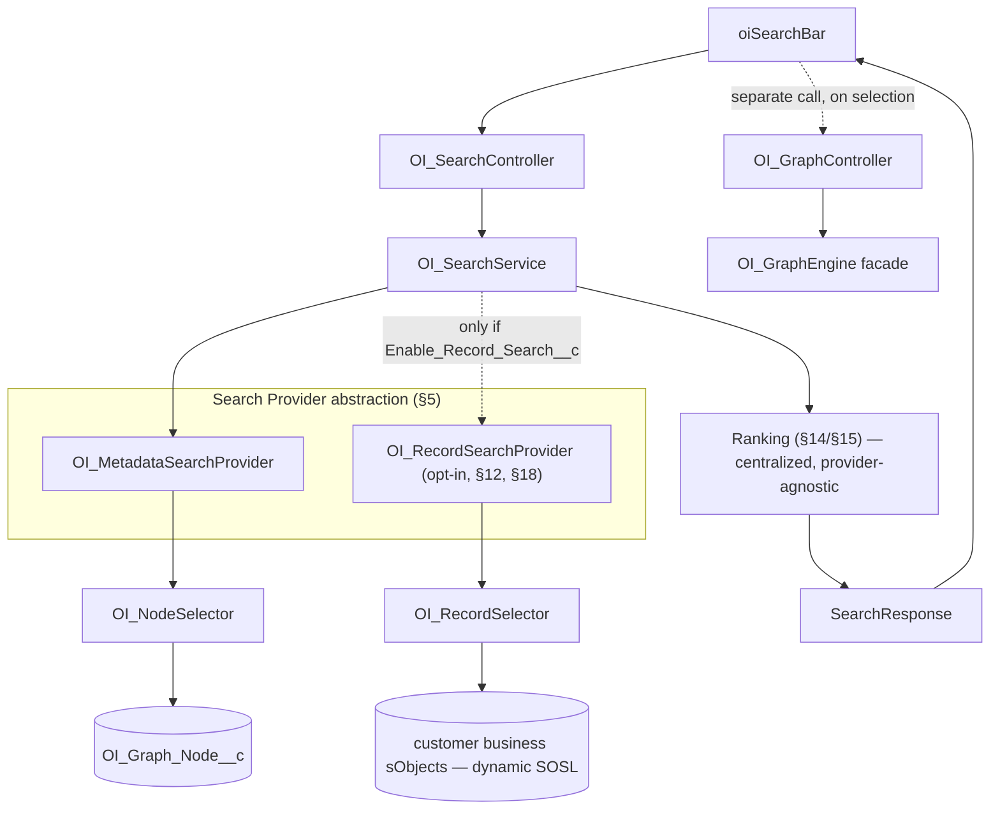

# Search Engine — Salesforce Org Intelligence Platform

Status: Draft v1
Owner: Architecture
Applies to: API v67.0

This document is the complete architectural specification of the Search subsystem: philosophy, architecture, request/response model, provider abstraction, SOSL/SOQL strategy, filtering, ranking, pagination, limits, security, caching, indexing, its integration with the Repository/Selector and Graph Engine layers, performance, error handling, forward-looking external-provider and AI extensions, and extension points. It contains no implementation code — only structure, contracts, and rationale.

**Governing constraints, stated once and enforced throughout, per this round's explicit mandate:**

- **Search never touches storage directly.** Every read goes through a Selector — the same Data Access layer citizen every other Service in this platform uses (CodingStandards §4), never through inline SOQL/SOSL inside `OI_SearchService` itself.
- **Search never contains metadata-type-specific branching where it can be avoided.** A new `componentKind`/`typeKey` must work with zero Search code changes, the same guarantee [GraphEngine.md §1](GraphEngine.md#1-graph-philosophy) already makes for the Graph Engine.
- **Search and graph traversal are separate concerns, enforced structurally, not just by convention.** `OI_SearchService` never calls `OI_GraphTraversal`, never calls `OI_GraphEngine.getGraphFragment`, and never loads a node's neighborhood as part of answering a search request. A search result hands the UI a `nodeKey` — nothing more — and the UI's *next*, independent action is what triggers any graph load.
- **Searching never requires loading the entire org.** Every provider call is bounded (§17, §19); there is no "search everything, then filter" code path anywhere in this design.

---

## 0. Relationship to Prior Documents — What This Corrects, Adds, and Challenges

Architecture.md §8 and [ADR-0007](ADR/0007-sosl-search-behind-abstracted-service.md) got the core decision right — SOSL behind an abstracted `OI_SearchService` seam — but left three things under-specified at the depth this document requires, and one entirely new capability (record search) was never designed at all. Each is a genuine correction or a genuine gap, not a stylistic rewrite:

| Finding | Where it was (silently) incomplete | Correction / addition |
|---|---|---|
| **Nothing in Architecture §8 said *where* the SOSL `FIND` statement itself is allowed to live.** | Read literally, "`OI_SearchService` backed by SOSL" could be — and, absent a stated rule, likely would be — implemented as an inline `FIND ... RETURNING ...` inside `OI_SearchService` itself. That is exactly the "no inline SOQL/SOSL outside Selectors" violation CodingStandards §4 already forbids everywhere else — this document is the first to actually apply that existing rule to Search, the same category of gap [GraphRepository.md §0](GraphRepository.md#0-relationship-to-prior-documents--what-this-corrects-and-adds) found and fixed for `OI_GraphRepository` last round. | The SOSL/SOQL statements live in `OI_NodeSelector` (a new method, §6/§22) and a new `OI_RecordSelector` (§12/§22) — never in `OI_SearchService` or any Search Provider. |
| **"Object filtering" (a Field search scoped to one parent Object) has no design that doesn't require a graph traversal** — and a graph traversal inside Search directly violates this round's own mandate. | Nothing in GraphEngine.md or DataModel.md gives a Node a way to answer "who is my structural parent" without walking a `HAS_FIELD`-shaped edge — which is exactly the `OI_GraphTraversal` dependency this document is required not to introduce. | A new, generic, opaque **`parentKey`** field is added to the Node model itself ([GraphEngine.md §2](GraphEngine.md#2-node-model), §11 below) — populated once, at ingestion time, by the same Mutation Generator that already derives every other Node field, never computed by Search. Formalized in [ADR-0018](ADR/0018-denormalized-parent-key-for-search-scoping.md). |
| **Record search was never designed at all** — Architecture §8 and `CLAUDE.md`'s own Product Vision describe this platform entirely in metadata terms (Objects, Fields, Flows, Apex, ...); "Records" appears nowhere in either. This round's mandate explicitly asks for it. | This is not a defect in a prior document — it is new scope this document must design honestly, including the tension it creates with the platform's stated vision (see the callout immediately below). | §12, §18 design Record Search as a **structurally separate, non-graph, opt-in-only** search domain, formalized in [ADR-0017](ADR/0017-search-provider-abstraction-record-search-outside-graph.md). |
| **No design existed for combining more than one search domain in a single response** without either inventing a fake single ranking across two structurally unrelated backends, or silently picking one. | Not addressed because record search — the second domain — didn't exist yet. | §4/§14 resolve this explicitly: results are **domain-partitioned**, never interleaved into one federated ranked list (Alternatives Considered, §31). |

**A scope callout worth stating plainly, in the spirit of "challenge the request, not just prior documents":** `CLAUDE.md`'s Product Vision section lists Objects, Fields, Relationships, Metadata, Dependencies, Apex, Flows, Validation Rules, Permission Sets, Profiles, Security, Packages, Integrations, Reports, Dashboards, Technical Debt, Org Health, and Impact Analysis — every one of them a *metadata* concept. It does not mention business records anywhere. Designing Record Search is not this document overreaching; it is this round's explicit instruction. But it is worth saying, once, in writing: Record Search is a genuine expansion of the platform's stated vision, not a natural extension of it, and this document's own recommendation (§29–§32) is that it ship **opt-in, disabled by default, and after the metadata search experience is solid** — not bundled into the same release milestone by default just because it's specified in the same document.

Everything else in Architecture §8 and ADR-0007 — SOSL as the native, lightest-solution backing mechanism; the abstraction seam that lets the backing mechanism change later without touching Controllers/LWCs — holds and is elaborated, not contradicted, below.

---

## 1. Search Philosophy

Three words, in the same spirit as [GraphEngine.md §1](GraphEngine.md#1-graph-philosophy) and [MetadataScanner.md §1](MetadataScanner.md#1-scanner-philosophy), each borrowed deliberately from a sibling document because Search's philosophy is genuinely a composite of both: **generic**, **bounded**, and — new here — **identity-only**.

**Generic**, in exactly the Graph Engine's sense (§1 there): Search operates over `typeKey`/`Node_Type__c` as an opaque string it filters by, never branches on. A new metadata type that ships as a Custom Metadata record and a new Scanner ([MetadataScanner.md §18](MetadataScanner.md#18-extension-points)) is searchable the instant its first node is ingested — zero Search code change, by construction, not by discipline.

**Bounded**, in exactly Architecture §1's sense: no search call ever scans, ranks, or returns an unbounded result set. Every provider call carries a hard row ceiling (§17, §19) before it ever reaches SOSL, not after.

**Identity-only** — new, and the philosophical anchor for this document's most important structural boundary: **a search result is a pointer, never a payload.** It tells the UI *what* matched and *how to ask for more* (a `nodeKey`, a `recordId`) — it never itself contains a neighborhood, a dependency list, or anything requiring traversal. This is what makes "search and graph traversal must remain separate concerns" true by design rather than true by convention: the response shape structurally cannot carry traversal-shaped data, because it was never given a field for it.

---

## 2. Search Architecture



The dashed line at the bottom is deliberate: it is the entire point of §23. Selecting a result and viewing its graph neighborhood are two different Controller calls, two different Service calls, and — as the diagram shows — the second one never originates from inside the Search subsystem.

**Layer responsibilities**, each single-purpose:

| Component | Knows about | Never knows about |
|---|---|---|
| `OI_SearchController` | DTO mapping, permission check, delegating to `OI_SearchService` | Any ranking/filtering logic, SOSL/SOQL shape |
| `OI_SearchService` | The Search Provider abstraction, centralized ranking, pagination assembly, caching policy | SOSL/SOQL syntax (delegates to Selectors via Providers), `OI_GraphTraversal`, `OI_GraphRepository`, `OI_GraphEngine` |
| `OI_MetadataSearchProvider` | How to ask `OI_NodeSelector` for text/exact/filtered matches over Nodes | Any specific `componentKind`/`typeKey`; how ranking weights are combined (returns raw candidates + raw relevance, §14) |
| `OI_RecordSearchProvider` (opt-in) | How to ask `OI_RecordSelector` for text matches over configured sObjects | Graph anything — has zero dependency on `OI_Graph_Node__c`, `OI_GraphEngine`, or any `OI_Graph*` class |
| `OI_NodeSelector` / `OI_RecordSelector` | Query construction, field lists, index-aware predicates | Ranking, pagination assembly, request/response DTO shape |

This table is the same enforcement mechanism [MetadataScanner.md §2](MetadataScanner.md#2-scanner-architecture) and [GraphEngine.md §1.1](GraphEngine.md#11-graphengine-facade--the-only-public-entry-point) already use: a reviewer asks one question — does a class in the left column now reference something in its "never" column?

---

## 3. Search Request Model

One generic request shape, used identically regardless of which domain(s) it targets — this is what makes "unified way to locate any supported component" true structurally rather than aspirationally:

| Field | Type | Notes |
|---|---|---|
| `query` | string, required | Raw user input. Sanitized against SOSL/SOQL reserved-character injection before any Selector sees it (§18, §25) — this happens once, at the `OI_SearchService` boundary, never per-provider. |
| `domains` | `Set<enum: Metadata, Record>` | Defaults to `{Metadata}`. `Record` is only honored if `OI_Settings__mdt.Enable_Record_Search__c = true` (§12) — otherwise silently treated as absent, not an error (consistent with `CLAUDE.md`'s "degrade gracefully" rule for missing/disabled capability, not just missing metadata). |
| `typeFilter` | `Set<typeKey>`, optional | Opaque strings (e.g. `SalesforceMetadata.Flow`) — Metadata domain only. Generic by construction (§10). |
| `parentKeyFilter` | opaque string, optional | Metadata domain only — scopes results to nodes whose `parentKey` equals this value (§11). Never triggers a traversal. |
| `sObjectFilter` | `Set<String>`, optional | Record domain only — a subset of the configured, enabled sObjects (§12) to search among; empty means "all enabled." |
| `pageSize` | integer | Capped server-side by `OI_Settings__mdt.Default_Search_Page_Size__c`/a hard ceiling (§16, §17) regardless of what the caller requests. |
| `pageCursor` | opaque string, optional | Domain-scoped (§4) — a cursor from a `Metadata`-domain page is never valid against the `Record` domain and vice versa. |

**Why one shape for both domains rather than two request DTOs**: the fields that don't apply to a given domain (e.g. `sObjectFilter` when only `Metadata` is requested) are simply ignored, not rejected — this keeps `oiSearchBar` (Architecture §9) able to construct one request object regardless of which domain toggle is active, without a DTO-shape branch in the LWC itself, consistent with "no business logic in LWC JS" (CodingStandards §10).

---

## 4. Search Response Model

**Domain-partitioned, not interleaved** — the direct consequence of §0's fourth finding and §31's Alternatives Considered entry:

```
SearchResponse {
  pages: Map<domain, DomainResultPage>
}

DomainResultPage {
  results: List<SearchResultItem>
  hasMore: boolean
  nextCursor: string (optional)
  truncated: boolean   // new — see below
}
```

**`truncated`, stated precisely because it is easy to gloss over**: `hasMore = false` normally means "you have seen every match." Under the search-limits ceiling (§17), a provider can be forced to stop before it has actually determined whether more matches exist (e.g., it hit its row ceiling mid-scan). In that case, the response sets `truncated = true` **and** `hasMore = false` together — an honest, distinct signal meaning "we stopped, not because we finished, but because we hit a bound; there may be more, but query refinement will find them faster than paging will." A UI that only checks `hasMore` never lies to the user about completeness; a UI that also checks `truncated` can show "showing top N — refine your search for more" instead of a bare "no more results." This is a small, deliberate design choice in the spirit of the platform's existing "no silent caps" pattern already applied to `getCurrentKeysByType` pagination ([GraphRepository.md §13](GraphRepository.md#13-pagination)) and MetadataScanner's retire-detection paging.

**`SearchResultItem`** — discriminated by `resultKind`, and this is the section that directly answers the mandate "search results must contain enough information for the UI to identify and select a graph node":

| Field | Present for | Notes |
|---|---|---|
| `resultKind` | Both | `Metadata` \| `Record` |
| `score` | Both | Post-ranking composite (§14/§15), comparable *within* one domain's page only — never across domains (they are never in the same list to compare within). |
| `matchQuality` | Both | `Exact` \| `Prefix` \| `Contains` \| `Fuzzy` — generic, computed structurally (§9, §15), exposed for a future "why did this match" affordance. |
| `nodeKey` | Metadata only | **This is the entire handoff contract to `OI_GraphEngine` (§23).** Opaque, stable, exactly the identifier `getGraphFragment`/`getNodeDetail` already accept (API.md §2.1). |
| `typeKey`, `label`, `secondaryKey`, `parentKey` | Metadata only | Enough for the UI to render the result row and decide whether to show a "scoped to parent" breadcrumb — without a second round-trip. |
| `recordId`, `sObjectApiName`, `displayName` | Record only | **Deliberately no `nodeKey`.** A record is not a graph node (§0, §12) — there is nothing to hand off to `OI_GraphEngine` for a record result itself. See §23 for the one narrow, optional bridge that does exist. |

---

## 5. Search Provider Abstraction

Directly mirrors [GraphRepository.md §3](GraphRepository.md#3-storageprovider-interface)'s Storage Provider pattern — deliberately, since it solves the identical structural problem (multiple backends, one small stable contract, zero branching in the orchestrator) one layer away from storage instead of at it.

`OI_ISearchProvider`:

| Method | Input | Output | Notes |
|---|---|---|---|
| `search(SearchRequest)` | The full request (provider reads only the fields relevant to its own domain) | `List<RawCandidate>` (unranked — see below) | Bulk-shaped, bounded internally by the provider's own row ceiling (§17) regardless of what `pageSize` asks for. |
| `exactMatch(SearchRequest)` | Same shape, used for "jump to" (§8) | `RawCandidate` or none | A SOQL, not SOSL, path — see §7. |

**Two implementations**, registered against a domain in `OI_Settings__mdt`-driven configuration (data-driven dispatch, not an `if (domain == Metadata)` branch inside `OI_SearchService` — the same Open/Closed reasoning [GraphRepository.md §3](GraphRepository.md#3-storageprovider-interface) already gives for Storage Providers applies identically here):

| Provider | Domain | Selector used | Backing store |
|---|---|---|---|
| `OI_MetadataSearchProvider` | `Metadata` | `OI_NodeSelector` | `OI_Graph_Node__c` |
| `OI_RecordSearchProvider` | `Record` | `OI_RecordSelector` | Customer business sObjects (dynamic, configured allow-list, §12) |

**Ranking is deliberately not inside the provider** — a provider returns `RawCandidate`s (identity fields + an unranked relevance signal from its own backend, e.g. SOSL's own score), and `OI_SearchService` applies one centralized, provider-agnostic ranking pass (§14/§15) before pagination. This is what keeps a future third provider (§26) from having to reimplement boost-weight logic — it inherits ranking for free just by returning the same `RawCandidate` shape.

**Future providers** (§26) implement `OI_ISearchProvider` the same way — zero change to `OI_SearchService`, `OI_SearchController`, or any DTO.

---

## 6. SOSL Strategy

SOSL remains the primary mechanism for both domains (ADR-0007), now precisely scoped:

- **One `FIND` statement per domain per request, never per type/object.** `OI_NodeSelector.searchCurrentByText` issues a single multi-clause SOSL query returning `OI_Graph_Node__c` rows, with `typeFilter`/`parentKeyFilter` expressed as `WHERE` predicates inside the `RETURNING` clause (SOSL supports this) — never one SOSL call per requested `typeKey`. `OI_RecordSelector` does the same across whichever sObjects are in scope, in one call (§12).
- **Fields searched**: `Label__c`, `Secondary_Key__c` — unchanged from [GraphEngine.md §13](GraphEngine.md#13-search-indexing-strategy); `Attributes_Json__c` remains explicitly not searched (an opaque JSON blob is not meaningfully SOSL-tokenizable) and `parentKey` is a filter field, not a `FIND`-clause target (§11).
- **`Is_Current__c = true` is always in the `RETURNING`-clause `WHERE`**, non-negotiable, same rule and same reasoning as every other query against these objects ([GraphEngine.md §13](GraphEngine.md#13-search-indexing-strategy)) — restated here because a stale/superseded version surfacing in a typeahead result is a worse user-facing failure mode than in almost any other read path: it actively tells the user something exists (or is still named/shaped a certain way) when it does not.
- **Escaping**: user input passes through a single sanitization step before entering the `FIND {...}` clause, removing/escaping SOSL reserved characters (`?`, `&`, `|`, `!`, `{`, `}`, `[`, `]`, `(`, `)`, `^`, `~`, `*`, `:`, `"`, `+`, `-`, `\`) rather than rejecting queries containing them outright — a user typing `Account_Status__c` or `Is-Active` should still get useful results, not an error.

---

## 7. SOQL Strategy

SOQL is the exact-match path (§8), and the secondary fallback when SOSL under-matches on a very short query (§9):

- **Exact "jump to"**: `SELECT ... FROM OI_Graph_Node__c WHERE Secondary_Key__c = :key AND Is_Current__c = true [AND Node_Type__c = :typeKey] [AND Parent_Key__c = :parentKey]` — a single indexed, highly selective query, never a SOSL call (SOSL's relevance ranking is wasted work for a lookup that already knows the exact value).
- **Short-query fallback**: SOSL requires a minimum token length to tokenize meaningfully (typically at least 2 characters); for queries below `OI_Settings__mdt.Min_Search_Query_Length__c` (§17), `OI_MetadataSearchProvider` skips SOSL entirely and issues a SOQL `LIKE 'query%'` prefix-match against `Label__c`/`Secondary_Key__c` instead — bounded by the same row ceiling, and this is the *only* place a `LIKE` query appears in this design (a full unbounded `LIKE '%query%'` is never used — leading-wildcard `LIKE` queries cannot use an index and are explicitly avoided here for exactly that reason).
- **No SOQL query in this subsystem is ever unbounded** — every SOQL statement carries an explicit `LIMIT` clause sized to the provider's row ceiling (§17), consistent with CodingStandards §4's existing rule.

---

## 8. Exact-Match Search

The "jump to node" / "jump to record" use case — precision over recall, no ranking needed because there is at most one right answer:

- **Metadata**: `exactLookup(secondaryKey, typeKey?, parentKey?)` (API.md §2.2, elaborated) — a single SOQL row lookup (§7). Returns the same `SearchResultItem` shape a ranked search would, with `matchQuality = Exact` and a `score` of the maximum value, so UI rendering code needs no special case for "this came from exact lookup vs. ranked search."
- **Record**: an analogous `recordId`-or-natural-key lookup against the target sObject, subject to the same enablement gate and sharing model as ranked record search (§12) — no separate security posture for the exact-match path; precision doesn't relax access control.
- **Why this stays a separate method rather than "ranked search with `pageSize = 1`"**: a ranked search with a tiny page size still pays SOSL's indexing/ranking overhead and still returns a `score` a caller might mistakenly compare against a different query's score; a genuinely separate, genuinely exact SOQL lookup is cheaper and its result is unambiguous — this mirrors exactly why API.md already kept `search` and `exactLookup` as two methods before this document existed, and this document simply confirms that decision was and remains correct.

---

## 9. Partial / Fuzzy Search

- **Partial (prefix/contains)**: SOSL's own tokenization handles this natively and is the default experience for any query at or above the minimum length (§7) — no custom logic needed; this is exactly the "lightest solution capable of solving the problem" ADR-0007 already committed to.
- **Fuzzy (typo-tolerant)**: **not supported in v1, stated as an honest limitation, not silently absent.** SOSL has no native edit-distance/typo-tolerance matching. A user searching "Acount" will not find "Account" through this design. This is recorded as a real product gap (§29 Risks) with a named, deliberate non-fix: building custom fuzzy matching in Apex (e.g., a hand-rolled Levenshtein-distance pass over candidate labels) would mean scanning far more candidates than SOSL's own index-backed matching ever touches, directly undermining "never requires loading the entire org" for the sake of a UX nicety — the correct answer, if this becomes a real customer complaint, is the external search provider extension point (§26), not a custom in-Apex fuzzy algorithm.
- **`matchQuality` classification**, computed structurally (never per-type): `Exact` (case-insensitive full string equality against `label`/`secondaryKey`), `Prefix` (query is a leading substring), `Contains` (query appears anywhere), `Fuzzy` (reserved for a future provider that actually supports it — never assigned by `OI_MetadataSearchProvider`/`OI_RecordSearchProvider` today). This is a plain string comparison against already-fetched candidates, computed once per candidate after SOSL returns them — not a second query.

---

## 10. Type Filtering

`typeFilter` (§3) is the Metadata domain's primary scoping mechanism, and it is deliberately the *only* mechanism — there is no secondary "category" concept layered on top of `typeKey`. Filtering by type is expressed as a `WHERE Node_Type__c IN :typeFilter` predicate inside the SOSL `RETURNING` clause (§6) or the SOQL exact-lookup predicate (§7) — an ordinary indexed equality-set filter, no branching. Because `typeKey` is opaque (ADR-0011), **this mechanism automatically supports every future metadata type with zero Search change** — the "Future metadata types" requirement in this round's mandate is satisfied by this section doing nothing type-specific at all, which is the intended outcome, not an oversight.

---

## 11. Object Filtering — via `parentKey`, Never via Traversal

This is the section §0 flagged as a genuine correction, worked through in full.

**The naive design, rejected**: "Object filtering" (show only Fields belonging to Account) sounds like it wants a graph traversal — start at the Account node, walk its `HAS_FIELD` edges, filter the candidate set to those neighbors. That is exactly what this round's mandate forbids ("do not load the dependency graph during search"; "search and graph traversal must remain separate concerns") — and it would also be slower and more complex than the alternative below for no benefit.

**The chosen design**: every Node gains an optional, generic, opaque **`parentKey`** field ([GraphEngine.md §2](GraphEngine.md#2-node-model), [DataModel.md §2.3](DataModel.md#23-oi_graph_nodec)) — populated once, at ingestion, by `OI_MutationGenerator`, from a `parentComponentKey` the Scanner already faithfully knows for types that have one natural structural parent ([MetadataScanner.md §5, §15](MetadataScanner.md#5-discovery-model)): a `CustomField`'s parent is its `CustomObject`; a `ValidationRule`'s parent is its `CustomObject`; a `RecordType`'s parent is its `CustomObject`. Types with no single natural parent (an `ApexClass`, a `Flow`) simply leave it blank. `parentKeyFilter` (§3) is then an ordinary indexed equality predicate — `WHERE Parent_Key__c = :parentKeyFilter` — exactly as cheap and exactly as generic as `typeFilter` (§10).

**Why this is not a violation of the Graph Engine's genericity requirement**: `parentKey` is, to the engine, exactly as opaque as `secondaryKey` already is — a domain-assigned string the engine stores, indexes, and never interprets. The engine does not know "parent" means "the object this field belongs to"; it only knows one node's `parentKey` value can equal another node's `nodeKey` value, which is a graph-mechanics fact (an optional reference), not a domain-vocabulary one — precisely the same distinction [GraphEngine.md §1](GraphEngine.md#1-graph-philosophy) already draws between vocabulary the engine must stay generic about and mechanics the engine legitimately owns.

**Why this is denormalization, and why that is an accepted, bounded trade, not an oversight**: the same fact (Account HAS_FIELD Industry) now lives in two places — an edge (already existing, used by traversal) and a field on the Field's own node (new, used only by Search). This is a deliberate, narrow instance of exactly the "promoted attribute slot" extension point [GraphEngine.md §2](GraphEngine.md#2-node-model) already flagged as future work — this document is the first concrete case that actually needed it, and it needed exactly one field, not the general mechanism. Full rationale and rejected alternatives: [ADR-0018](ADR/0018-denormalized-parent-key-for-search-scoping.md), §31 below.

---

## 12. Record Search

The new domain, designed in full per this round's mandate, and deliberately kept structurally separate from everything above it in this document.

**Records are never modeled as Graph Nodes — full stop.** A subscriber org can hold millions of Account/Contact/custom-object records; persisting even a fraction of that as `OI_Graph_Node__c` rows would multiply this platform's own storage footprint by an order of magnitude no metadata-only design ever accounted for, and would directly violate Architecture §1's "never load an entire org" for a category of data this product was never scoped to warehouse (§0's scope callout). Records are searched **live, on demand, never persisted by this platform**.

**Scope is admin-configured and opt-in, off by default** — a new Custom Metadata Type, `OI_Record_Search_Scope__mdt` ([DataModel.md §4](DataModel.md#4-custom-metadata-types-packageable-configuration), new):

| Field | Type | Notes |
|---|---|---|
| `SObject_Api_Name__c` | Text(80) | The target business object. |
| `Enabled__c` | Checkbox | Off by default for every row — nothing is searchable until an admin explicitly opts it in, mirroring the platform's existing "scans are opt-in, never auto-enabled" posture (Architecture §15). |
| `Display_Field_Api_Name__c` | Text(80) | Which field supplies `displayName` in the result (usually `Name`, but not every object has one). |
| `Search_Boost_Weight__c` | Number | Same generic ranking mechanism as the Domain Type Registry's field of the same name (§14/§15) — one ranking mechanism, applied uniformly across both domains, not two. |

Plus a single master switch, `OI_Settings__mdt.Enable_Record_Search__c` (default `false`) — even with individual sObjects configured, Record Search as a whole stays off until this is explicitly turned on, a deliberate double opt-in given the vision-scope tension §0 already named.

**Mechanism — dynamic SOSL, necessarily**: because the target object list is runtime configuration, not compile-time knowledge, `OI_RecordSelector` cannot use static SOSL syntax (whose `RETURNING` clause targets are fixed at compile time) — it constructs and executes a dynamic SOSL string via `Search.query(String)`, built from the enabled `OI_Record_Search_Scope__mdt` rows for the request's `sObjectFilter` (or all enabled rows if unset). This is the one place in this platform's search design where the query shape is assembled at runtime rather than written statically — worth naming explicitly since it is a materially different code shape from every other Selector in the codebase, and worth confirming it is still executed as a `[SELECT]`-shape query living inside a Selector (`OI_RecordSelector`), not inline in a Service, so CodingStandards §4's rule holds even for a dynamically-built statement.

**Security — full CRUD/FLS/sharing, not the Apex-boundary model**: [ADR-0006](ADR/0006-apex-boundary-security-model-for-app-internal-data.md) explicitly scopes the Custom-Permission-only gating model to the platform's own `OI_*__c` application-internal objects; it explicitly does *not* cover "data reachable through the graph that actually is customer business data." Records are exactly that data, directly, not "reachable through" anything. `OI_RecordSelector` runs `with sharing`, and its dynamic SOSL string includes `WITH USER_MODE` — a user searching records only ever sees records they could already see through standard Salesforce access control. `OI_View_Graph`/`OI_Run_Scan` (the platform's existing Custom Permissions) are irrelevant here; a *new*, narrower Custom Permission, `OI_Search_Records`, gates whether the *feature* is exposed to a given user at all — access to individual records themselves is exclusively governed by the org's own sharing model, never by this new permission, which only ever narrows, never substitutes for, standard access control.

**Result identity**: `recordId` + `sObjectApiName` + `displayName` (§4) — deliberately no `nodeKey`. §23 covers the one narrow, optional bridge back toward the Graph Engine that does exist for a Record result.

**Ranking**: identical mechanism to Metadata (§14/§15) — SOSL's own relevance score, combined with `Search_Boost_Weight__c` and `matchQuality` (§9) — no separate ranking design needed, another benefit of the provider-agnostic centralized ranking decision (§5).

---

## 13. Metadata Search

The composition section for the domain that actually ships in v1 — `OI_MetadataSearchProvider.search()`'s full behavior, stated as one coherent flow rather than scattered across §6–§11:

1. Sanitize `query` (§6).
2. If `query.length() < Min_Search_Query_Length__c`: SOQL prefix-match fallback (§7), else SOSL (§6).
3. Apply `typeFilter` (§10) and `parentKeyFilter` (§11) as `RETURNING`-clause predicates on the *same* query — never as a second, post-fetch in-memory filter pass, which would mean over-fetching from SOSL only to discard rows, wasting exactly the governor budget §19 is designed to protect.
4. `Is_Current__c = true` always (§6).
5. Return `RawCandidate`s (identity fields + SOSL's own relevance signal) — unranked; `OI_SearchService` ranks (§14/§15).

This is the entire Metadata provider's job — no step above is `componentKind`-specific, satisfying the "no metadata-type-specific branching" mandate by construction, the same way §10 does.

---

## 14. Ranking Strategy

Centralized in `OI_SearchService`, applied identically regardless of which provider produced a candidate (§5) — one ranking pipeline, not one per domain:

1. **Base signal**: the backing query's own relevance score — SOSL's built-in ranking for both domains (§6).
2. **Match-quality boost**: `Exact` > `Prefix` > `Contains` > `Fuzzy` (§9), a fixed, generic ordinal boost — never type-specific.
3. **Configured boost weight**: `Search_Boost_Weight__c`, read once per request from the Domain Type Registry (Metadata, keyed by `typeKey`) or `OI_Record_Search_Scope__mdt` (Record, keyed by `sObjectApiName`) — a small, admin-tunable multiplier (e.g., an org might want `CustomObject`/`ApexClass` results to rank above `ValidationRule` results for equally-good text matches, without any code change).
4. **Tie-break**: alphabetical by `label`/`displayName` — deterministic, so repeated identical queries return a stable order (a real, if minor, UX property — nothing is worse for trust in a search box than the same query returning results in a different order on every keystroke-triggered re-fetch).

**Why boost weight lives in existing Custom Metadata rather than a new ranking-specific object**: both the Domain Type Registry and the new `OI_Record_Search_Scope__mdt` already exist as the natural, per-type/per-object configuration home (§11, §12) — adding the field there, rather than inventing a third "ranking config" object, is the same "reuse existing configuration surfaces" instinct `CLAUDE.md` already asks for generally ("search existing... avoid duplicated logic") applied to configuration schema, not just code.

---

## 15. Relevance Scoring

The composite `score` (§4) exposed to the UI is `baseSignal × matchQualityBoost × configuredBoostWeight`, normalized to a `0–1` range **per domain page**, not globally — restated from §4 because it matters enough to repeat precisely: a `0.9` in a `Metadata` page and a `0.9` in a `Record` page are not claims about relative quality against each other, only within their own list. This is a direct, structural consequence of §4's domain-partitioning decision, not a separate design choice — there is no formula in this document for combining scores *across* domains, because §31 concluded no such formula can be made honest without materializing both backends fully first.

`OI_SearchService`, not a provider, computes the final composite — providers return raw, pre-boost signal (§5) specifically so this formula lives in exactly one place and changing it (e.g., re-weighting the boost multiplier) never requires touching `OI_MetadataSearchProvider` or `OI_RecordSearchProvider`.

---

## 16. Pagination

- **Metadata & Record domains paginate independently** (§4) — a multi-domain request returns one `DomainResultPage` per requested, enabled domain, each with its own `nextCursor`.
- **Cursor shape**: an opaque, offset-encoding cursor is deliberately *not* used past a small ceiling (§17, §19) — SOSL's `OFFSET` support has a platform-enforced ceiling beyond which rows are simply not retrievable that way at all, a hard constraint worth designing around rather than discovering in production. Instead, `pageSize` is capped low enough (§17) that most real search sessions never need more than one or two pages, and paging past the ceiling is explicitly unsupported — refine the query instead (§29 Risks states this honestly as a limitation).
- **No cross-domain, no cross-provider, no cross-request cursor reuse** — a cursor is valid only for the exact `(domain, query, filters)` tuple it was issued against; a changed query invalidates any outstanding cursor implicitly (there is nothing to explicitly invalidate — a new query is simply a new, independent request).

---

## 17. Search Limits

Product-level bounds, distinct from platform governor ceilings (§19) — these exist even where the platform would technically allow more, because more would not be useful:

| Limit | Config | Rationale |
|---|---|---|
| `Min_Search_Query_Length__c` | `OI_Settings__mdt`, default 2 | Below this, SOSL's own tokenization is unreliable and a 1-character query against a large org would be relevance-noise, not a useful result — the SOQL prefix fallback (§7) exists specifically to still do *something* reasonable below this threshold, cheaply. |
| `Default_Search_Page_Size__c` / hard ceiling | `OI_Settings__mdt` | Caller-requested `pageSize` (§3) is clamped to this, never trusted as-is — the same "never trust a client-supplied size" posture `Max_Hop_Depth__c` already enforces for graph traversal (GraphEngine.md §12, DataModel §4.3). |
| `Max_Search_Results__c` | `OI_Settings__mdt` | Total results returned across all pages for one logical query session before pagination stops offering `nextCursor` at all and instead sets `truncated = true` (§4) — the product-level answer to §16's OFFSET-ceiling constraint. |

---

## 18. Security and Sharing

Two entirely different postures, by domain — stated together here precisely because conflating them would be the security mistake most likely to actually happen:

- **Metadata domain**: identical to every other graph read path (Architecture §14, [ADR-0006](ADR/0006-apex-boundary-security-model-for-app-internal-data.md)) — `OI_View_Graph` Custom Permission required at the Controller boundary; `OI_NodeSelector` reads run `with sharing` (these are application-internal cache objects with no meaningful record-level sharing, per ADR-0006, but the read path itself is still permission-gated).
- **Record domain**: **not** covered by ADR-0006 at all (§12) — full CRUD/FLS/sharing via `WITH USER_MODE`, gated additionally by the new `OI_Search_Records` Custom Permission *and* the double opt-in (`Enable_Record_Search__c` + per-object `Enabled__c`, §12). A user with `OI_Search_Records` but no access to Account records under standard sharing sees zero Account results — the feature permission only exposes the *capability*; the org's own access model still decides *visibility*, exactly as ADR-0006's own carve-out already anticipated for this category of data.
- **Input sanitization** (§6) is itself a security-relevant step, not just a correctness one: unescaped user input placed into a dynamic SOSL string (§12 especially, since it is genuinely dynamically constructed) is the platform's one legitimate injection-shaped surface in this subsystem — mitigated by sanitizing once, centrally, before any provider or Selector sees the raw query string, never per-provider (a per-provider sanitization step would be exactly the kind of duplicated-logic risk `CLAUDE.md` warns against, and a missed instance would be a real vulnerability, not a cosmetic bug).
- **No new elevated access is introduced.** Search never runs `without sharing` for anything — unlike `OI_GraphRepository`'s narrowly-justified write paths (Architecture §14), Search is a pure read surface across both domains, and a pure read surface has no justification for relaxing sharing at all.

---

## 19. Governor-Limit Strategy

- **At most one SOSL query per domain per request** (§6, §12) — a federated `{Metadata, Record}` request costs at most two SOSL queries, both well inside the platform's per-transaction query ceiling shared with every other Apex execution in the same transaction.
- **Every SOQL statement carries an explicit `LIMIT`** (§7) sized to the relevant row ceiling (§17) — never an unbounded query, never a query inside a loop (CodingStandards §4, restated here because this subsystem is a read-heavy one where the temptation to "just query per candidate for extra detail" is real and explicitly rejected — §13's step 5 returns identity fields only, precisely so no second per-candidate query is ever needed).
- **Heap**: `RawCandidate` lists are bounded by the same row ceilings before ranking (§14) ever runs over them — ranking is a fixed-size in-memory sort over an already-small, already-bounded list, never a heap-risk operation.
- **CPU**: sanitization (§6/§18) and ranking (§14) are both linear-time, single-pass operations over an already-bounded candidate set — no algorithmic complexity concern at the row counts this subsystem ever actually handles.
- **Dynamic SOSL specifically** (§12): `Search.query(String)` is still subject to the same per-transaction SOSL query count and result-row ceilings as static SOSL — "dynamic" changes how the query text is assembled, not what governor limits apply to it; this is stated explicitly because dynamic-anything sometimes gets mistaken for "escapes the usual limits," which it does not.

---

## 20. Caching

- **Metadata domain**: cached in **L1 (Platform Cache, via the existing `OI_CacheService` — Architecture §4/§11)**, keyed `hash(domain + query + typeFilter + parentKeyFilter + pageCursor)`, short TTL (shorter than graph-fragment caching's default, since a search cache entry keyed by raw query text has no natural invalidation trigger the way `OI_GraphCache`'s checksum-folded keys do — GraphEngine.md §14 — expiry alone, not targeted eviction, is this cache's only invalidation mechanism, and that is an accepted, stated limitation, not a gap: a rename that hasn't yet expired from cache is a stale label for at most one TTL window, a far smaller correctness concern than a stale current-version flag would be). `OI_CacheService`'s existing scope (Architecture §4) is extended to cover this explicitly — Search does not need `OI_GraphCache`'s versioning-aware invalidation machinery, so reusing the simpler, already-existing generic cache service is the right fit, not a new `OI_SearchCache` component.
- **Record domain: never cached in L1, deliberately.** Platform Cache's Org partition is shared across every user in the org; caching a record-search result there would risk one user's cache entry (built under *their* sharing visibility) being served to a different user with *different* visibility over the same underlying data — a real, concrete data-leakage risk, not a theoretical one, given how directly record search is tied to per-user sharing (§18). Record search results may be held in **L3 (client-side, within the requesting user's own session only)** exactly as any other UI state would be, but never server-side, never shared, never TTL-cached in a way that could outlive the request that produced it under a *different* user's session.
- **No caching for exact-match lookups** (§8) — these are already single indexed-row SOQL calls; caching would add complexity for a query cheap enough that the cache lookup itself would cost a meaningful fraction of the work it's trying to save.

---

## 21. Search Indexing Strategy

[GraphEngine.md §13](GraphEngine.md#13-search-indexing-strategy) already established the Graph Engine's own contribution — `Label__c`/`Secondary_Key__c` searchable, `Node_Type__c` filter-only, `Attributes_Json__c` not searchable, `Is_Current__c` always scoped — and is amended (below) to point here as this document is the deeper, authoritative treatment; nothing in that section is contradicted, only extended:

- **`Parent_Key__c` is filter-only, like `Node_Type__c`** — an indexed equality predicate (§11), never a `FIND`-clause text target. Searching *for* a parent by name is a separate, ordinary metadata search (find the Object node); *filtering by* a parent once you have its key is what `Parent_Key__c` is for. The two are not the same operation and this document does not conflate them.
- **`Search_Boost_Weight__c`** (§14) is Custom Metadata, not an indexed field on the searched object at all — it is read once per request (a handful of Domain Type Registry/Record Search Scope rows, already small and already cached by the platform's own Custom Metadata caching), never joined into the SOSL query itself.
- **Records get zero custom indexing from this platform** — Salesforce's own platform search index already covers standard/custom sObjects natively; there is nothing for this document to add here, and stating that plainly is itself useful: Record Search's "indexing strategy" is "there isn't one to build; it already exists."
- **Versioning consequence, restated once more because it is this subsystem's single most important correctness rule**: every text-search and filter query against `OI_Graph_Node__c` scopes `Is_Current__c = true` inside the Selector itself (§6, CodingStandards §4) — never left to a caller to remember.

---

## 22. Repository Integration

**Search has no dependency on `OI_GraphRepository`, deliberately.** This is worth stating as a decision, not an omission, because the natural first assumption — "Repository is the data-access gateway for graph data, so Search must go through it" — is wrong, and it is worth explaining why:

`OI_GraphRepository`'s public contract ([GraphRepository.md §2](GraphRepository.md#2-graphrepository-interface)) is five operations shaped entirely around the Graph Builder's write-decision workflow (`getCurrentVersions`, `getCurrentKeysByType`, `commitVersion`, `touchLiveness`, `archiveSupersededVersions`) — none of them is "give me a relevance-ranked, paginated, filtered text match." Forcing Search through the Repository would mean one of two bad outcomes: bloating the Repository's contract with a search-shaped method it has no architectural business owning (directly worsening the "Repository becoming a god-object" risk [GraphRepository.md §21](GraphRepository.md#21-risks) already names), or adding a pointless pass-through method that adds indirection with no benefit. Instead:

- **`OI_NodeSelector` is a shared Data Access layer citizen, not a Repository-exclusive one.** `OI_GraphRepository` uses it for current-version lookups ([GraphRepository.md §12](GraphRepository.md#12-query-strategy--selector-delegation)); `OI_SearchService`'s `OI_MetadataSearchProvider` uses the *same class*, a different method, for text search. This is consistent with Architecture §4's own layering rule ("a service may call another service's public API; it may never call another service's Selector/Repository/Adapter directly") — `OI_NodeSelector` is not "the Graph Engine's Selector" in the sense that rule protects against; it is a general Data Access component any Service may depend on, the same way any Service may depend on `OI_LoggerService` without that making `OI_LoggerService` "owned" by whichever Service happened to use it first.
- **This is a deliberate, explicit answer to a question the platform's layering diagram (Architecture §2) leaves implicit** — the diagram shows one "Selectors" box under the Data Access Layer, shared by everything above it, and this document is simply the first to make that sharing concrete for a Selector that also happens to be used by the Graph Engine's own Repository.
- **`OI_RecordSelector` has no Repository at all, by design** (§12) — records are never persisted by this platform, so there is nothing for a Repository to be "the sole writer" of; a Selector alone is the complete, correct Data Access footprint for a read-only, never-written-by-us data source.

---

## 23. Graph Engine Integration

**The entire integration is one field: `nodeKey`.** This section exists to make that claim precise rather than hand-wavy.

- A Metadata search result carries `nodeKey` (§4). Selecting it triggers a **new, independent** Controller call — `OI_GraphController.getGraphFragment(nodeKey, hopDepth: 0 or a small default)` or `getNodeDetail(nodeKey)` (API.md §2.1), already-existing methods, unchanged by this document — issued by the UI, not by `OI_SearchService`, not automatically, not as part of the search response.
- **`OI_SearchService` never calls `OI_GraphEngine`, `OI_GraphTraversal`, or `OI_GraphController` — in either direction.** There is no code path in this design where finding a result and viewing its neighborhood share a single server round-trip. This is the literal, structural enforcement of "search and graph traversal must remain separate concerns" — not a convention a future contributor could accidentally violate by adding "just one convenience method," because there is no shared component between the two subsystems for such a method to live on.
- **The one narrow, optional bridge from Record results back toward the graph** (§12): if a Record result's `sObjectApiName` happens to also exist as a Metadata (`CustomObject`) node — which, for standard/custom objects the Metadata Scanner has scanned, it usually will — the UI *may* offer a secondary "view this object's metadata" affordance. This is implemented as the UI issuing its own, separate `exactLookup(secondaryKey: sObjectApiName, typeKey: "SalesforceMetadata.CustomObject")` call (§8) — not something `OI_RecordSearchProvider` resolves or returns, and not something that happens automatically. It is a UI-composition choice built entirely from two already-independent, already-existing capabilities, exactly the kind of "AI/NL layer composes Search and Dependency Engine, not a merged component" pattern §27 also relies on — the same architectural principle answering two different sections' questions is a sign the boundary is drawn in the right place, not a coincidence.

---

## 24. Performance

Consolidated, each item traceable to a section above:

- One SOSL query per domain per request (§6, §19) — never per type, never per object, never per candidate.
- `typeFilter`/`parentKeyFilter` are `RETURNING`-clause predicates, not post-fetch in-memory filters (§13) — SOSL itself narrows the row set before it ever reaches Apex heap.
- Bulk fragment responses elsewhere in this platform exclude full attributes (GraphEngine.md §10); this subsystem goes further for its own result shape — `SearchResultItem` never carries `Attributes_Json__c`/full record field values at all, only identity fields (§4) — there is no "lazy load the rest later" step here because there is no "rest" to lazy-load; a selected result's full detail comes from `getNodeDetail`/the standard record page, entirely outside this subsystem.
- Ranking (§14) is a single linear pass over an already-bounded, already-small candidate list — never a second query, never a sort over an unbounded set.
- Metadata search results are cacheable (§20), meaningfully reducing repeat-keystroke SOSL cost during a typeahead session; Record results are not cached server-side, an accepted latency cost traded for the security guarantee it protects (§18, §20).
- Dynamic SOSL (§12) costs the same as static SOSL at execution time — the "dynamic" cost is entirely at query-construction time (string assembly from configuration), a negligible CPU cost compared to the query execution itself.

---

## 25. Error Handling

No new exception type is introduced — every failure mode here fits an existing branch of `OI_ApplicationException` (Architecture §12), and inventing a `OI_SearchException` with no distinct handling behavior from `OI_ServiceException` would be exactly the kind of unnecessary class `CLAUDE.md`'s Core Principles warn against:

- **Malformed/unescapable input** (e.g., a query that is empty after sanitization strips every character) → `OI_ValidationException`, translated to a sanitized "try a different search term" message — never a raw SOSL syntax error surfacing to the client.
- **SOSL/SOQL execution failure** (a transient platform issue, not a caller error) → caught and re-wrapped as `OI_ServiceException` with correlation-ID logging (Architecture §12), never a bare `QueryException` escaping the Service boundary.
- **Record Search disabled or an unconfigured/disabled sObject requested via `sObjectFilter`** → **not an error.** The `Record` domain's `DomainResultPage` for that request is simply empty (`results: []`, `hasMore: false`, `truncated: false`) — consistent with `CLAUDE.md`'s "degrade gracefully" rule for missing/unconfigured capability, treated identically to "this org has zero Flows" already is elsewhere in this platform.
- **A cursor from a stale/mismatched request** (§16) → treated as "start a new first page," not an error — cursors are opaque and best-effort; a client holding on to one past its useful life should get a fresh page, not a failure.

---

## 26. Future External Search Providers

Directly, structurally enabled by §5's Provider abstraction — this section is the concrete fulfillment of [ADR-0007](ADR/0007-sosl-search-behind-abstracted-service.md)'s original promise ("the fix is localized to `OI_SearchService`'s internals"), now precise about *what* that fix actually is: **a new class implementing `OI_ISearchProvider`**, nothing more.

- **Trigger conditions this document anticipates but does not act on** (per `CLAUDE.md`'s "never invent missing business requirements"): SOSL relevance-ranking quality complaints at real large-org scale (already flagged, ADR-0007/Backlog SR-5/SR-6); a genuine fuzzy/typo-tolerant search requirement (§9); a future need for search *inside* `Attributes_Json__c` content, which SOSL cannot do today (GraphEngine.md §13's existing accepted limitation).
- **Mechanism**: a new provider (e.g., `OI_ExternalSearchProvider`, calling a hosted search service via Named Credential — ADR-0007's already-named alternative) plugs in at exactly the same seam `OI_MetadataSearchProvider`/`OI_RecordSearchProvider` occupy today. It still returns `RawCandidate`s; centralized ranking (§14) still applies unchanged; `OI_SearchController` and every DTO are untouched.
- **What would have to change, honestly**: keeping the *indexed data* fed to an external provider current would require a new integration point — either the Metadata Scanner or the Mutation Generator publishing to it alongside (not instead of) the Graph Repository, or a separate sync job — genuinely new plumbing this document does not design, since no concrete external provider or requirement exists yet to design against (§32 Open Questions).

---

## 27. AI / Natural-Language Search Extension

Follows the identical philosophy [GraphEngine.md §19](GraphEngine.md#19-future-ai-integration) already established: **AI is a consumer of the existing generic contracts, never a reason to change them.**

- A natural-language query translator (e.g., "find all flows that reference the Account object") sits **above** `OI_SearchService`, decomposing the request into calls this document already defines: a Metadata search scoped by `typeFilter = {SalesforceMetadata.Flow}`, *combined with* — critically, **not inside Search** — a separate `OI_DependencyEngineService`/`OI_GraphEngine` call answering "what references Account." This is not a hypothetical composition problem invented for this section; it is the direct, concrete reason §23's separation-of-concerns boundary matters in the first place. An NL layer that tried to answer that query using Search alone *would* need Search to perform a traversal internally — exactly the violation this document was instructed to avoid — and the fact that a real, plausible NL query immediately exposes that tension is the best evidence that keeping Search and traversal structurally separate was the correct call, not an arbitrary constraint.
- **The NL layer, not Search, owns composition.** This mirrors §23's Record-to-Metadata bridge exactly: two independent, already-correct capabilities (Search, Dependency Engine) composed by a caller above both, never merged into a single component that would need to know about both vocabularies to answer one query.
- **Nothing here is committed to a roadmap phase** — listed, as GraphEngine.md §19 already does for its own AI section, to demonstrate the generic design doesn't need reopening to support it later, not as a promised feature.

---

## 28. Extension Points

| Extension point | Where introduced | What it enables without touching `OI_SearchController`/DTOs |
|---|---|---|
| `OI_ISearchProvider` (pluggable domains/backends) | §5 | A new domain or a new backend for an existing domain (§26) as a new provider class |
| `parentKey` generic reference field | §11, [ADR-0018](ADR/0018-denormalized-parent-key-for-search-scoping.md) | Any future "scope to a structural container" filter for a new type that has one, with zero new mechanism |
| `Search_Boost_Weight__c` (shared ranking config) | §14 | Per-type/per-object ranking tuning without a code change, across both domains uniformly |
| `OI_Record_Search_Scope__mdt` allow-list | §12 | Admin-controlled expansion of searchable business objects without an Apex change |
| Centralized, provider-agnostic ranking pass | §5, §14, §15 | A new provider inherits correct ranking behavior automatically, never reimplements it |
| Domain-partitioned response shape | §4 | A third domain (should one ever emerge) adds a new map entry, never a schema redesign of `SearchResponse` |
| NL query translator composing Search + Dependency Engine | §27 | Natural-language queries with zero change to either engine's contract |

---

## 29. Risks

| Risk | Why it could happen | Mitigation |
|---|---|---|
| **Record Search caching leak across users** (the single highest-severity risk in this document) | Platform Cache's Org partition is shared; a naive implementer reusing the existing `OI_CacheService` pattern for Record results "because it already exists for Metadata" would silently reintroduce a real data-visibility leak across users with different sharing. | Structurally forbidden, not just discouraged (§20) — stated as a hard rule with the concrete mechanism of harm spelled out, specifically so a future contributor cannot reach the same reasonable-sounding shortcut without first reading why it's wrong. |
| **No fuzzy/typo-tolerant matching** | SOSL has no native support, and this document deliberately declines to build a custom in-Apex alternative (§9). | Named honestly as a real, present product limitation rather than solved with a compromise (e.g., naive Levenshtein over an unbounded candidate set) that would itself violate "never load an entire org." The correct fix, if ever needed, is §26, not a workaround inside this document's own design. |
| **SOSL `OFFSET` ceiling makes deep pagination unsupported** | Platform-enforced, not a design choice this document can remove. | `truncated` (§4) makes the boundary visible to the UI rather than silently returning wrong "no more results" once the ceiling is hit; `Max_Search_Results__c` (§17) makes the practical bound explicit and configurable rather than a surprise discovered in production. |
| **`parentKey` goes stale relative to the edge it denormalizes** (§11) | Two representations of the same fact (an edge, and a field) can drift if a future Mutation Generator change updates one path and not the other. | Both are populated from the *same* Scanner-observed fact (`parentComponentKey`, [MetadataScanner.md §5](MetadataScanner.md#5-discovery-model)) in the *same* Mutation Generator pass, not two independent derivations — drift would require a code defect in one class, not a normal operational occurrence; flagged honestly rather than assumed impossible. |
| **Vision-scope creep**: Record Search, once built, quietly becomes a larger investment focus than the metadata search experience the product's stated vision actually centers on | Two domains existing in the same document/backlog epic makes it easy to treat them as equally prioritized by default. | Explicit, written recommendation (§0, §32) that Record Search ship opt-in, disabled by default, and sequenced after Metadata search is solid — a process control, stated as such, not a technical safeguard. |

---

## 30. Trade-offs

| Trade-off | Cost accepted | Benefit gained |
|---|---|---|
| Denormalized `parentKey` instead of a graph traversal for object filtering (§11) | One more field to keep populated correctly (mitigated per §29); a small, bounded storage cost per node that has a natural parent | Object filtering that is exactly as cheap and exactly as generic as type filtering, with zero traversal dependency inside Search |
| Domain-partitioned response instead of federated cross-domain ranking (§4, §15) | The UI must render (or choose to hide) two result groups instead of one unified list when both domains are requested | An honest, achievable ranking guarantee within each domain, instead of a fabricated cross-domain comparison with no principled basis |
| Record Search kept entirely outside the graph, live-queried, never persisted (§12) | No caching benefit, no offline/incremental-scan speed-up the way Metadata search gets; every Record search request pays live query cost | Avoids an unbounded storage/governor-limit liability this platform was never scoped to carry, and avoids inheriting the Apex-boundary security model that is actively wrong for genuine business data |
| Centralized, provider-agnostic ranking (§5, §14) rather than per-provider ranking | A provider cannot apply backend-specific ranking nuance (e.g., an external provider's own proprietary relevance signal) without that signal being reduced to the generic `baseSignal` input | Every current and future provider inherits correct, consistent ranking behavior for free, and boost-weight tuning (§14) works uniformly across domains |
| No fuzzy search in v1 (§9) | A real, named UX gap for typo-heavy queries | Avoids a custom-Apex matching algorithm that would have to scan a far larger candidate set than SOSL's index-backed matching ever touches |

---

## 31. Alternatives Considered

- **Where the SOSL/SOQL statement lives** — (a) inline inside `OI_SearchService` (rejected — §0, the exact defect this document exists to correct); (b) **chosen** — inside `OI_NodeSelector`/`OI_RecordSelector`, consistent with every other Selector in the platform.
- **Object filtering mechanism** — (a) a live `OI_GraphTraversal` call from inside Search (rejected outright — directly violates this round's mandate); (b) a materialized "flattened ancestor path" attribute recomputed on every scan (considered, rejected as more machinery than the problem needs — a single flat `parentKey`, not a full path, already answers every object-filtering question this platform's UI actually asks); (c) **chosen** — a single generic `parentKey` field, populated once at ingestion. Full analysis: [ADR-0018](ADR/0018-denormalized-parent-key-for-search-scoping.md).
- **Record Search's relationship to the graph** — (a) persist records as Graph Nodes, reusing all existing Search/Graph machinery uniformly (rejected — §12, an unbounded storage/governor-limit liability and a category-error about what a Node represents); (b) a completely separate, parallel search feature with its own Controller/DTO/permission model, no shared vocabulary with Metadata search at all (considered — rejected because it would have meant no shared ranking, no shared request/response shape, and no path to the unified "one way to search" experience this round's mandate explicitly asks for); (c) **chosen** — one unified request/response model, one Provider abstraction, structurally separate backing stores and security models. Full analysis: [ADR-0017](ADR/0017-search-provider-abstraction-record-search-outside-graph.md).
- **Cross-domain result combination** — (a) a single interleaved, federated ranked list across Metadata and Record results (rejected: no principled way to compare a SOSL score against an unrelated backend's SOSL score without either an arbitrary weighting nobody could defend, or fully materializing and re-ranking both sets — itself a bound-violating operation at real result-set sizes); (b) **chosen** — domain-partitioned response pages (§4).
- **Fuzzy matching** — (a) a hand-rolled edit-distance pass over all label text (rejected — §9, would require scanning far more candidates than SOSL's index ever touches); (b) **chosen** — explicitly unsupported in v1, deferred to a future external provider (§26) if ever justified by real demand.

---

## 32. Open Questions

1. **Should `parentKey` support more than one parent** (a component with two natural structural containers) **or remain strictly single-valued?** Every `componentKind` designed for in this round has at most one natural parent; if a future type genuinely needs more than one, this field's shape would need to change from a scalar to a small set — not decided now, since no concrete case exists yet (`CLAUDE.md`: never invent missing business requirements).
2. **Exactly when should Record Search actually ship** relative to the Metadata search experience — same release, a later minor version, or gated behind a separate pilot program given the vision-scope tension (§0, §29)? This document recommends "after," but the precise sequencing is a Roadmap/Backlog prioritization decision this document does not own.
3. **Should the external search provider extension point (§26) be scoped to Metadata only, Record only, or both**, if/when it is ever actually built? Both domains' provider contracts are identical in shape today, so nothing forecloses either answer — genuinely undecided because no concrete external provider exists to design against yet.
4. **Does the SOQL prefix-match fallback (§7) need its own, separate rate/abuse consideration** — e.g., a very short, very common query fired rapidly during typeahead — beyond the governor-limit bounds already in place (§19)? No evidence yet either way; flagged for observation once real usage data exists, not solved speculatively here.
5. **Should `matchQuality: Fuzzy` be removed from the enum entirely until a provider actually produces it**, rather than reserved-but-unused? Left in deliberately for now, as a forward-compatible placeholder that costs nothing (§9) — revisit if an unused enum value ever proves confusing in practice rather than merely unused.
